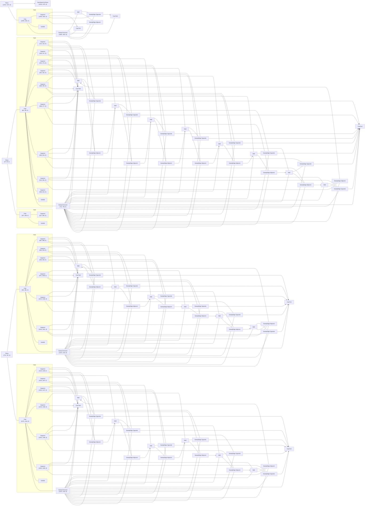

```mermaid
flowchart LR
  subgraph path5 [Path]
    5["Path<br>[89, 136, 0]"]
      %% [ProgramBodyItem { index: 1 }, VariableDeclarationDeclaration, VariableDeclarationInit, PipeBodyItem { index: 0 }]
    10["Segment<br>[142, 163, 0]"]
      %% [ProgramBodyItem { index: 1 }, VariableDeclarationDeclaration, VariableDeclarationInit, PipeBodyItem { index: 1 }]
    11["Segment<br>[169, 247, 0]"]
      %% [ProgramBodyItem { index: 1 }, VariableDeclarationDeclaration, VariableDeclarationInit, PipeBodyItem { index: 2 }]
    12["Segment<br>[253, 275, 0]"]
      %% [ProgramBodyItem { index: 1 }, VariableDeclarationDeclaration, VariableDeclarationInit, PipeBodyItem { index: 3 }]
    13["Segment<br>[281, 362, 0]"]
      %% [ProgramBodyItem { index: 1 }, VariableDeclarationDeclaration, VariableDeclarationInit, PipeBodyItem { index: 4 }]
    14["Segment<br>[368, 390, 0]"]
      %% [ProgramBodyItem { index: 1 }, VariableDeclarationDeclaration, VariableDeclarationInit, PipeBodyItem { index: 5 }]
    15["Segment<br>[396, 477, 0]"]
      %% [ProgramBodyItem { index: 1 }, VariableDeclarationDeclaration, VariableDeclarationInit, PipeBodyItem { index: 6 }]
    16["Segment<br>[483, 504, 0]"]
      %% [ProgramBodyItem { index: 1 }, VariableDeclarationDeclaration, VariableDeclarationInit, PipeBodyItem { index: 7 }]
    17["Segment<br>[510, 590, 0]"]
      %% [ProgramBodyItem { index: 1 }, VariableDeclarationDeclaration, VariableDeclarationInit, PipeBodyItem { index: 8 }]
    18["Segment<br>[596, 603, 0]"]
      %% [ProgramBodyItem { index: 1 }, VariableDeclarationDeclaration, VariableDeclarationInit, PipeBodyItem { index: 9 }]
    34[Solid2d]
  end
  subgraph path6 [Path]
    6["Path<br>[627, 695, 0]"]
      %% [ProgramBodyItem { index: 1 }, VariableDeclarationDeclaration, VariableDeclarationInit, PipeBodyItem { index: 10 }, CallKwArg { index: 0 }]
    19["Segment<br>[627, 695, 0]"]
      %% [ProgramBodyItem { index: 1 }, VariableDeclarationDeclaration, VariableDeclarationInit, PipeBodyItem { index: 10 }, CallKwArg { index: 0 }]
    37[Solid2d]
  end
  subgraph path7 [Path]
    7["Path<br>[811, 861, 0]"]
      %% [ProgramBodyItem { index: 4 }, VariableDeclarationDeclaration, VariableDeclarationInit, PipeBodyItem { index: 0 }]
    20["Segment<br>[867, 898, 0]"]
      %% [ProgramBodyItem { index: 4 }, VariableDeclarationDeclaration, VariableDeclarationInit, PipeBodyItem { index: 1 }]
    21["Segment<br>[904, 929, 0]"]
      %% [ProgramBodyItem { index: 4 }, VariableDeclarationDeclaration, VariableDeclarationInit, PipeBodyItem { index: 2 }]
    22["Segment<br>[935, 969, 0]"]
      %% [ProgramBodyItem { index: 4 }, VariableDeclarationDeclaration, VariableDeclarationInit, PipeBodyItem { index: 3 }]
    23["Segment<br>[975, 1008, 0]"]
      %% [ProgramBodyItem { index: 4 }, VariableDeclarationDeclaration, VariableDeclarationInit, PipeBodyItem { index: 4 }]
    24["Segment<br>[1014, 1038, 0]"]
      %% [ProgramBodyItem { index: 4 }, VariableDeclarationDeclaration, VariableDeclarationInit, PipeBodyItem { index: 5 }]
    25["Segment<br>[1044, 1051, 0]"]
      %% [ProgramBodyItem { index: 4 }, VariableDeclarationDeclaration, VariableDeclarationInit, PipeBodyItem { index: 6 }]
    33[Solid2d]
  end
  subgraph path8 [Path]
    8["Path<br>[1075, 1118, 0]"]
      %% [ProgramBodyItem { index: 5 }, VariableDeclarationDeclaration, VariableDeclarationInit, PipeBodyItem { index: 0 }]
    26["Segment<br>[1124, 1148, 0]"]
      %% [ProgramBodyItem { index: 5 }, VariableDeclarationDeclaration, VariableDeclarationInit, PipeBodyItem { index: 1 }]
    27["Segment<br>[1154, 1187, 0]"]
      %% [ProgramBodyItem { index: 5 }, VariableDeclarationDeclaration, VariableDeclarationInit, PipeBodyItem { index: 2 }]
    28["Segment<br>[1193, 1227, 0]"]
      %% [ProgramBodyItem { index: 5 }, VariableDeclarationDeclaration, VariableDeclarationInit, PipeBodyItem { index: 3 }]
    29["Segment<br>[1233, 1258, 0]"]
      %% [ProgramBodyItem { index: 5 }, VariableDeclarationDeclaration, VariableDeclarationInit, PipeBodyItem { index: 4 }]
    30["Segment<br>[1264, 1296, 0]"]
      %% [ProgramBodyItem { index: 5 }, VariableDeclarationDeclaration, VariableDeclarationInit, PipeBodyItem { index: 5 }]
    31["Segment<br>[1302, 1309, 0]"]
      %% [ProgramBodyItem { index: 5 }, VariableDeclarationDeclaration, VariableDeclarationInit, PipeBodyItem { index: 6 }]
    36[Solid2d]
  end
  subgraph path9 [Path]
    9["Path<br>[1499, 1562, 0]"]
      %% [ProgramBodyItem { index: 8 }, VariableDeclarationDeclaration, VariableDeclarationInit]
    32["Segment<br>[1499, 1562, 0]"]
      %% [ProgramBodyItem { index: 8 }, VariableDeclarationDeclaration, VariableDeclarationInit]
    35[Solid2d]
  end
  1["Plane<br>[47, 65, 0]"]
    %% [ProgramBodyItem { index: 0 }, VariableDeclarationDeclaration, VariableDeclarationInit]
  2["Plane<br>[770, 787, 0]"]
    %% [ProgramBodyItem { index: 3 }, VariableDeclarationDeclaration, VariableDeclarationInit]
  3["Plane<br>[1444, 1474, 0]"]
    %% [ProgramBodyItem { index: 7 }, VariableDeclarationDeclaration, VariableDeclarationInit, CallKwUnlabeledArg]
  4["StartSketchOnPlane<br>[1430, 1475, 0]"]
    %% [ProgramBodyItem { index: 7 }, VariableDeclarationDeclaration, VariableDeclarationInit]
  38["Sweep Extrusion<br>[711, 756, 0]"]
    %% [ProgramBodyItem { index: 2 }, VariableDeclarationDeclaration, VariableDeclarationInit]
  39["Sweep Extrusion<br>[1324, 1416, 0]"]
    %% [ProgramBodyItem { index: 6 }, VariableDeclarationDeclaration, VariableDeclarationInit]
  40["Sweep Extrusion<br>[1324, 1416, 0]"]
    %% [ProgramBodyItem { index: 6 }, VariableDeclarationDeclaration, VariableDeclarationInit]
  41["Sweep Extrusion<br>[1580, 1623, 0]"]
    %% [ProgramBodyItem { index: 9 }, VariableDeclarationDeclaration, VariableDeclarationInit]
  42[Wall]
    %% face_code_ref=Missing NodePath
  43[Wall]
    %% face_code_ref=Missing NodePath
  44[Wall]
    %% face_code_ref=Missing NodePath
  45[Wall]
    %% face_code_ref=Missing NodePath
  46[Wall]
    %% face_code_ref=Missing NodePath
  47[Wall]
    %% face_code_ref=Missing NodePath
  48[Wall]
    %% face_code_ref=Missing NodePath
  49[Wall]
    %% face_code_ref=Missing NodePath
  50[Wall]
    %% face_code_ref=Missing NodePath
  51[Wall]
    %% face_code_ref=Missing NodePath
  52[Wall]
    %% face_code_ref=Missing NodePath
  53[Wall]
    %% face_code_ref=Missing NodePath
  54[Wall]
    %% face_code_ref=Missing NodePath
  55[Wall]
    %% face_code_ref=Missing NodePath
  56[Wall]
    %% face_code_ref=Missing NodePath
  57[Wall]
    %% face_code_ref=Missing NodePath
  58[Wall]
    %% face_code_ref=Missing NodePath
  59[Wall]
    %% face_code_ref=Missing NodePath
  60[Wall]
    %% face_code_ref=Missing NodePath
  61[Wall]
    %% face_code_ref=Missing NodePath
  62[Wall]
    %% face_code_ref=Missing NodePath
  63["Cap Start"]
    %% face_code_ref=Missing NodePath
  64["Cap Start"]
    %% face_code_ref=Missing NodePath
  65["Cap Start"]
    %% face_code_ref=Missing NodePath
  66["Cap Start"]
    %% face_code_ref=Missing NodePath
  67["Cap End"]
    %% face_code_ref=Missing NodePath
  68["Cap End"]
    %% face_code_ref=Missing NodePath
  69["Cap End"]
    %% face_code_ref=Missing NodePath
  70["Cap End"]
    %% face_code_ref=Missing NodePath
  71["SweepEdge Opposite"]
  72["SweepEdge Opposite"]
  73["SweepEdge Opposite"]
  74["SweepEdge Opposite"]
  75["SweepEdge Opposite"]
  76["SweepEdge Opposite"]
  77["SweepEdge Opposite"]
  78["SweepEdge Opposite"]
  79["SweepEdge Opposite"]
  80["SweepEdge Opposite"]
  81["SweepEdge Opposite"]
  82["SweepEdge Opposite"]
  83["SweepEdge Opposite"]
  84["SweepEdge Opposite"]
  85["SweepEdge Opposite"]
  86["SweepEdge Opposite"]
  87["SweepEdge Opposite"]
  88["SweepEdge Opposite"]
  89["SweepEdge Opposite"]
  90["SweepEdge Opposite"]
  91["SweepEdge Opposite"]
  92["SweepEdge Adjacent"]
  93["SweepEdge Adjacent"]
  94["SweepEdge Adjacent"]
  95["SweepEdge Adjacent"]
  96["SweepEdge Adjacent"]
  97["SweepEdge Adjacent"]
  98["SweepEdge Adjacent"]
  99["SweepEdge Adjacent"]
  100["SweepEdge Adjacent"]
  101["SweepEdge Adjacent"]
  102["SweepEdge Adjacent"]
  103["SweepEdge Adjacent"]
  104["SweepEdge Adjacent"]
  105["SweepEdge Adjacent"]
  106["SweepEdge Adjacent"]
  107["SweepEdge Adjacent"]
  108["SweepEdge Adjacent"]
  109["SweepEdge Adjacent"]
  110["SweepEdge Adjacent"]
  111["SweepEdge Adjacent"]
  112["SweepEdge Adjacent"]
  1 --- 5
  1 --- 6
  2 --- 7
  2 --- 8
  3 <--x 4
  3 --- 9
  5 --- 10
  5 --- 11
  5 --- 12
  5 --- 13
  5 --- 14
  5 --- 15
  5 --- 16
  5 --- 17
  5 --- 18
  5 --- 34
  5 ---- 38
  6 --- 19
  6 --- 37
  7 --- 20
  7 --- 21
  7 --- 22
  7 --- 23
  7 --- 24
  7 --- 25
  7 --- 33
  7 ---- 40
  8 --- 26
  8 --- 27
  8 --- 28
  8 --- 29
  8 --- 30
  8 --- 31
  8 --- 36
  8 ---- 39
  9 --- 32
  9 --- 35
  9 ---- 41
  10 --- 58
  10 x--> 65
  10 --- 91
  10 --- 112
  11 --- 57
  11 x--> 65
  11 --- 90
  11 --- 111
  12 --- 59
  12 x--> 65
  12 --- 89
  12 --- 110
  13 --- 56
  13 x--> 65
  13 --- 88
  13 --- 109
  14 --- 55
  14 x--> 65
  14 --- 87
  14 --- 108
  15 --- 60
  15 x--> 65
  15 --- 86
  15 --- 107
  16 --- 62
  16 x--> 65
  16 --- 85
  16 --- 106
  17 --- 61
  17 x--> 65
  17 --- 84
  17 --- 105
  20 --- 49
  20 x--> 63
  20 --- 78
  20 --- 99
  21 --- 54
  21 x--> 63
  21 --- 79
  21 --- 100
  22 --- 52
  22 x--> 63
  22 --- 80
  22 --- 101
  23 --- 51
  23 x--> 63
  23 --- 81
  23 --- 102
  24 --- 53
  24 x--> 63
  24 --- 82
  24 --- 103
  25 --- 50
  25 x--> 63
  25 --- 83
  25 --- 104
  26 --- 44
  26 x--> 64
  26 --- 76
  26 --- 97
  27 --- 45
  27 x--> 64
  27 --- 75
  27 --- 96
  28 --- 47
  28 x--> 64
  28 --- 74
  28 --- 95
  29 --- 42
  29 x--> 64
  29 --- 73
  29 --- 94
  30 --- 46
  30 x--> 64
  30 --- 72
  30 --- 93
  31 --- 43
  31 x--> 64
  31 --- 71
  31 --- 92
  32 --- 48
  32 x--> 70
  32 --- 77
  32 --- 98
  38 --- 55
  38 --- 56
  38 --- 57
  38 --- 58
  38 --- 59
  38 --- 60
  38 --- 61
  38 --- 62
  38 --- 65
  38 --- 69
  38 --- 84
  38 --- 85
  38 --- 86
  38 --- 87
  38 --- 88
  38 --- 89
  38 --- 90
  38 --- 91
  38 --- 105
  38 --- 106
  38 --- 107
  38 --- 108
  38 --- 109
  38 --- 110
  38 --- 111
  38 --- 112
  39 --- 42
  39 --- 43
  39 --- 44
  39 --- 45
  39 --- 46
  39 --- 47
  39 --- 64
  39 --- 68
  39 --- 71
  39 --- 72
  39 --- 73
  39 --- 74
  39 --- 75
  39 --- 76
  39 --- 92
  39 --- 93
  39 --- 94
  39 --- 95
  39 --- 96
  39 --- 97
  40 --- 49
  40 --- 50
  40 --- 51
  40 --- 52
  40 --- 53
  40 --- 54
  40 --- 63
  40 --- 67
  40 --- 78
  40 --- 79
  40 --- 80
  40 --- 81
  40 --- 82
  40 --- 83
  40 --- 99
  40 --- 100
  40 --- 101
  40 --- 102
  40 --- 103
  40 --- 104
  41 --- 48
  41 --- 66
  41 --- 70
  41 --- 77
  41 --- 98
  42 --- 73
  42 --- 94
  95 <--x 42
  43 --- 71
  43 --- 92
  93 <--x 43
  44 --- 76
  92 <--x 44
  44 --- 97
  45 --- 75
  45 --- 96
  97 <--x 45
  46 --- 72
  46 --- 93
  94 <--x 46
  47 --- 74
  47 --- 95
  96 <--x 47
  48 --- 77
  48 --- 98
  49 --- 78
  49 --- 99
  104 <--x 49
  50 --- 83
  103 <--x 50
  50 --- 104
  51 --- 81
  101 <--x 51
  51 --- 102
  52 --- 80
  100 <--x 52
  52 --- 101
  53 --- 82
  102 <--x 53
  53 --- 103
  54 --- 79
  99 <--x 54
  54 --- 100
  55 --- 87
  55 --- 108
  109 <--x 55
  56 --- 88
  56 --- 109
  110 <--x 56
  57 --- 90
  57 --- 111
  112 <--x 57
  58 --- 91
  105 <--x 58
  58 --- 112
  59 --- 89
  59 --- 110
  111 <--x 59
  60 --- 86
  60 --- 107
  108 <--x 60
  61 --- 84
  61 --- 105
  106 <--x 61
  62 --- 85
  62 --- 106
  107 <--x 62
  77 <--x 66
  78 <--x 67
  79 <--x 67
  80 <--x 67
  81 <--x 67
  82 <--x 67
  83 <--x 67
  71 <--x 68
  72 <--x 68
  73 <--x 68
  74 <--x 68
  75 <--x 68
  76 <--x 68
  84 <--x 69
  85 <--x 69
  86 <--x 69
  87 <--x 69
  88 <--x 69
  89 <--x 69
  90 <--x 69
  91 <--x 69
```
