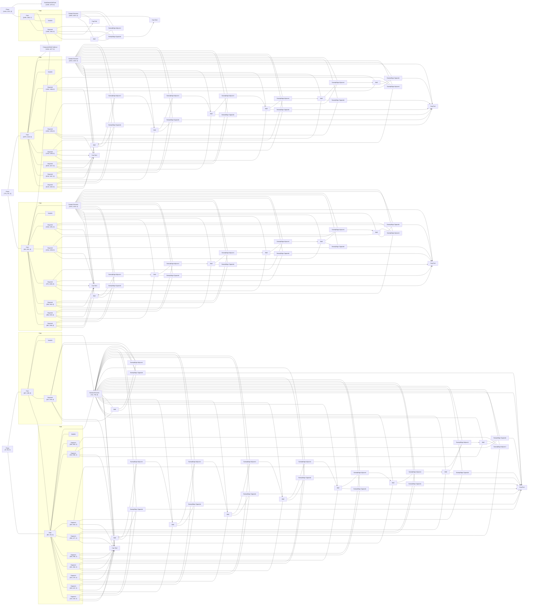

```mermaid
flowchart LR
  subgraph path2 [Path]
    2["Path<br>[89, 136, 0]"]
      %% [ProgramBodyItem { index: 1 }, VariableDeclarationDeclaration, VariableDeclarationInit, PipeBodyItem { index: 0 }]
    3["Segment<br>[142, 163, 0]"]
      %% [ProgramBodyItem { index: 1 }, VariableDeclarationDeclaration, VariableDeclarationInit, PipeBodyItem { index: 1 }]
    4["Segment<br>[169, 247, 0]"]
      %% [ProgramBodyItem { index: 1 }, VariableDeclarationDeclaration, VariableDeclarationInit, PipeBodyItem { index: 2 }]
    5["Segment<br>[253, 275, 0]"]
      %% [ProgramBodyItem { index: 1 }, VariableDeclarationDeclaration, VariableDeclarationInit, PipeBodyItem { index: 3 }]
    6["Segment<br>[281, 362, 0]"]
      %% [ProgramBodyItem { index: 1 }, VariableDeclarationDeclaration, VariableDeclarationInit, PipeBodyItem { index: 4 }]
    7["Segment<br>[368, 390, 0]"]
      %% [ProgramBodyItem { index: 1 }, VariableDeclarationDeclaration, VariableDeclarationInit, PipeBodyItem { index: 5 }]
    8["Segment<br>[396, 477, 0]"]
      %% [ProgramBodyItem { index: 1 }, VariableDeclarationDeclaration, VariableDeclarationInit, PipeBodyItem { index: 6 }]
    9["Segment<br>[483, 504, 0]"]
      %% [ProgramBodyItem { index: 1 }, VariableDeclarationDeclaration, VariableDeclarationInit, PipeBodyItem { index: 7 }]
    10["Segment<br>[510, 590, 0]"]
      %% [ProgramBodyItem { index: 1 }, VariableDeclarationDeclaration, VariableDeclarationInit, PipeBodyItem { index: 8 }]
    11["Segment<br>[596, 603, 0]"]
      %% [ProgramBodyItem { index: 1 }, VariableDeclarationDeclaration, VariableDeclarationInit, PipeBodyItem { index: 9 }]
    12[Solid2d]
  end
  subgraph path13 [Path]
    13["Path<br>[627, 695, 0]"]
      %% [ProgramBodyItem { index: 1 }, VariableDeclarationDeclaration, VariableDeclarationInit, PipeBodyItem { index: 10 }, CallKwArg { index: 0 }]
    14["Segment<br>[627, 695, 0]"]
      %% [ProgramBodyItem { index: 1 }, VariableDeclarationDeclaration, VariableDeclarationInit, PipeBodyItem { index: 10 }, CallKwArg { index: 0 }]
    15[Solid2d]
  end
  subgraph path47 [Path]
    47["Path<br>[811, 861, 0]"]
      %% [ProgramBodyItem { index: 4 }, VariableDeclarationDeclaration, VariableDeclarationInit, PipeBodyItem { index: 0 }]
    48["Segment<br>[867, 898, 0]"]
      %% [ProgramBodyItem { index: 4 }, VariableDeclarationDeclaration, VariableDeclarationInit, PipeBodyItem { index: 1 }]
    49["Segment<br>[904, 929, 0]"]
      %% [ProgramBodyItem { index: 4 }, VariableDeclarationDeclaration, VariableDeclarationInit, PipeBodyItem { index: 2 }]
    50["Segment<br>[935, 969, 0]"]
      %% [ProgramBodyItem { index: 4 }, VariableDeclarationDeclaration, VariableDeclarationInit, PipeBodyItem { index: 3 }]
    51["Segment<br>[975, 1008, 0]"]
      %% [ProgramBodyItem { index: 4 }, VariableDeclarationDeclaration, VariableDeclarationInit, PipeBodyItem { index: 4 }]
    52["Segment<br>[1014, 1038, 0]"]
      %% [ProgramBodyItem { index: 4 }, VariableDeclarationDeclaration, VariableDeclarationInit, PipeBodyItem { index: 5 }]
    53["Segment<br>[1044, 1051, 0]"]
      %% [ProgramBodyItem { index: 4 }, VariableDeclarationDeclaration, VariableDeclarationInit, PipeBodyItem { index: 6 }]
    54[Solid2d]
  end
  subgraph path55 [Path]
    55["Path<br>[1075, 1118, 0]"]
      %% [ProgramBodyItem { index: 5 }, VariableDeclarationDeclaration, VariableDeclarationInit, PipeBodyItem { index: 0 }]
    56["Segment<br>[1124, 1148, 0]"]
      %% [ProgramBodyItem { index: 5 }, VariableDeclarationDeclaration, VariableDeclarationInit, PipeBodyItem { index: 1 }]
    57["Segment<br>[1154, 1187, 0]"]
      %% [ProgramBodyItem { index: 5 }, VariableDeclarationDeclaration, VariableDeclarationInit, PipeBodyItem { index: 2 }]
    58["Segment<br>[1193, 1227, 0]"]
      %% [ProgramBodyItem { index: 5 }, VariableDeclarationDeclaration, VariableDeclarationInit, PipeBodyItem { index: 3 }]
    59["Segment<br>[1233, 1258, 0]"]
      %% [ProgramBodyItem { index: 5 }, VariableDeclarationDeclaration, VariableDeclarationInit, PipeBodyItem { index: 4 }]
    60["Segment<br>[1264, 1296, 0]"]
      %% [ProgramBodyItem { index: 5 }, VariableDeclarationDeclaration, VariableDeclarationInit, PipeBodyItem { index: 5 }]
    61["Segment<br>[1302, 1309, 0]"]
      %% [ProgramBodyItem { index: 5 }, VariableDeclarationDeclaration, VariableDeclarationInit, PipeBodyItem { index: 6 }]
    62[Solid2d]
  end
  subgraph path106 [Path]
    106["Path<br>[1499, 1562, 0]"]
      %% [ProgramBodyItem { index: 8 }, VariableDeclarationDeclaration, VariableDeclarationInit]
    107["Segment<br>[1499, 1562, 0]"]
      %% [ProgramBodyItem { index: 8 }, VariableDeclarationDeclaration, VariableDeclarationInit]
    108[Solid2d]
  end
  1["Plane<br>[47, 65, 0]"]
    %% [ProgramBodyItem { index: 0 }, VariableDeclarationDeclaration, VariableDeclarationInit]
  16["Sweep Extrusion<br>[711, 756, 0]"]
    %% [ProgramBodyItem { index: 2 }, VariableDeclarationDeclaration, VariableDeclarationInit]
  17[Wall]
    %% face_code_ref=Missing NodePath
  18[Wall]
    %% face_code_ref=Missing NodePath
  19[Wall]
    %% face_code_ref=Missing NodePath
  20[Wall]
    %% face_code_ref=Missing NodePath
  21[Wall]
    %% face_code_ref=Missing NodePath
  22[Wall]
    %% face_code_ref=Missing NodePath
  23[Wall]
    %% face_code_ref=Missing NodePath
  24[Wall]
    %% face_code_ref=Missing NodePath
  25[Wall]
    %% face_code_ref=Missing NodePath
  26["Cap Start"]
    %% face_code_ref=Missing NodePath
  27["Cap End"]
    %% face_code_ref=Missing NodePath
  28["SweepEdge Opposite"]
  29["SweepEdge Adjacent"]
  30["SweepEdge Opposite"]
  31["SweepEdge Adjacent"]
  32["SweepEdge Opposite"]
  33["SweepEdge Adjacent"]
  34["SweepEdge Opposite"]
  35["SweepEdge Adjacent"]
  36["SweepEdge Opposite"]
  37["SweepEdge Adjacent"]
  38["SweepEdge Opposite"]
  39["SweepEdge Adjacent"]
  40["SweepEdge Opposite"]
  41["SweepEdge Adjacent"]
  42["SweepEdge Opposite"]
  43["SweepEdge Adjacent"]
  44["SweepEdge Opposite"]
  45["SweepEdge Adjacent"]
  46["Plane<br>[770, 787, 0]"]
    %% [ProgramBodyItem { index: 3 }, VariableDeclarationDeclaration, VariableDeclarationInit]
  63["Sweep Extrusion<br>[1324, 1416, 0]"]
    %% [ProgramBodyItem { index: 6 }, VariableDeclarationDeclaration, VariableDeclarationInit]
  64[Wall]
    %% face_code_ref=Missing NodePath
  65[Wall]
    %% face_code_ref=Missing NodePath
  66[Wall]
    %% face_code_ref=Missing NodePath
  67[Wall]
    %% face_code_ref=Missing NodePath
  68[Wall]
    %% face_code_ref=Missing NodePath
  69[Wall]
    %% face_code_ref=Missing NodePath
  70["Cap Start"]
    %% face_code_ref=Missing NodePath
  71["Cap End"]
    %% face_code_ref=Missing NodePath
  72["SweepEdge Opposite"]
  73["SweepEdge Adjacent"]
  74["SweepEdge Opposite"]
  75["SweepEdge Adjacent"]
  76["SweepEdge Opposite"]
  77["SweepEdge Adjacent"]
  78["SweepEdge Opposite"]
  79["SweepEdge Adjacent"]
  80["SweepEdge Opposite"]
  81["SweepEdge Adjacent"]
  82["SweepEdge Opposite"]
  83["SweepEdge Adjacent"]
  84["Sweep Extrusion<br>[1324, 1416, 0]"]
    %% [ProgramBodyItem { index: 6 }, VariableDeclarationDeclaration, VariableDeclarationInit]
  85[Wall]
    %% face_code_ref=Missing NodePath
  86[Wall]
    %% face_code_ref=Missing NodePath
  87[Wall]
    %% face_code_ref=Missing NodePath
  88[Wall]
    %% face_code_ref=Missing NodePath
  89[Wall]
    %% face_code_ref=Missing NodePath
  90[Wall]
    %% face_code_ref=Missing NodePath
  91["Cap Start"]
    %% face_code_ref=Missing NodePath
  92["Cap End"]
    %% face_code_ref=Missing NodePath
  93["SweepEdge Opposite"]
  94["SweepEdge Adjacent"]
  95["SweepEdge Opposite"]
  96["SweepEdge Adjacent"]
  97["SweepEdge Opposite"]
  98["SweepEdge Adjacent"]
  99["SweepEdge Opposite"]
  100["SweepEdge Adjacent"]
  101["SweepEdge Opposite"]
  102["SweepEdge Adjacent"]
  103["SweepEdge Opposite"]
  104["SweepEdge Adjacent"]
  105["Plane<br>[1444, 1474, 0]"]
    %% [ProgramBodyItem { index: 7 }, VariableDeclarationDeclaration, VariableDeclarationInit, CallKwUnlabeledArg]
  109["Sweep Extrusion<br>[1580, 1623, 0]"]
    %% [ProgramBodyItem { index: 9 }, VariableDeclarationDeclaration, VariableDeclarationInit]
  110[Wall]
    %% face_code_ref=Missing NodePath
  111["Cap Start"]
    %% face_code_ref=Missing NodePath
  112["Cap End"]
    %% face_code_ref=Missing NodePath
  113["SweepEdge Opposite"]
  114["SweepEdge Adjacent"]
  115["CompositeSolid Subtract<br>[1634, 1677, 0]"]
    %% [ProgramBodyItem { index: 10 }, VariableDeclarationDeclaration, VariableDeclarationInit]
  116["StartSketchOnPlane<br>[1430, 1475, 0]"]
    %% [ProgramBodyItem { index: 7 }, VariableDeclarationDeclaration, VariableDeclarationInit]
  1 --- 2
  1 --- 13
  2 --- 3
  2 --- 4
  2 --- 5
  2 --- 6
  2 --- 7
  2 --- 8
  2 --- 9
  2 --- 10
  2 --- 11
  2 --- 12
  13 --- 2
  2 ---- 16
  3 --- 24
  3 x--> 26
  3 --- 42
  3 --- 43
  4 --- 23
  4 x--> 26
  4 --- 40
  4 --- 41
  5 --- 22
  5 x--> 26
  5 --- 38
  5 --- 39
  6 --- 21
  6 x--> 26
  6 --- 36
  6 --- 37
  7 --- 20
  7 x--> 26
  7 --- 34
  7 --- 35
  8 --- 19
  8 x--> 26
  8 --- 32
  8 --- 33
  9 --- 18
  9 x--> 26
  9 --- 30
  9 --- 31
  10 --- 17
  10 x--> 26
  10 --- 28
  10 --- 29
  13 --- 14
  13 --- 15
  13 x---> 16
  14 --- 25
  14 x--> 26
  14 --- 44
  14 --- 45
  16 --- 17
  16 --- 18
  16 --- 19
  16 --- 20
  16 --- 21
  16 --- 22
  16 --- 23
  16 --- 24
  16 --- 25
  16 --- 26
  16 --- 27
  16 --- 28
  16 --- 29
  16 --- 30
  16 --- 31
  16 --- 32
  16 --- 33
  16 --- 34
  16 --- 35
  16 --- 36
  16 --- 37
  16 --- 38
  16 --- 39
  16 --- 40
  16 --- 41
  16 --- 42
  16 --- 43
  16 --- 44
  16 --- 45
  17 --- 28
  17 --- 29
  31 <--x 17
  18 --- 30
  18 --- 31
  33 <--x 18
  19 --- 32
  19 --- 33
  35 <--x 19
  20 --- 34
  20 --- 35
  37 <--x 20
  21 --- 36
  21 --- 37
  39 <--x 21
  22 --- 38
  22 --- 39
  41 <--x 22
  23 --- 40
  23 --- 41
  43 <--x 23
  29 <--x 24
  24 --- 42
  24 --- 43
  25 --- 44
  25 --- 45
  28 <--x 27
  30 <--x 27
  32 <--x 27
  34 <--x 27
  36 <--x 27
  38 <--x 27
  40 <--x 27
  42 <--x 27
  44 <--x 27
  46 --- 47
  46 --- 55
  47 --- 48
  47 --- 49
  47 --- 50
  47 --- 51
  47 --- 52
  47 --- 53
  47 --- 54
  47 ---- 63
  47 --- 115
  48 --- 64
  48 x--> 70
  48 --- 72
  48 --- 73
  49 --- 65
  49 x--> 70
  49 --- 74
  49 --- 75
  50 --- 66
  50 x--> 70
  50 --- 76
  50 --- 77
  51 --- 67
  51 x--> 70
  51 --- 78
  51 --- 79
  52 --- 68
  52 x--> 70
  52 --- 80
  52 --- 81
  53 --- 69
  53 x--> 70
  53 --- 82
  53 --- 83
  55 --- 56
  55 --- 57
  55 --- 58
  55 --- 59
  55 --- 60
  55 --- 61
  55 --- 62
  55 ---- 84
  55 --- 115
  56 --- 90
  56 x--> 91
  56 --- 103
  56 --- 104
  57 --- 89
  57 x--> 91
  57 --- 101
  57 --- 102
  58 --- 88
  58 x--> 91
  58 --- 99
  58 --- 100
  59 --- 87
  59 x--> 91
  59 --- 97
  59 --- 98
  60 --- 86
  60 x--> 91
  60 --- 95
  60 --- 96
  61 --- 85
  61 x--> 91
  61 --- 93
  61 --- 94
  63 --- 64
  63 --- 65
  63 --- 66
  63 --- 67
  63 --- 68
  63 --- 69
  63 --- 70
  63 --- 71
  63 --- 72
  63 --- 73
  63 --- 74
  63 --- 75
  63 --- 76
  63 --- 77
  63 --- 78
  63 --- 79
  63 --- 80
  63 --- 81
  63 --- 82
  63 --- 83
  64 --- 72
  64 --- 73
  83 <--x 64
  73 <--x 65
  65 --- 74
  65 --- 75
  75 <--x 66
  66 --- 76
  66 --- 77
  77 <--x 67
  67 --- 78
  67 --- 79
  79 <--x 68
  68 --- 80
  68 --- 81
  81 <--x 69
  69 --- 82
  69 --- 83
  72 <--x 71
  74 <--x 71
  76 <--x 71
  78 <--x 71
  80 <--x 71
  82 <--x 71
  84 --- 85
  84 --- 86
  84 --- 87
  84 --- 88
  84 --- 89
  84 --- 90
  84 --- 91
  84 --- 92
  84 --- 93
  84 --- 94
  84 --- 95
  84 --- 96
  84 --- 97
  84 --- 98
  84 --- 99
  84 --- 100
  84 --- 101
  84 --- 102
  84 --- 103
  84 --- 104
  85 --- 93
  85 --- 94
  96 <--x 85
  86 --- 95
  86 --- 96
  98 <--x 86
  87 --- 97
  87 --- 98
  100 <--x 87
  88 --- 99
  88 --- 100
  102 <--x 88
  89 --- 101
  89 --- 102
  104 <--x 89
  94 <--x 90
  90 --- 103
  90 --- 104
  93 <--x 92
  95 <--x 92
  97 <--x 92
  99 <--x 92
  101 <--x 92
  103 <--x 92
  105 --- 106
  105 <--x 116
  106 --- 107
  106 --- 108
  106 ---- 109
  106 --- 115
  107 --- 110
  107 x--> 112
  107 --- 113
  107 --- 114
  109 --- 110
  109 --- 111
  109 --- 112
  109 --- 113
  109 --- 114
  110 --- 113
  110 --- 114
  113 <--x 111
```
