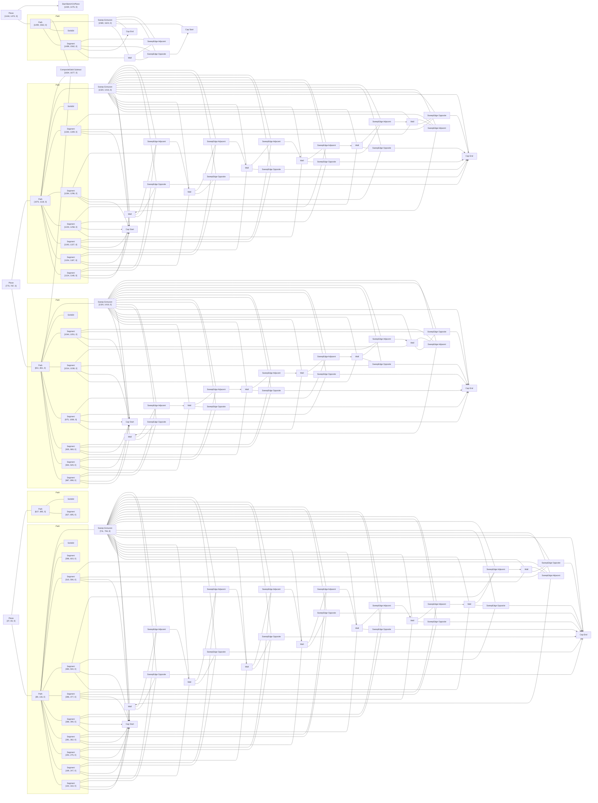

```mermaid
flowchart LR
  subgraph path2 [Path]
    2["Path<br>[89, 136, 0]"]
      %% [ProgramBodyItem { index: 1 }, VariableDeclarationDeclaration, VariableDeclarationInit, PipeBodyItem { index: 0 }]
    3["Segment<br>[142, 163, 0]"]
      %% [ProgramBodyItem { index: 1 }, VariableDeclarationDeclaration, VariableDeclarationInit, PipeBodyItem { index: 1 }]
    4["Segment<br>[169, 247, 0]"]
      %% [ProgramBodyItem { index: 1 }, VariableDeclarationDeclaration, VariableDeclarationInit, PipeBodyItem { index: 2 }]
    5["Segment<br>[253, 275, 0]"]
      %% [ProgramBodyItem { index: 1 }, VariableDeclarationDeclaration, VariableDeclarationInit, PipeBodyItem { index: 3 }]
    6["Segment<br>[281, 362, 0]"]
      %% [ProgramBodyItem { index: 1 }, VariableDeclarationDeclaration, VariableDeclarationInit, PipeBodyItem { index: 4 }]
    7["Segment<br>[368, 390, 0]"]
      %% [ProgramBodyItem { index: 1 }, VariableDeclarationDeclaration, VariableDeclarationInit, PipeBodyItem { index: 5 }]
    8["Segment<br>[396, 477, 0]"]
      %% [ProgramBodyItem { index: 1 }, VariableDeclarationDeclaration, VariableDeclarationInit, PipeBodyItem { index: 6 }]
    9["Segment<br>[483, 504, 0]"]
      %% [ProgramBodyItem { index: 1 }, VariableDeclarationDeclaration, VariableDeclarationInit, PipeBodyItem { index: 7 }]
    10["Segment<br>[510, 590, 0]"]
      %% [ProgramBodyItem { index: 1 }, VariableDeclarationDeclaration, VariableDeclarationInit, PipeBodyItem { index: 8 }]
    11["Segment<br>[596, 603, 0]"]
      %% [ProgramBodyItem { index: 1 }, VariableDeclarationDeclaration, VariableDeclarationInit, PipeBodyItem { index: 9 }]
    12[Solid2d]
  end
  subgraph path13 [Path]
    13["Path<br>[627, 695, 0]"]
      %% [ProgramBodyItem { index: 1 }, VariableDeclarationDeclaration, VariableDeclarationInit, PipeBodyItem { index: 10 }, CallKwArg { index: 0 }]
    14["Segment<br>[627, 695, 0]"]
      %% [ProgramBodyItem { index: 1 }, VariableDeclarationDeclaration, VariableDeclarationInit, PipeBodyItem { index: 10 }, CallKwArg { index: 0 }]
    15[Solid2d]
  end
  subgraph path44 [Path]
    44["Path<br>[811, 861, 0]"]
      %% [ProgramBodyItem { index: 4 }, VariableDeclarationDeclaration, VariableDeclarationInit, PipeBodyItem { index: 0 }]
    45["Segment<br>[867, 898, 0]"]
      %% [ProgramBodyItem { index: 4 }, VariableDeclarationDeclaration, VariableDeclarationInit, PipeBodyItem { index: 1 }]
    46["Segment<br>[904, 929, 0]"]
      %% [ProgramBodyItem { index: 4 }, VariableDeclarationDeclaration, VariableDeclarationInit, PipeBodyItem { index: 2 }]
    47["Segment<br>[935, 969, 0]"]
      %% [ProgramBodyItem { index: 4 }, VariableDeclarationDeclaration, VariableDeclarationInit, PipeBodyItem { index: 3 }]
    48["Segment<br>[975, 1008, 0]"]
      %% [ProgramBodyItem { index: 4 }, VariableDeclarationDeclaration, VariableDeclarationInit, PipeBodyItem { index: 4 }]
    49["Segment<br>[1014, 1038, 0]"]
      %% [ProgramBodyItem { index: 4 }, VariableDeclarationDeclaration, VariableDeclarationInit, PipeBodyItem { index: 5 }]
    50["Segment<br>[1044, 1051, 0]"]
      %% [ProgramBodyItem { index: 4 }, VariableDeclarationDeclaration, VariableDeclarationInit, PipeBodyItem { index: 6 }]
    51[Solid2d]
  end
  subgraph path52 [Path]
    52["Path<br>[1075, 1118, 0]"]
      %% [ProgramBodyItem { index: 5 }, VariableDeclarationDeclaration, VariableDeclarationInit, PipeBodyItem { index: 0 }]
    53["Segment<br>[1124, 1148, 0]"]
      %% [ProgramBodyItem { index: 5 }, VariableDeclarationDeclaration, VariableDeclarationInit, PipeBodyItem { index: 1 }]
    54["Segment<br>[1154, 1187, 0]"]
      %% [ProgramBodyItem { index: 5 }, VariableDeclarationDeclaration, VariableDeclarationInit, PipeBodyItem { index: 2 }]
    55["Segment<br>[1193, 1227, 0]"]
      %% [ProgramBodyItem { index: 5 }, VariableDeclarationDeclaration, VariableDeclarationInit, PipeBodyItem { index: 3 }]
    56["Segment<br>[1233, 1258, 0]"]
      %% [ProgramBodyItem { index: 5 }, VariableDeclarationDeclaration, VariableDeclarationInit, PipeBodyItem { index: 4 }]
    57["Segment<br>[1264, 1296, 0]"]
      %% [ProgramBodyItem { index: 5 }, VariableDeclarationDeclaration, VariableDeclarationInit, PipeBodyItem { index: 5 }]
    58["Segment<br>[1302, 1309, 0]"]
      %% [ProgramBodyItem { index: 5 }, VariableDeclarationDeclaration, VariableDeclarationInit, PipeBodyItem { index: 6 }]
    59[Solid2d]
  end
  subgraph path103 [Path]
    103["Path<br>[1499, 1562, 0]"]
      %% [ProgramBodyItem { index: 8 }, VariableDeclarationDeclaration, VariableDeclarationInit]
    104["Segment<br>[1499, 1562, 0]"]
      %% [ProgramBodyItem { index: 8 }, VariableDeclarationDeclaration, VariableDeclarationInit]
    105[Solid2d]
  end
  1["Plane<br>[47, 65, 0]"]
    %% [ProgramBodyItem { index: 0 }, VariableDeclarationDeclaration, VariableDeclarationInit]
  16["Sweep Extrusion<br>[711, 756, 0]"]
    %% [ProgramBodyItem { index: 2 }, VariableDeclarationDeclaration, VariableDeclarationInit]
  17[Wall]
    %% face_code_ref=Missing NodePath
  18[Wall]
    %% face_code_ref=Missing NodePath
  19[Wall]
    %% face_code_ref=Missing NodePath
  20[Wall]
    %% face_code_ref=Missing NodePath
  21[Wall]
    %% face_code_ref=Missing NodePath
  22[Wall]
    %% face_code_ref=Missing NodePath
  23[Wall]
    %% face_code_ref=Missing NodePath
  24[Wall]
    %% face_code_ref=Missing NodePath
  25["Cap Start"]
    %% face_code_ref=Missing NodePath
  26["Cap End"]
    %% face_code_ref=Missing NodePath
  27["SweepEdge Opposite"]
  28["SweepEdge Adjacent"]
  29["SweepEdge Opposite"]
  30["SweepEdge Adjacent"]
  31["SweepEdge Opposite"]
  32["SweepEdge Adjacent"]
  33["SweepEdge Opposite"]
  34["SweepEdge Adjacent"]
  35["SweepEdge Opposite"]
  36["SweepEdge Adjacent"]
  37["SweepEdge Opposite"]
  38["SweepEdge Adjacent"]
  39["SweepEdge Opposite"]
  40["SweepEdge Adjacent"]
  41["SweepEdge Opposite"]
  42["SweepEdge Adjacent"]
  43["Plane<br>[770, 787, 0]"]
    %% [ProgramBodyItem { index: 3 }, VariableDeclarationDeclaration, VariableDeclarationInit]
  60["Sweep Extrusion<br>[1324, 1416, 0]"]
    %% [ProgramBodyItem { index: 6 }, VariableDeclarationDeclaration, VariableDeclarationInit]
  61[Wall]
    %% face_code_ref=Missing NodePath
  62[Wall]
    %% face_code_ref=Missing NodePath
  63[Wall]
    %% face_code_ref=Missing NodePath
  64[Wall]
    %% face_code_ref=Missing NodePath
  65[Wall]
    %% face_code_ref=Missing NodePath
  66[Wall]
    %% face_code_ref=Missing NodePath
  67["Cap Start"]
    %% face_code_ref=Missing NodePath
  68["Cap End"]
    %% face_code_ref=Missing NodePath
  69["SweepEdge Opposite"]
  70["SweepEdge Adjacent"]
  71["SweepEdge Opposite"]
  72["SweepEdge Adjacent"]
  73["SweepEdge Opposite"]
  74["SweepEdge Adjacent"]
  75["SweepEdge Opposite"]
  76["SweepEdge Adjacent"]
  77["SweepEdge Opposite"]
  78["SweepEdge Adjacent"]
  79["SweepEdge Opposite"]
  80["SweepEdge Adjacent"]
  81["Sweep Extrusion<br>[1324, 1416, 0]"]
    %% [ProgramBodyItem { index: 6 }, VariableDeclarationDeclaration, VariableDeclarationInit]
  82[Wall]
    %% face_code_ref=Missing NodePath
  83[Wall]
    %% face_code_ref=Missing NodePath
  84[Wall]
    %% face_code_ref=Missing NodePath
  85[Wall]
    %% face_code_ref=Missing NodePath
  86[Wall]
    %% face_code_ref=Missing NodePath
  87[Wall]
    %% face_code_ref=Missing NodePath
  88["Cap Start"]
    %% face_code_ref=Missing NodePath
  89["Cap End"]
    %% face_code_ref=Missing NodePath
  90["SweepEdge Opposite"]
  91["SweepEdge Adjacent"]
  92["SweepEdge Opposite"]
  93["SweepEdge Adjacent"]
  94["SweepEdge Opposite"]
  95["SweepEdge Adjacent"]
  96["SweepEdge Opposite"]
  97["SweepEdge Adjacent"]
  98["SweepEdge Opposite"]
  99["SweepEdge Adjacent"]
  100["SweepEdge Opposite"]
  101["SweepEdge Adjacent"]
  102["Plane<br>[1444, 1474, 0]"]
    %% [ProgramBodyItem { index: 7 }, VariableDeclarationDeclaration, VariableDeclarationInit, CallKwUnlabeledArg]
  106["Sweep Extrusion<br>[1580, 1623, 0]"]
    %% [ProgramBodyItem { index: 9 }, VariableDeclarationDeclaration, VariableDeclarationInit]
  107[Wall]
    %% face_code_ref=Missing NodePath
  108["Cap Start"]
    %% face_code_ref=Missing NodePath
  109["Cap End"]
    %% face_code_ref=Missing NodePath
  110["SweepEdge Opposite"]
  111["SweepEdge Adjacent"]
  112["CompositeSolid Subtract<br>[1634, 1677, 0]"]
    %% [ProgramBodyItem { index: 10 }, VariableDeclarationDeclaration, VariableDeclarationInit]
  113["StartSketchOnPlane<br>[1430, 1475, 0]"]
    %% [ProgramBodyItem { index: 7 }, VariableDeclarationDeclaration, VariableDeclarationInit]
  1 --- 2
  1 --- 13
  2 --- 3
  2 --- 4
  2 --- 5
  2 --- 6
  2 --- 7
  2 --- 8
  2 --- 9
  2 --- 10
  2 --- 11
  2 --- 12
  2 ---- 16
  3 --- 24
  3 x--> 25
  3 --- 41
  3 --- 42
  4 --- 23
  4 x--> 25
  4 --- 39
  4 --- 40
  5 --- 22
  5 x--> 25
  5 --- 37
  5 --- 38
  6 --- 21
  6 x--> 25
  6 --- 35
  6 --- 36
  7 --- 20
  7 x--> 25
  7 --- 33
  7 --- 34
  8 --- 19
  8 x--> 25
  8 --- 31
  8 --- 32
  9 --- 18
  9 x--> 25
  9 --- 29
  9 --- 30
  10 --- 17
  10 x--> 25
  10 --- 27
  10 --- 28
  13 --- 14
  13 --- 15
  16 --- 17
  16 --- 18
  16 --- 19
  16 --- 20
  16 --- 21
  16 --- 22
  16 --- 23
  16 --- 24
  16 --- 25
  16 --- 26
  16 --- 27
  16 --- 28
  16 --- 29
  16 --- 30
  16 --- 31
  16 --- 32
  16 --- 33
  16 --- 34
  16 --- 35
  16 --- 36
  16 --- 37
  16 --- 38
  16 --- 39
  16 --- 40
  16 --- 41
  16 --- 42
  17 --- 27
  17 --- 28
  30 <--x 17
  18 --- 29
  18 --- 30
  32 <--x 18
  19 --- 31
  19 --- 32
  34 <--x 19
  20 --- 33
  20 --- 34
  36 <--x 20
  21 --- 35
  21 --- 36
  38 <--x 21
  22 --- 37
  22 --- 38
  40 <--x 22
  23 --- 39
  23 --- 40
  42 <--x 23
  28 <--x 24
  24 --- 41
  24 --- 42
  27 <--x 26
  29 <--x 26
  31 <--x 26
  33 <--x 26
  35 <--x 26
  37 <--x 26
  39 <--x 26
  41 <--x 26
  43 --- 44
  43 --- 52
  44 --- 45
  44 --- 46
  44 --- 47
  44 --- 48
  44 --- 49
  44 --- 50
  44 --- 51
  44 ---- 60
  44 --- 112
  45 --- 61
  45 x--> 67
  45 --- 69
  45 --- 70
  46 --- 62
  46 x--> 67
  46 --- 71
  46 --- 72
  47 --- 63
  47 x--> 67
  47 --- 73
  47 --- 74
  48 --- 64
  48 x--> 67
  48 --- 75
  48 --- 76
  49 --- 65
  49 x--> 67
  49 --- 77
  49 --- 78
  50 --- 66
  50 x--> 67
  50 --- 79
  50 --- 80
  52 --- 53
  52 --- 54
  52 --- 55
  52 --- 56
  52 --- 57
  52 --- 58
  52 --- 59
  52 ---- 81
  52 --- 112
  53 --- 87
  53 x--> 88
  53 --- 100
  53 --- 101
  54 --- 86
  54 x--> 88
  54 --- 98
  54 --- 99
  55 --- 85
  55 x--> 88
  55 --- 96
  55 --- 97
  56 --- 84
  56 x--> 88
  56 --- 94
  56 --- 95
  57 --- 83
  57 x--> 88
  57 --- 92
  57 --- 93
  58 --- 82
  58 x--> 88
  58 --- 90
  58 --- 91
  60 --- 61
  60 --- 62
  60 --- 63
  60 --- 64
  60 --- 65
  60 --- 66
  60 --- 67
  60 --- 68
  60 --- 69
  60 --- 70
  60 --- 71
  60 --- 72
  60 --- 73
  60 --- 74
  60 --- 75
  60 --- 76
  60 --- 77
  60 --- 78
  60 --- 79
  60 --- 80
  61 --- 69
  61 --- 70
  80 <--x 61
  70 <--x 62
  62 --- 71
  62 --- 72
  72 <--x 63
  63 --- 73
  63 --- 74
  74 <--x 64
  64 --- 75
  64 --- 76
  76 <--x 65
  65 --- 77
  65 --- 78
  78 <--x 66
  66 --- 79
  66 --- 80
  69 <--x 68
  71 <--x 68
  73 <--x 68
  75 <--x 68
  77 <--x 68
  79 <--x 68
  81 --- 82
  81 --- 83
  81 --- 84
  81 --- 85
  81 --- 86
  81 --- 87
  81 --- 88
  81 --- 89
  81 --- 90
  81 --- 91
  81 --- 92
  81 --- 93
  81 --- 94
  81 --- 95
  81 --- 96
  81 --- 97
  81 --- 98
  81 --- 99
  81 --- 100
  81 --- 101
  82 --- 90
  82 --- 91
  93 <--x 82
  83 --- 92
  83 --- 93
  95 <--x 83
  84 --- 94
  84 --- 95
  97 <--x 84
  85 --- 96
  85 --- 97
  99 <--x 85
  86 --- 98
  86 --- 99
  101 <--x 86
  91 <--x 87
  87 --- 100
  87 --- 101
  90 <--x 89
  92 <--x 89
  94 <--x 89
  96 <--x 89
  98 <--x 89
  100 <--x 89
  102 --- 103
  102 <--x 113
  103 --- 104
  103 --- 105
  103 ---- 106
  103 --- 112
  104 --- 107
  104 x--> 109
  104 --- 110
  104 --- 111
  106 --- 107
  106 --- 108
  106 --- 109
  106 --- 110
  106 --- 111
  107 --- 110
  107 --- 111
  110 <--x 108
```
