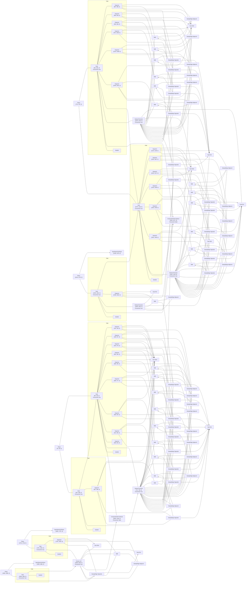

```mermaid
flowchart LR
  subgraph path35 [Path]
    35["Path<br>[89, 136, 0]<br>Consumed: true"]
      %% [ProgramBodyItem { index: 1 }, VariableDeclarationDeclaration, VariableDeclarationInit, PipeBodyItem { index: 0 }]
    36["Segment<br>[142, 163, 0]"]
      %% [ProgramBodyItem { index: 1 }, VariableDeclarationDeclaration, VariableDeclarationInit, PipeBodyItem { index: 1 }]
    37["Segment<br>[169, 247, 0]"]
      %% [ProgramBodyItem { index: 1 }, VariableDeclarationDeclaration, VariableDeclarationInit, PipeBodyItem { index: 2 }]
    38["Segment<br>[253, 275, 0]"]
      %% [ProgramBodyItem { index: 1 }, VariableDeclarationDeclaration, VariableDeclarationInit, PipeBodyItem { index: 3 }]
    39["Segment<br>[281, 362, 0]"]
      %% [ProgramBodyItem { index: 1 }, VariableDeclarationDeclaration, VariableDeclarationInit, PipeBodyItem { index: 4 }]
    40["Segment<br>[368, 390, 0]"]
      %% [ProgramBodyItem { index: 1 }, VariableDeclarationDeclaration, VariableDeclarationInit, PipeBodyItem { index: 5 }]
    41["Segment<br>[396, 477, 0]"]
      %% [ProgramBodyItem { index: 1 }, VariableDeclarationDeclaration, VariableDeclarationInit, PipeBodyItem { index: 6 }]
    42["Segment<br>[483, 504, 0]"]
      %% [ProgramBodyItem { index: 1 }, VariableDeclarationDeclaration, VariableDeclarationInit, PipeBodyItem { index: 7 }]
    43["Segment<br>[510, 590, 0]"]
      %% [ProgramBodyItem { index: 1 }, VariableDeclarationDeclaration, VariableDeclarationInit, PipeBodyItem { index: 8 }]
    44["Segment<br>[596, 603, 0]"]
      %% [ProgramBodyItem { index: 1 }, VariableDeclarationDeclaration, VariableDeclarationInit, PipeBodyItem { index: 9 }]
    86[Solid2d]
  end
  subgraph path45 [Path]
    45["Path<br>[627, 695, 0]<br>Consumed: true"]
      %% [ProgramBodyItem { index: 1 }, VariableDeclarationDeclaration, VariableDeclarationInit, PipeBodyItem { index: 10 }, CallKwArg { index: 0 }]
    46["Segment<br>[627, 695, 0]"]
      %% [ProgramBodyItem { index: 1 }, VariableDeclarationDeclaration, VariableDeclarationInit, PipeBodyItem { index: 10 }, CallKwArg { index: 0 }]
    84[Solid2d]
  end
  subgraph path49 [Path]
    49["Path<br>[811, 861, 0]<br>Consumed: true"]
      %% [ProgramBodyItem { index: 4 }, VariableDeclarationDeclaration, VariableDeclarationInit, PipeBodyItem { index: 0 }]
    50["Segment<br>[867, 898, 0]"]
      %% [ProgramBodyItem { index: 4 }, VariableDeclarationDeclaration, VariableDeclarationInit, PipeBodyItem { index: 1 }]
    51["Segment<br>[904, 929, 0]"]
      %% [ProgramBodyItem { index: 4 }, VariableDeclarationDeclaration, VariableDeclarationInit, PipeBodyItem { index: 2 }]
    52["Segment<br>[935, 969, 0]"]
      %% [ProgramBodyItem { index: 4 }, VariableDeclarationDeclaration, VariableDeclarationInit, PipeBodyItem { index: 3 }]
    53["Segment<br>[975, 1008, 0]"]
      %% [ProgramBodyItem { index: 4 }, VariableDeclarationDeclaration, VariableDeclarationInit, PipeBodyItem { index: 4 }]
    54["Segment<br>[1014, 1038, 0]"]
      %% [ProgramBodyItem { index: 4 }, VariableDeclarationDeclaration, VariableDeclarationInit, PipeBodyItem { index: 5 }]
    55["Segment<br>[1044, 1051, 0]"]
      %% [ProgramBodyItem { index: 4 }, VariableDeclarationDeclaration, VariableDeclarationInit, PipeBodyItem { index: 6 }]
    85[Solid2d]
  end
  subgraph path56 [Path]
    56["Path<br>[1075, 1118, 0]<br>Consumed: true"]
      %% [ProgramBodyItem { index: 5 }, VariableDeclarationDeclaration, VariableDeclarationInit, PipeBodyItem { index: 0 }]
    57["Segment<br>[1124, 1148, 0]"]
      %% [ProgramBodyItem { index: 5 }, VariableDeclarationDeclaration, VariableDeclarationInit, PipeBodyItem { index: 1 }]
    58["Segment<br>[1154, 1187, 0]"]
      %% [ProgramBodyItem { index: 5 }, VariableDeclarationDeclaration, VariableDeclarationInit, PipeBodyItem { index: 2 }]
    59["Segment<br>[1193, 1227, 0]"]
      %% [ProgramBodyItem { index: 5 }, VariableDeclarationDeclaration, VariableDeclarationInit, PipeBodyItem { index: 3 }]
    60["Segment<br>[1233, 1258, 0]"]
      %% [ProgramBodyItem { index: 5 }, VariableDeclarationDeclaration, VariableDeclarationInit, PipeBodyItem { index: 4 }]
    61["Segment<br>[1264, 1296, 0]"]
      %% [ProgramBodyItem { index: 5 }, VariableDeclarationDeclaration, VariableDeclarationInit, PipeBodyItem { index: 5 }]
    62["Segment<br>[1302, 1309, 0]"]
      %% [ProgramBodyItem { index: 5 }, VariableDeclarationDeclaration, VariableDeclarationInit, PipeBodyItem { index: 6 }]
    80[Solid2d]
  end
  subgraph path67 [Path]
    67["Path<br>[1499, 1562, 0]<br>Consumed: true"]
      %% [ProgramBodyItem { index: 8 }, VariableDeclarationDeclaration, VariableDeclarationInit]
    68["Segment<br>[1499, 1562, 0]"]
      %% [ProgramBodyItem { index: 8 }, VariableDeclarationDeclaration, VariableDeclarationInit]
    81[Solid2d]
  end
  subgraph path73 [Path]
    73["Path<br>[1761, 1822, 0]<br>Consumed: true"]
      %% [ProgramBodyItem { index: 12 }, VariableDeclarationDeclaration, VariableDeclarationInit]
    74["Segment<br>[1761, 1822, 0]"]
      %% [ProgramBodyItem { index: 12 }, VariableDeclarationDeclaration, VariableDeclarationInit]
    82[Solid2d]
  end
  subgraph path77 [Path]
    77["Path<br>[1908, 1965, 0]<br>Consumed: true"]
      %% [ProgramBodyItem { index: 14 }, VariableDeclarationDeclaration, VariableDeclarationInit]
    83[Solid2d]
  end
  1["Cap End"]
    %% face_code_ref=Missing NodePath
  2["Cap End"]
    %% face_code_ref=Missing NodePath
  3["Cap End"]
    %% face_code_ref=Missing NodePath
  4["Cap End"]
    %% face_code_ref=Missing NodePath
  5["Cap End"]
    %% face_code_ref=Missing NodePath
  6["Cap Start"]
    %% face_code_ref=Missing NodePath
  7["Cap Start"]
    %% face_code_ref=Missing NodePath
  8["Cap Start"]
    %% face_code_ref=Missing NodePath
  9["Cap Start"]
    %% face_code_ref=Missing NodePath
  10["Cap Start"]
    %% face_code_ref=Missing NodePath
  11[Wall]
    %% face_code_ref=Missing NodePath
  12[Wall]
    %% face_code_ref=Missing NodePath
  13[Wall]
    %% face_code_ref=Missing NodePath
  14[Wall]
    %% face_code_ref=Missing NodePath
  15[Wall]
    %% face_code_ref=Missing NodePath
  16[Wall]
    %% face_code_ref=Missing NodePath
  17[Wall]
    %% face_code_ref=Missing NodePath
  18[Wall]
    %% face_code_ref=Missing NodePath
  19[Wall]
    %% face_code_ref=Missing NodePath
  20[Wall]
    %% face_code_ref=Missing NodePath
  21[Wall]
    %% face_code_ref=Missing NodePath
  22[Wall]
    %% face_code_ref=Missing NodePath
  23[Wall]
    %% face_code_ref=Missing NodePath
  24[Wall]
    %% face_code_ref=Missing NodePath
  25[Wall]
    %% face_code_ref=Missing NodePath
  26[Wall]
    %% face_code_ref=Missing NodePath
  27[Wall]
    %% face_code_ref=Missing NodePath
  28[Wall]
    %% face_code_ref=Missing NodePath
  29[Wall]
    %% face_code_ref=Missing NodePath
  30[Wall]
    %% face_code_ref=Missing NodePath
  31[Wall]
    %% face_code_ref=Missing NodePath
  32[Wall]
    %% face_code_ref=Missing NodePath
  33[Wall]
    %% face_code_ref=Missing NodePath
  34["Plane<br>[47, 65, 0]"]
    %% [ProgramBodyItem { index: 0 }, VariableDeclarationDeclaration, VariableDeclarationInit]
  47["Sweep Extrusion<br>[711, 756, 0]<br>Consumed: true"]
    %% [ProgramBodyItem { index: 2 }, VariableDeclarationDeclaration, VariableDeclarationInit]
  48["Plane<br>[770, 787, 0]"]
    %% [ProgramBodyItem { index: 3 }, VariableDeclarationDeclaration, VariableDeclarationInit]
  63["Sweep Extrusion<br>[1324, 1416, 0]<br>Consumed: true"]
    %% [ProgramBodyItem { index: 6 }, VariableDeclarationDeclaration, VariableDeclarationInit]
  64["Sweep Extrusion<br>[1324, 1416, 0]<br>Consumed: true"]
    %% [ProgramBodyItem { index: 6 }, VariableDeclarationDeclaration, VariableDeclarationInit]
  65["StartSketchOnPlane<br>[1430, 1475, 0]"]
    %% [ProgramBodyItem { index: 7 }, VariableDeclarationDeclaration, VariableDeclarationInit]
  66["Plane<br>[1444, 1474, 0]"]
    %% [ProgramBodyItem { index: 7 }, VariableDeclarationDeclaration, VariableDeclarationInit, CallKwUnlabeledArg]
  69["Sweep Extrusion<br>[1580, 1623, 0]<br>Consumed: true"]
    %% [ProgramBodyItem { index: 9 }, VariableDeclarationDeclaration, VariableDeclarationInit]
  70["CompositeSolid Subtract<br>[1634, 1677, 0]<br>Consumed: false"]
    %% [ProgramBodyItem { index: 10 }, VariableDeclarationDeclaration, VariableDeclarationInit]
  71["StartSketchOnPlane<br>[1691, 1737, 0]"]
    %% [ProgramBodyItem { index: 11 }, VariableDeclarationDeclaration, VariableDeclarationInit]
  72["Plane<br>[1705, 1736, 0]"]
    %% [ProgramBodyItem { index: 11 }, VariableDeclarationDeclaration, VariableDeclarationInit, CallKwUnlabeledArg]
  75["StartSketchOnPlane<br>[1836, 1884, 0]"]
    %% [ProgramBodyItem { index: 13 }, VariableDeclarationDeclaration, VariableDeclarationInit]
  76["Plane<br>[1850, 1883, 0]"]
    %% [ProgramBodyItem { index: 13 }, VariableDeclarationDeclaration, VariableDeclarationInit, CallKwUnlabeledArg]
  78["Sweep Loft<br>[1988, 2036, 0]<br>Consumed: true"]
    %% [ProgramBodyItem { index: 15 }, VariableDeclarationDeclaration, VariableDeclarationInit]
  79["CompositeSolid Subtract<br>[2052, 2100, 0]<br>Consumed: false"]
    %% [ProgramBodyItem { index: 16 }, VariableDeclarationDeclaration, VariableDeclarationInit]
  87["SweepEdge Adjacent"]
  88["SweepEdge Adjacent"]
  89["SweepEdge Adjacent"]
  90["SweepEdge Adjacent"]
  91["SweepEdge Adjacent"]
  92["SweepEdge Adjacent"]
  93["SweepEdge Adjacent"]
  94["SweepEdge Adjacent"]
  95["SweepEdge Adjacent"]
  96["SweepEdge Adjacent"]
  97["SweepEdge Adjacent"]
  98["SweepEdge Adjacent"]
  99["SweepEdge Adjacent"]
  100["SweepEdge Adjacent"]
  101["SweepEdge Adjacent"]
  102["SweepEdge Adjacent"]
  103["SweepEdge Adjacent"]
  104["SweepEdge Adjacent"]
  105["SweepEdge Adjacent"]
  106["SweepEdge Adjacent"]
  107["SweepEdge Adjacent"]
  108["SweepEdge Adjacent"]
  109["SweepEdge Adjacent"]
  110["SweepEdge Opposite"]
  111["SweepEdge Opposite"]
  112["SweepEdge Opposite"]
  113["SweepEdge Opposite"]
  114["SweepEdge Opposite"]
  115["SweepEdge Opposite"]
  116["SweepEdge Opposite"]
  117["SweepEdge Opposite"]
  118["SweepEdge Opposite"]
  119["SweepEdge Opposite"]
  120["SweepEdge Opposite"]
  121["SweepEdge Opposite"]
  122["SweepEdge Opposite"]
  123["SweepEdge Opposite"]
  124["SweepEdge Opposite"]
  125["SweepEdge Opposite"]
  126["SweepEdge Opposite"]
  127["SweepEdge Opposite"]
  128["SweepEdge Opposite"]
  129["SweepEdge Opposite"]
  130["SweepEdge Opposite"]
  131["SweepEdge Opposite"]
  132["SweepEdge Opposite"]
  63 --- 1
  110 <--x 1
  111 <--x 1
  128 <--x 1
  129 <--x 1
  130 <--x 1
  131 <--x 1
  64 --- 2
  112 <--x 2
  113 <--x 2
  114 <--x 2
  115 <--x 2
  116 <--x 2
  117 <--x 2
  68 <--x 3
  69 --- 3
  47 --- 4
  118 <--x 4
  119 <--x 4
  121 <--x 4
  122 <--x 4
  123 <--x 4
  124 <--x 4
  125 <--x 4
  126 <--x 4
  127 <--x 4
  78 --- 5
  120 <--x 5
  50 <--x 6
  51 <--x 6
  52 <--x 6
  53 <--x 6
  54 <--x 6
  55 <--x 6
  63 --- 6
  57 <--x 7
  58 <--x 7
  59 <--x 7
  60 <--x 7
  61 <--x 7
  62 <--x 7
  64 --- 7
  69 --- 8
  132 <--x 8
  36 <--x 9
  37 <--x 9
  38 <--x 9
  39 <--x 9
  40 <--x 9
  41 <--x 9
  42 <--x 9
  43 <--x 9
  46 <--x 9
  47 --- 9
  74 <--x 10
  78 --- 10
  54 --- 11
  64 --- 11
  11 --- 87
  87 <--x 11
  11 --- 110
  55 --- 12
  64 --- 12
  12 --- 88
  88 <--x 12
  12 --- 111
  57 --- 13
  63 --- 13
  13 --- 89
  89 <--x 13
  13 --- 112
  58 --- 14
  63 --- 14
  14 --- 90
  90 <--x 14
  14 --- 113
  59 --- 15
  63 --- 15
  15 --- 91
  91 <--x 15
  15 --- 114
  60 --- 16
  63 --- 16
  16 --- 92
  92 <--x 16
  16 --- 115
  61 --- 17
  63 --- 17
  17 --- 93
  93 <--x 17
  17 --- 116
  62 --- 18
  63 --- 18
  18 --- 94
  94 <--x 18
  18 --- 117
  36 --- 19
  47 --- 19
  19 --- 95
  95 <--x 19
  19 --- 118
  68 --- 20
  69 --- 20
  20 --- 96
  20 --- 119
  37 --- 21
  47 --- 21
  21 --- 97
  97 <--x 21
  21 --- 121
  74 --- 22
  78 --- 22
  22 --- 98
  120 --- 22
  38 --- 23
  47 --- 23
  23 --- 99
  99 <--x 23
  23 --- 122
  39 --- 24
  47 --- 24
  24 --- 100
  100 <--x 24
  24 --- 123
  40 --- 25
  47 --- 25
  25 --- 101
  101 <--x 25
  25 --- 124
  41 --- 26
  47 --- 26
  26 --- 102
  102 <--x 26
  26 --- 125
  42 --- 27
  47 --- 27
  27 --- 103
  103 <--x 27
  27 --- 126
  43 --- 28
  47 --- 28
  28 --- 104
  104 <--x 28
  28 --- 127
  46 --- 29
  47 --- 29
  29 --- 105
  29 --- 128
  50 --- 30
  64 --- 30
  30 --- 106
  106 <--x 30
  30 --- 129
  51 --- 31
  64 --- 31
  31 --- 107
  107 <--x 31
  31 --- 130
  52 --- 32
  64 --- 32
  32 --- 108
  108 <--x 32
  32 --- 131
  53 --- 33
  64 --- 33
  33 --- 109
  109 <--x 33
  33 --- 132
  34 --- 35
  34 --- 45
  35 --- 36
  35 --- 37
  35 --- 38
  35 --- 39
  35 --- 40
  35 --- 41
  35 --- 42
  35 --- 43
  35 --- 44
  45 --- 35
  35 ---- 47
  35 --- 79
  35 --- 86
  36 --- 95
  36 --- 118
  37 --- 97
  37 --- 119
  38 --- 99
  38 --- 121
  39 --- 100
  39 --- 122
  40 --- 101
  40 --- 123
  41 --- 102
  41 --- 124
  42 --- 103
  42 --- 125
  43 --- 104
  43 --- 126
  45 --- 46
  45 x---> 47
  45 --- 84
  46 --- 105
  46 --- 127
  47 --- 95
  47 --- 97
  47 --- 99
  47 --- 100
  47 --- 101
  47 --- 102
  47 --- 103
  47 --- 104
  47 --- 105
  47 --- 118
  47 --- 119
  47 --- 121
  47 --- 122
  47 --- 123
  47 --- 124
  47 --- 125
  47 --- 126
  47 --- 127
  48 --- 49
  48 --- 56
  49 --- 50
  49 --- 51
  49 --- 52
  49 --- 53
  49 --- 54
  49 --- 55
  49 x--> 56
  49 ---- 64
  49 <--x 70
  49 --- 85
  50 --- 106
  50 --- 128
  51 --- 107
  51 --- 129
  52 --- 108
  52 --- 130
  53 --- 109
  53 --- 131
  54 --- 87
  54 --- 110
  55 --- 88
  55 --- 111
  56 --- 57
  56 --- 58
  56 --- 59
  56 --- 60
  56 --- 61
  56 --- 62
  56 ---- 63
  67 <--x 56
  56 <--x 70
  56 --- 80
  57 --- 89
  57 --- 112
  58 --- 90
  58 --- 113
  59 --- 91
  59 --- 114
  60 --- 92
  60 --- 115
  61 --- 93
  61 --- 116
  62 --- 94
  62 --- 117
  63 --- 89
  63 --- 90
  63 --- 91
  63 --- 92
  63 --- 93
  63 --- 94
  63 --- 112
  63 --- 113
  63 --- 114
  63 --- 115
  63 --- 116
  63 --- 117
  64 --- 87
  64 --- 88
  64 --- 106
  64 --- 107
  64 --- 108
  64 --- 109
  64 --- 110
  64 --- 111
  64 --- 128
  64 --- 129
  64 --- 130
  64 --- 131
  66 x--> 65
  66 --- 67
  67 --- 68
  67 ---- 69
  67 <--x 70
  67 --- 81
  68 --- 96
  68 --- 132
  69 --- 96
  69 --- 132
  72 x--> 71
  72 --- 73
  73 --- 74
  73 ---- 78
  73 --- 82
  74 --- 98
  74 --- 120
  76 x--> 75
  76 --- 77
  77 x---> 78
  77 --- 83
  77 x--> 120
  78 <--x 79
  78 --- 98
  78 --- 120
```
