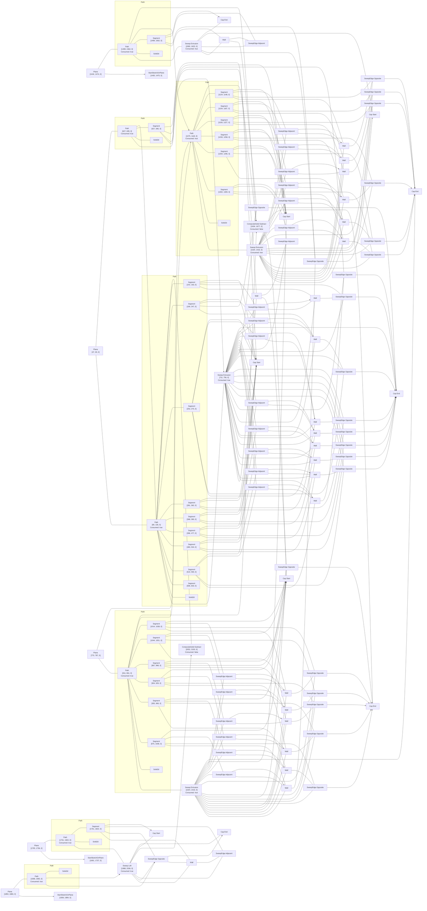

```mermaid
flowchart LR
  subgraph path13 [Path]
    13["Path<br>[1075, 1118, 0]<br>Consumed: true"]
      %% [ProgramBodyItem { index: 5 }, VariableDeclarationDeclaration, VariableDeclarationInit, PipeBodyItem { index: 0 }]
    27["Segment<br>[1124, 1148, 0]"]
      %% [ProgramBodyItem { index: 5 }, VariableDeclarationDeclaration, VariableDeclarationInit, PipeBodyItem { index: 1 }]
    28["Segment<br>[1154, 1187, 0]"]
      %% [ProgramBodyItem { index: 5 }, VariableDeclarationDeclaration, VariableDeclarationInit, PipeBodyItem { index: 2 }]
    29["Segment<br>[1193, 1227, 0]"]
      %% [ProgramBodyItem { index: 5 }, VariableDeclarationDeclaration, VariableDeclarationInit, PipeBodyItem { index: 3 }]
    30["Segment<br>[1233, 1258, 0]"]
      %% [ProgramBodyItem { index: 5 }, VariableDeclarationDeclaration, VariableDeclarationInit, PipeBodyItem { index: 4 }]
    31["Segment<br>[1264, 1296, 0]"]
      %% [ProgramBodyItem { index: 5 }, VariableDeclarationDeclaration, VariableDeclarationInit, PipeBodyItem { index: 5 }]
    32["Segment<br>[1302, 1309, 0]"]
      %% [ProgramBodyItem { index: 5 }, VariableDeclarationDeclaration, VariableDeclarationInit, PipeBodyItem { index: 6 }]
    49[Solid2d]
  end
  subgraph path14 [Path]
    14["Path<br>[1499, 1562, 0]<br>Consumed: true"]
      %% [ProgramBodyItem { index: 8 }, VariableDeclarationDeclaration, VariableDeclarationInit]
    34["Segment<br>[1499, 1562, 0]"]
      %% [ProgramBodyItem { index: 8 }, VariableDeclarationDeclaration, VariableDeclarationInit]
    50[Solid2d]
  end
  subgraph path15 [Path]
    15["Path<br>[1761, 1822, 0]<br>Consumed: true"]
      %% [ProgramBodyItem { index: 12 }, VariableDeclarationDeclaration, VariableDeclarationInit]
    36["Segment<br>[1761, 1822, 0]"]
      %% [ProgramBodyItem { index: 12 }, VariableDeclarationDeclaration, VariableDeclarationInit]
    51[Solid2d]
  end
  subgraph path16 [Path]
    16["Path<br>[1908, 1965, 0]<br>Consumed: true"]
      %% [ProgramBodyItem { index: 14 }, VariableDeclarationDeclaration, VariableDeclarationInit]
    52[Solid2d]
  end
  subgraph path17 [Path]
    17["Path<br>[627, 695, 0]<br>Consumed: true"]
      %% [ProgramBodyItem { index: 1 }, VariableDeclarationDeclaration, VariableDeclarationInit, PipeBodyItem { index: 10 }, CallKwArg { index: 0 }]
    44["Segment<br>[627, 695, 0]"]
      %% [ProgramBodyItem { index: 1 }, VariableDeclarationDeclaration, VariableDeclarationInit, PipeBodyItem { index: 10 }, CallKwArg { index: 0 }]
    53[Solid2d]
  end
  subgraph path18 [Path]
    18["Path<br>[811, 861, 0]<br>Consumed: true"]
      %% [ProgramBodyItem { index: 4 }, VariableDeclarationDeclaration, VariableDeclarationInit, PipeBodyItem { index: 0 }]
    25["Segment<br>[1014, 1038, 0]"]
      %% [ProgramBodyItem { index: 4 }, VariableDeclarationDeclaration, VariableDeclarationInit, PipeBodyItem { index: 5 }]
    26["Segment<br>[1044, 1051, 0]"]
      %% [ProgramBodyItem { index: 4 }, VariableDeclarationDeclaration, VariableDeclarationInit, PipeBodyItem { index: 6 }]
    45["Segment<br>[867, 898, 0]"]
      %% [ProgramBodyItem { index: 4 }, VariableDeclarationDeclaration, VariableDeclarationInit, PipeBodyItem { index: 1 }]
    46["Segment<br>[904, 929, 0]"]
      %% [ProgramBodyItem { index: 4 }, VariableDeclarationDeclaration, VariableDeclarationInit, PipeBodyItem { index: 2 }]
    47["Segment<br>[935, 969, 0]"]
      %% [ProgramBodyItem { index: 4 }, VariableDeclarationDeclaration, VariableDeclarationInit, PipeBodyItem { index: 3 }]
    48["Segment<br>[975, 1008, 0]"]
      %% [ProgramBodyItem { index: 4 }, VariableDeclarationDeclaration, VariableDeclarationInit, PipeBodyItem { index: 4 }]
    54[Solid2d]
  end
  subgraph path19 [Path]
    19["Path<br>[89, 136, 0]<br>Consumed: true"]
      %% [ProgramBodyItem { index: 1 }, VariableDeclarationDeclaration, VariableDeclarationInit, PipeBodyItem { index: 0 }]
    33["Segment<br>[142, 163, 0]"]
      %% [ProgramBodyItem { index: 1 }, VariableDeclarationDeclaration, VariableDeclarationInit, PipeBodyItem { index: 1 }]
    35["Segment<br>[169, 247, 0]"]
      %% [ProgramBodyItem { index: 1 }, VariableDeclarationDeclaration, VariableDeclarationInit, PipeBodyItem { index: 2 }]
    37["Segment<br>[253, 275, 0]"]
      %% [ProgramBodyItem { index: 1 }, VariableDeclarationDeclaration, VariableDeclarationInit, PipeBodyItem { index: 3 }]
    38["Segment<br>[281, 362, 0]"]
      %% [ProgramBodyItem { index: 1 }, VariableDeclarationDeclaration, VariableDeclarationInit, PipeBodyItem { index: 4 }]
    39["Segment<br>[368, 390, 0]"]
      %% [ProgramBodyItem { index: 1 }, VariableDeclarationDeclaration, VariableDeclarationInit, PipeBodyItem { index: 5 }]
    40["Segment<br>[396, 477, 0]"]
      %% [ProgramBodyItem { index: 1 }, VariableDeclarationDeclaration, VariableDeclarationInit, PipeBodyItem { index: 6 }]
    41["Segment<br>[483, 504, 0]"]
      %% [ProgramBodyItem { index: 1 }, VariableDeclarationDeclaration, VariableDeclarationInit, PipeBodyItem { index: 7 }]
    42["Segment<br>[510, 590, 0]"]
      %% [ProgramBodyItem { index: 1 }, VariableDeclarationDeclaration, VariableDeclarationInit, PipeBodyItem { index: 8 }]
    43["Segment<br>[596, 603, 0]"]
      %% [ProgramBodyItem { index: 1 }, VariableDeclarationDeclaration, VariableDeclarationInit, PipeBodyItem { index: 9 }]
    55[Solid2d]
  end
  1["Cap End"]
    %% face_code_ref=Missing NodePath
  2["Cap End"]
    %% face_code_ref=Missing NodePath
  3["Cap End"]
    %% face_code_ref=Missing NodePath
  4["Cap End"]
    %% face_code_ref=Missing NodePath
  5["Cap End"]
    %% face_code_ref=Missing NodePath
  6["Cap Start"]
    %% face_code_ref=Missing NodePath
  7["Cap Start"]
    %% face_code_ref=Missing NodePath
  8["Cap Start"]
    %% face_code_ref=Missing NodePath
  9["Cap Start"]
    %% face_code_ref=Missing NodePath
  10["Cap Start"]
    %% face_code_ref=Missing NodePath
  11["CompositeSolid Subtract<br>[1634, 1677, 0]<br>Consumed: false"]
    %% [ProgramBodyItem { index: 10 }, VariableDeclarationDeclaration, VariableDeclarationInit]
  12["CompositeSolid Subtract<br>[2052, 2100, 0]<br>Consumed: false"]
    %% [ProgramBodyItem { index: 16 }, VariableDeclarationDeclaration, VariableDeclarationInit]
  20["Plane<br>[1444, 1474, 0]"]
    %% [ProgramBodyItem { index: 7 }, VariableDeclarationDeclaration, VariableDeclarationInit, CallKwUnlabeledArg]
  21["Plane<br>[1705, 1736, 0]"]
    %% [ProgramBodyItem { index: 11 }, VariableDeclarationDeclaration, VariableDeclarationInit, CallKwUnlabeledArg]
  22["Plane<br>[1850, 1883, 0]"]
    %% [ProgramBodyItem { index: 13 }, VariableDeclarationDeclaration, VariableDeclarationInit, CallKwUnlabeledArg]
  23["Plane<br>[47, 65, 0]"]
    %% [ProgramBodyItem { index: 0 }, VariableDeclarationDeclaration, VariableDeclarationInit]
  24["Plane<br>[770, 787, 0]"]
    %% [ProgramBodyItem { index: 3 }, VariableDeclarationDeclaration, VariableDeclarationInit]
  56["StartSketchOnPlane<br>[1430, 1475, 0]"]
    %% [ProgramBodyItem { index: 7 }, VariableDeclarationDeclaration, VariableDeclarationInit]
  57["StartSketchOnPlane<br>[1691, 1737, 0]"]
    %% [ProgramBodyItem { index: 11 }, VariableDeclarationDeclaration, VariableDeclarationInit]
  58["StartSketchOnPlane<br>[1836, 1884, 0]"]
    %% [ProgramBodyItem { index: 13 }, VariableDeclarationDeclaration, VariableDeclarationInit]
  59["Sweep Extrusion<br>[1324, 1416, 0]<br>Consumed: true"]
    %% [ProgramBodyItem { index: 6 }, VariableDeclarationDeclaration, VariableDeclarationInit]
  60["Sweep Extrusion<br>[1324, 1416, 0]<br>Consumed: true"]
    %% [ProgramBodyItem { index: 6 }, VariableDeclarationDeclaration, VariableDeclarationInit]
  61["Sweep Extrusion<br>[1580, 1623, 0]<br>Consumed: true"]
    %% [ProgramBodyItem { index: 9 }, VariableDeclarationDeclaration, VariableDeclarationInit]
  62["Sweep Extrusion<br>[711, 756, 0]<br>Consumed: true"]
    %% [ProgramBodyItem { index: 2 }, VariableDeclarationDeclaration, VariableDeclarationInit]
  63["Sweep Loft<br>[1988, 2036, 0]<br>Consumed: true"]
    %% [ProgramBodyItem { index: 15 }, VariableDeclarationDeclaration, VariableDeclarationInit]
  64["SweepEdge Adjacent"]
  65["SweepEdge Adjacent"]
  66["SweepEdge Adjacent"]
  67["SweepEdge Adjacent"]
  68["SweepEdge Adjacent"]
  69["SweepEdge Adjacent"]
  70["SweepEdge Adjacent"]
  71["SweepEdge Adjacent"]
  72["SweepEdge Adjacent"]
  73["SweepEdge Adjacent"]
  74["SweepEdge Adjacent"]
  75["SweepEdge Adjacent"]
  76["SweepEdge Adjacent"]
  77["SweepEdge Adjacent"]
  78["SweepEdge Adjacent"]
  79["SweepEdge Adjacent"]
  80["SweepEdge Adjacent"]
  81["SweepEdge Adjacent"]
  82["SweepEdge Adjacent"]
  83["SweepEdge Adjacent"]
  84["SweepEdge Adjacent"]
  85["SweepEdge Adjacent"]
  86["SweepEdge Adjacent"]
  87["SweepEdge Opposite"]
  88["SweepEdge Opposite"]
  89["SweepEdge Opposite"]
  90["SweepEdge Opposite"]
  91["SweepEdge Opposite"]
  92["SweepEdge Opposite"]
  93["SweepEdge Opposite"]
  94["SweepEdge Opposite"]
  95["SweepEdge Opposite"]
  96["SweepEdge Opposite"]
  97["SweepEdge Opposite"]
  98["SweepEdge Opposite"]
  99["SweepEdge Opposite"]
  100["SweepEdge Opposite"]
  101["SweepEdge Opposite"]
  102["SweepEdge Opposite"]
  103["SweepEdge Opposite"]
  104["SweepEdge Opposite"]
  105["SweepEdge Opposite"]
  106["SweepEdge Opposite"]
  107["SweepEdge Opposite"]
  108["SweepEdge Opposite"]
  109["SweepEdge Opposite"]
  110[Wall]
    %% face_code_ref=Missing NodePath
  111[Wall]
    %% face_code_ref=Missing NodePath
  112[Wall]
    %% face_code_ref=Missing NodePath
  113[Wall]
    %% face_code_ref=Missing NodePath
  114[Wall]
    %% face_code_ref=Missing NodePath
  115[Wall]
    %% face_code_ref=Missing NodePath
  116[Wall]
    %% face_code_ref=Missing NodePath
  117[Wall]
    %% face_code_ref=Missing NodePath
  118[Wall]
    %% face_code_ref=Missing NodePath
  119[Wall]
    %% face_code_ref=Missing NodePath
  120[Wall]
    %% face_code_ref=Missing NodePath
  121[Wall]
    %% face_code_ref=Missing NodePath
  122[Wall]
    %% face_code_ref=Missing NodePath
  123[Wall]
    %% face_code_ref=Missing NodePath
  124[Wall]
    %% face_code_ref=Missing NodePath
  125[Wall]
    %% face_code_ref=Missing NodePath
  126[Wall]
    %% face_code_ref=Missing NodePath
  127[Wall]
    %% face_code_ref=Missing NodePath
  128[Wall]
    %% face_code_ref=Missing NodePath
  129[Wall]
    %% face_code_ref=Missing NodePath
  130[Wall]
    %% face_code_ref=Missing NodePath
  131[Wall]
    %% face_code_ref=Missing NodePath
  132[Wall]
    %% face_code_ref=Missing NodePath
  59 --- 1
  87 <--x 1
  88 <--x 1
  105 <--x 1
  106 <--x 1
  107 <--x 1
  108 <--x 1
  60 --- 2
  89 <--x 2
  90 <--x 2
  91 <--x 2
  92 <--x 2
  93 <--x 2
  94 <--x 2
  34 <--x 3
  61 --- 3
  62 --- 4
  95 <--x 4
  96 <--x 4
  98 <--x 4
  99 <--x 4
  100 <--x 4
  101 <--x 4
  102 <--x 4
  103 <--x 4
  104 <--x 4
  63 --- 5
  97 <--x 5
  25 <--x 6
  26 <--x 6
  45 <--x 6
  46 <--x 6
  47 <--x 6
  48 <--x 6
  59 --- 6
  27 <--x 7
  28 <--x 7
  29 <--x 7
  30 <--x 7
  31 <--x 7
  32 <--x 7
  60 --- 7
  61 --- 8
  109 <--x 8
  33 <--x 9
  35 <--x 9
  37 <--x 9
  38 <--x 9
  39 <--x 9
  40 <--x 9
  41 <--x 9
  42 <--x 9
  44 <--x 9
  62 --- 9
  36 <--x 10
  63 --- 10
  13 x--> 11
  14 x--> 11
  18 x--> 11
  19 --- 12
  63 x--> 12
  14 <--x 13
  18 <--x 13
  24 --- 13
  13 --- 27
  13 --- 28
  13 --- 29
  13 --- 30
  13 --- 31
  13 --- 32
  13 --- 49
  13 ---- 59
  20 --- 14
  14 --- 34
  14 --- 50
  14 ---- 61
  21 --- 15
  15 --- 36
  15 --- 51
  15 ---- 63
  22 --- 16
  16 --- 52
  16 x---> 63
  16 x--> 97
  17 --- 19
  23 --- 17
  17 --- 44
  17 --- 53
  17 x---> 62
  24 --- 18
  18 --- 25
  18 --- 26
  18 --- 45
  18 --- 46
  18 --- 47
  18 --- 48
  18 --- 54
  18 ---- 60
  23 --- 19
  19 --- 33
  19 --- 35
  19 --- 37
  19 --- 38
  19 --- 39
  19 --- 40
  19 --- 41
  19 --- 42
  19 --- 43
  19 --- 55
  19 ---- 62
  20 <--x 56
  21 <--x 57
  22 <--x 58
  25 --- 64
  25 --- 87
  25 --- 110
  26 --- 65
  26 --- 88
  26 --- 111
  27 --- 66
  27 --- 89
  27 --- 112
  28 --- 67
  28 --- 90
  28 --- 113
  29 --- 68
  29 --- 91
  29 --- 114
  30 --- 69
  30 --- 92
  30 --- 115
  31 --- 70
  31 --- 93
  31 --- 116
  32 --- 71
  32 --- 94
  32 --- 117
  33 --- 72
  33 --- 95
  33 --- 118
  34 --- 73
  34 --- 109
  34 --- 119
  35 --- 74
  35 --- 96
  35 --- 120
  36 --- 75
  36 --- 97
  36 --- 121
  37 --- 76
  37 --- 98
  37 --- 122
  38 --- 77
  38 --- 99
  38 --- 123
  39 --- 78
  39 --- 100
  39 --- 124
  40 --- 79
  40 --- 101
  40 --- 125
  41 --- 80
  41 --- 102
  41 --- 126
  42 --- 81
  42 --- 103
  42 --- 127
  44 --- 82
  44 --- 104
  44 --- 128
  45 --- 83
  45 --- 105
  45 --- 129
  46 --- 84
  46 --- 106
  46 --- 130
  47 --- 85
  47 --- 107
  47 --- 131
  48 --- 86
  48 --- 108
  48 --- 132
  59 --- 66
  59 --- 67
  59 --- 68
  59 --- 69
  59 --- 70
  59 --- 71
  59 --- 89
  59 --- 90
  59 --- 91
  59 --- 92
  59 --- 93
  59 --- 94
  59 --- 112
  59 --- 113
  59 --- 114
  59 --- 115
  59 --- 116
  59 --- 117
  60 --- 64
  60 --- 65
  60 --- 83
  60 --- 84
  60 --- 85
  60 --- 86
  60 --- 87
  60 --- 88
  60 --- 105
  60 --- 106
  60 --- 107
  60 --- 108
  60 --- 110
  60 --- 111
  60 --- 129
  60 --- 130
  60 --- 131
  60 --- 132
  61 --- 73
  61 --- 109
  61 --- 119
  62 --- 72
  62 --- 74
  62 --- 76
  62 --- 77
  62 --- 78
  62 --- 79
  62 --- 80
  62 --- 81
  62 --- 82
  62 --- 95
  62 --- 96
  62 --- 98
  62 --- 99
  62 --- 100
  62 --- 101
  62 --- 102
  62 --- 103
  62 --- 104
  62 --- 118
  62 --- 120
  62 --- 122
  62 --- 123
  62 --- 124
  62 --- 125
  62 --- 126
  62 --- 127
  62 --- 128
  63 --- 75
  63 --- 97
  63 --- 121
  110 --- 64
  64 x--> 110
  111 --- 65
  65 x--> 111
  112 --- 66
  66 x--> 112
  113 --- 67
  67 x--> 113
  114 --- 68
  68 x--> 114
  115 --- 69
  69 x--> 115
  116 --- 70
  70 x--> 116
  71 x--> 117
  117 --- 71
  118 --- 72
  72 x--> 118
  119 --- 73
  120 --- 74
  74 x--> 120
  121 --- 75
  122 --- 76
  76 x--> 122
  123 --- 77
  77 x--> 123
  124 --- 78
  78 x--> 124
  125 --- 79
  79 x--> 125
  126 --- 80
  80 x--> 126
  81 x--> 127
  127 --- 81
  128 --- 82
  129 --- 83
  83 x--> 129
  130 --- 84
  84 x--> 130
  131 --- 85
  85 x--> 131
  86 x--> 132
  132 --- 86
  110 --- 87
  111 --- 88
  112 --- 89
  113 --- 90
  114 --- 91
  115 --- 92
  116 --- 93
  117 --- 94
  118 --- 95
  119 --- 96
  97 --- 121
  120 --- 98
  122 --- 99
  123 --- 100
  124 --- 101
  125 --- 102
  126 --- 103
  127 --- 104
  128 --- 105
  129 --- 106
  130 --- 107
  131 --- 108
  132 --- 109
```
