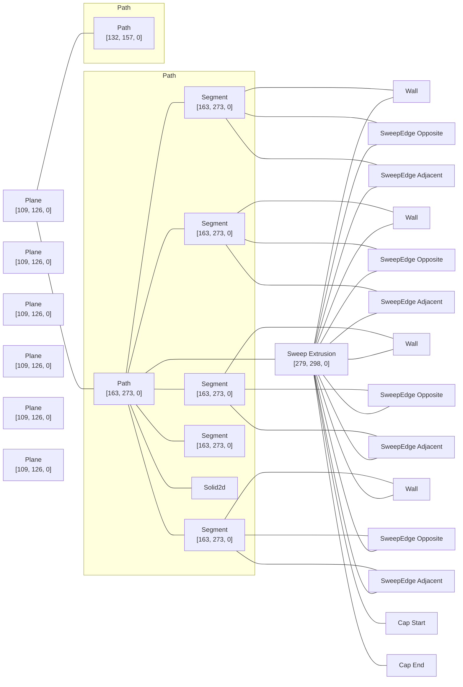

```mermaid
flowchart LR
  subgraph path7 [Path]
    7["Path<br>[132, 157, 0]"]
  end
  subgraph path8 [Path]
    8["Path<br>[163, 273, 0]"]
    9["Segment<br>[163, 273, 0]"]
    10["Segment<br>[163, 273, 0]"]
    11["Segment<br>[163, 273, 0]"]
    12["Segment<br>[163, 273, 0]"]
    13["Segment<br>[163, 273, 0]"]
    14[Solid2d]
  end
  1["Plane<br>[109, 126, 0]"]
  2["Plane<br>[109, 126, 0]"]
  3["Plane<br>[109, 126, 0]"]
  4["Plane<br>[109, 126, 0]"]
  5["Plane<br>[109, 126, 0]"]
  6["Plane<br>[109, 126, 0]"]
  15["Sweep Extrusion<br>[279, 298, 0]"]
  16[Wall]
  17[Wall]
  18[Wall]
  19[Wall]
  20["Cap Start"]
  21["Cap End"]
  22["SweepEdge Opposite"]
  23["SweepEdge Adjacent"]
  24["SweepEdge Opposite"]
  25["SweepEdge Adjacent"]
  26["SweepEdge Opposite"]
  27["SweepEdge Adjacent"]
  28["SweepEdge Opposite"]
  29["SweepEdge Adjacent"]
  1 --- 7
  1 --- 8
  8 --- 9
  8 --- 10
  8 --- 11
  8 --- 12
  8 --- 13
  8 ---- 15
  8 --- 14
  9 --- 16
  9 --- 22
  9 --- 23
  10 --- 17
  10 --- 24
  10 --- 25
  11 --- 18
  11 --- 26
  11 --- 27
  12 --- 19
  12 --- 28
  12 --- 29
  15 --- 16
  15 --- 17
  15 --- 18
  15 --- 19
  15 --- 20
  15 --- 21
  15 --- 22
  15 --- 23
  15 --- 24
  15 --- 25
  15 --- 26
  15 --- 27
  15 --- 28
  15 --- 29
```
