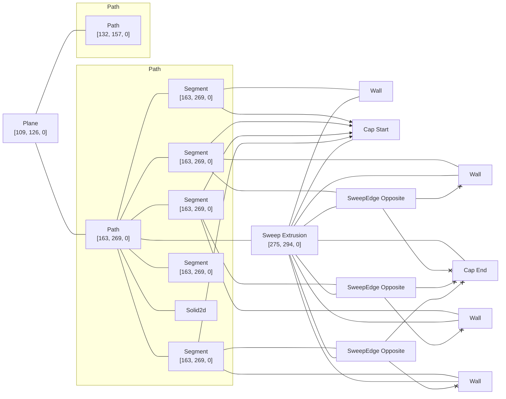

```mermaid
flowchart LR
  subgraph path2 [Path]
    2["Path<br>[132, 157, 0]"]
  end
  subgraph path3 [Path]
    3["Path<br>[163, 269, 0]"]
    4["Segment<br>[163, 269, 0]"]
    5["Segment<br>[163, 269, 0]"]
    6["Segment<br>[163, 269, 0]"]
    7["Segment<br>[163, 269, 0]"]
    8["Segment<br>[163, 269, 0]"]
    9[Solid2d]
  end
  1["Plane<br>[109, 126, 0]"]
  10["Sweep Extrusion<br>[275, 294, 0]"]
  11[Wall]
  12[Wall]
  13[Wall]
  14[Wall]
  15["Cap Start"]
  16["Cap End"]
  17["SweepEdge Opposite"]
  18["SweepEdge Opposite"]
  19["SweepEdge Opposite"]
  1 --- 2
  1 --- 3
  3 --- 4
  3 --- 5
  3 --- 6
  3 --- 7
  3 --- 8
  3 ---- 10
  3 --- 9
  4 --- 11
  4 x--> 15
  5 --- 12
  5 --- 17
  5 x--> 15
  6 --- 13
  6 --- 18
  6 x--> 15
  7 --- 14
  7 --- 19
  7 x--> 15
  10 --- 11
  10 --- 12
  10 --- 13
  10 --- 14
  10 --- 15
  10 --- 16
  10 --- 17
  10 --- 18
  10 --- 19
  17 <--x 12
  17 <--x 16
  18 <--x 13
  18 <--x 16
  19 <--x 14
  19 <--x 16
```
