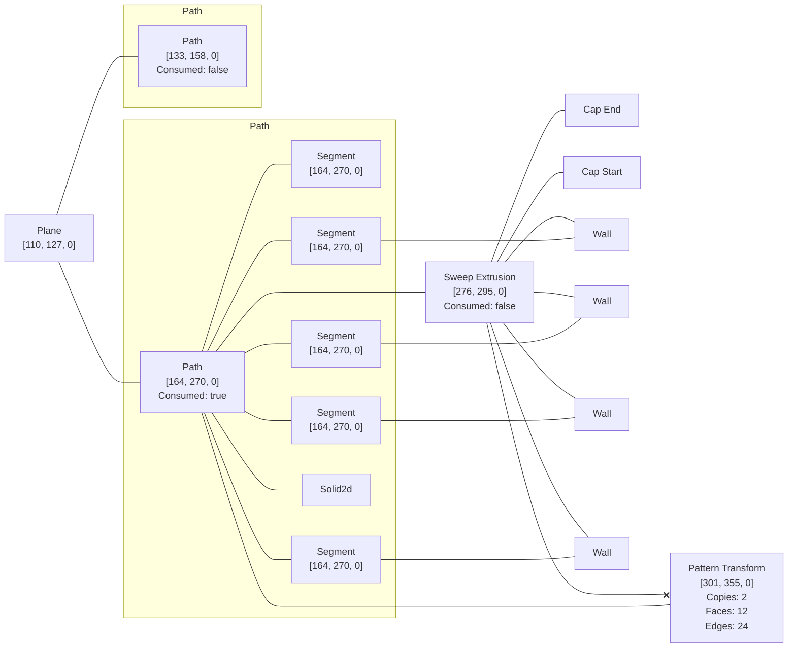

```mermaid
flowchart LR
  subgraph path3 [Path]
    3["Path<br>[133, 158, 0]<br>Consumed: false"]
      %% [ProgramBodyItem { index: 1 }, ExpressionStatementExpr, PipeBodyItem { index: 1 }]
  end
  subgraph path4 [Path]
    4["Path<br>[164, 270, 0]<br>Consumed: true"]
      %% [ProgramBodyItem { index: 1 }, ExpressionStatementExpr, PipeBodyItem { index: 2 }]
    7["Segment<br>[164, 270, 0]"]
      %% [ProgramBodyItem { index: 1 }, ExpressionStatementExpr, PipeBodyItem { index: 2 }]
    8["Segment<br>[164, 270, 0]"]
      %% [ProgramBodyItem { index: 1 }, ExpressionStatementExpr, PipeBodyItem { index: 2 }]
    9["Segment<br>[164, 270, 0]"]
      %% [ProgramBodyItem { index: 1 }, ExpressionStatementExpr, PipeBodyItem { index: 2 }]
    10["Segment<br>[164, 270, 0]"]
      %% [ProgramBodyItem { index: 1 }, ExpressionStatementExpr, PipeBodyItem { index: 2 }]
    11["Segment<br>[164, 270, 0]"]
      %% [ProgramBodyItem { index: 1 }, ExpressionStatementExpr, PipeBodyItem { index: 2 }]
    12[Solid2d]
  end
  1["Cap End"]
    %% face_code_ref=Missing NodePath
  2["Cap Start"]
    %% face_code_ref=Missing NodePath
  5["Pattern Transform<br>[301, 355, 0]<br>Copies: 2<br>Faces: 12<br>Edges: 24"]
    %% [ProgramBodyItem { index: 1 }, ExpressionStatementExpr, PipeBodyItem { index: 4 }]
  6["Plane<br>[110, 127, 0]"]
    %% [ProgramBodyItem { index: 1 }, ExpressionStatementExpr, PipeBodyItem { index: 0 }]
  13["Sweep Extrusion<br>[276, 295, 0]<br>Consumed: false"]
    %% [ProgramBodyItem { index: 1 }, ExpressionStatementExpr, PipeBodyItem { index: 3 }]
  14[Wall]
    %% face_code_ref=Missing NodePath
  15[Wall]
    %% face_code_ref=Missing NodePath
  16[Wall]
    %% face_code_ref=Missing NodePath
  17[Wall]
    %% face_code_ref=Missing NodePath
  13 --- 1
  13 --- 2
  6 --- 3
  4 --- 5
  6 --- 4
  4 --- 7
  4 --- 8
  4 --- 9
  4 --- 10
  4 --- 11
  4 --- 12
  4 ---- 13
  13 <--x 5
  8 --- 14
  9 --- 15
  10 --- 16
  11 --- 17
  13 --- 14
  13 --- 15
  13 --- 16
  13 --- 17
```
