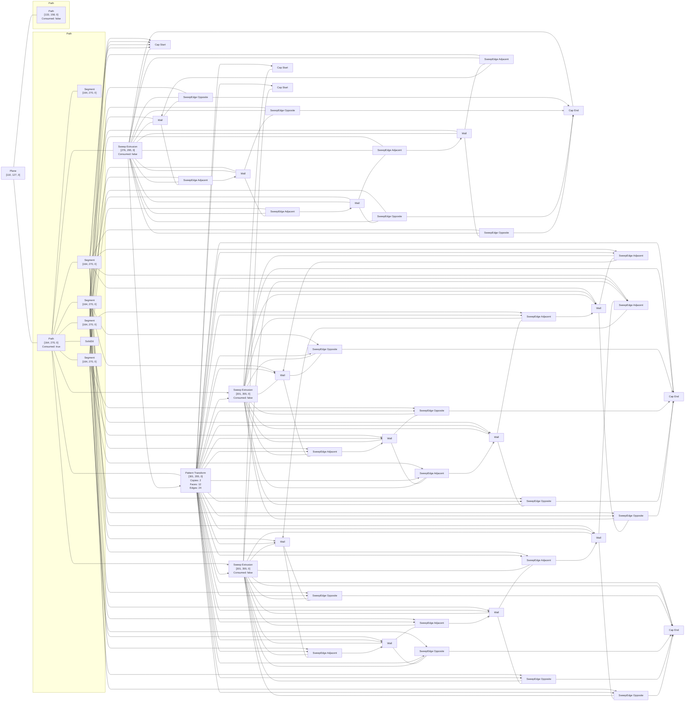

```mermaid
flowchart LR
  subgraph path2 [Path]
    2["Path<br>[133, 158, 0]<br>Consumed: false"]
      %% [ProgramBodyItem { index: 1 }, ExpressionStatementExpr, PipeBodyItem { index: 1 }]
  end
  subgraph path3 [Path]
    3["Path<br>[164, 270, 0]<br>Consumed: true"]
      %% [ProgramBodyItem { index: 1 }, ExpressionStatementExpr, PipeBodyItem { index: 2 }]
    4["Segment<br>[164, 270, 0]"]
      %% [ProgramBodyItem { index: 1 }, ExpressionStatementExpr, PipeBodyItem { index: 2 }]
    5["Segment<br>[164, 270, 0]"]
      %% [ProgramBodyItem { index: 1 }, ExpressionStatementExpr, PipeBodyItem { index: 2 }]
    6["Segment<br>[164, 270, 0]"]
      %% [ProgramBodyItem { index: 1 }, ExpressionStatementExpr, PipeBodyItem { index: 2 }]
    7["Segment<br>[164, 270, 0]"]
      %% [ProgramBodyItem { index: 1 }, ExpressionStatementExpr, PipeBodyItem { index: 2 }]
    8["Segment<br>[164, 270, 0]"]
      %% [ProgramBodyItem { index: 1 }, ExpressionStatementExpr, PipeBodyItem { index: 2 }]
    9[Solid2d]
  end
  1["Plane<br>[110, 127, 0]"]
    %% [ProgramBodyItem { index: 1 }, ExpressionStatementExpr, PipeBodyItem { index: 0 }]
  10["Sweep Extrusion<br>[276, 295, 0]<br>Consumed: false"]
    %% [ProgramBodyItem { index: 1 }, ExpressionStatementExpr, PipeBodyItem { index: 3 }]
  11[Wall]
    %% face_code_ref=Missing NodePath
  12[Wall]
    %% face_code_ref=Missing NodePath
  13[Wall]
    %% face_code_ref=Missing NodePath
  14[Wall]
    %% face_code_ref=Missing NodePath
  15["Cap Start"]
    %% face_code_ref=Missing NodePath
  16["Cap End"]
    %% face_code_ref=Missing NodePath
  17["SweepEdge Opposite"]
  18["SweepEdge Adjacent"]
  19["SweepEdge Opposite"]
  20["SweepEdge Adjacent"]
  21["SweepEdge Opposite"]
  22["SweepEdge Adjacent"]
  23["SweepEdge Opposite"]
  24["SweepEdge Adjacent"]
  25["Pattern Transform<br>[301, 355, 0]<br>Copies: 2<br>Faces: 12<br>Edges: 24"]
    %% [ProgramBodyItem { index: 1 }, ExpressionStatementExpr, PipeBodyItem { index: 4 }]
  26["Sweep Extrusion<br>[301, 355, 0]<br>Consumed: false"]
    %% [ProgramBodyItem { index: 1 }, ExpressionStatementExpr, PipeBodyItem { index: 4 }]
  27[Wall]
    %% face_code_ref=Missing NodePath
  28[Wall]
    %% face_code_ref=Missing NodePath
  29[Wall]
    %% face_code_ref=Missing NodePath
  30[Wall]
    %% face_code_ref=Missing NodePath
  31["Cap Start"]
    %% face_code_ref=Missing NodePath
  32["Cap End"]
    %% face_code_ref=Missing NodePath
  33["SweepEdge Opposite"]
  34["SweepEdge Adjacent"]
  35["SweepEdge Opposite"]
  36["SweepEdge Adjacent"]
  37["SweepEdge Opposite"]
  38["SweepEdge Adjacent"]
  39["SweepEdge Opposite"]
  40["SweepEdge Adjacent"]
  41["Sweep Extrusion<br>[301, 355, 0]<br>Consumed: false"]
    %% [ProgramBodyItem { index: 1 }, ExpressionStatementExpr, PipeBodyItem { index: 4 }]
  42[Wall]
    %% face_code_ref=Missing NodePath
  43[Wall]
    %% face_code_ref=Missing NodePath
  44[Wall]
    %% face_code_ref=Missing NodePath
  45[Wall]
    %% face_code_ref=Missing NodePath
  46["Cap Start"]
    %% face_code_ref=Missing NodePath
  47["Cap End"]
    %% face_code_ref=Missing NodePath
  48["SweepEdge Opposite"]
  49["SweepEdge Adjacent"]
  50["SweepEdge Opposite"]
  51["SweepEdge Adjacent"]
  52["SweepEdge Opposite"]
  53["SweepEdge Adjacent"]
  54["SweepEdge Opposite"]
  55["SweepEdge Adjacent"]
  1 --- 2
  1 --- 3
  3 --- 4
  3 --- 5
  3 --- 6
  3 --- 7
  3 --- 8
  3 --- 9
  3 ---- 10
  3 --- 25
  3 <---x 26
  3 <---x 41
  5 --- 11
  5 x--> 15
  5 --- 17
  5 --- 18
  5 <--x 27
  5 <--x 33
  5 <--x 34
  5 <--x 42
  5 <--x 48
  5 <--x 49
  6 --- 12
  6 x--> 15
  6 --- 19
  6 --- 20
  6 <--x 28
  6 <--x 35
  6 <--x 36
  6 <--x 43
  6 <--x 50
  6 <--x 51
  7 --- 13
  7 x--> 15
  7 --- 21
  7 --- 22
  7 <--x 29
  7 <--x 37
  7 <--x 38
  7 <--x 44
  7 <--x 52
  7 <--x 53
  8 --- 14
  8 x--> 15
  8 --- 23
  8 --- 24
  8 <--x 30
  8 <--x 39
  8 <--x 40
  8 <--x 45
  8 <--x 54
  8 <--x 55
  10 --- 11
  10 --- 12
  10 --- 13
  10 --- 14
  10 --- 15
  10 --- 16
  10 --- 17
  10 --- 18
  10 --- 19
  10 --- 20
  10 --- 21
  10 --- 22
  10 --- 23
  10 --- 24
  10 x--> 25
  11 --- 17
  11 --- 18
  24 <--x 11
  18 <--x 12
  12 --- 19
  12 --- 20
  20 <--x 13
  13 --- 21
  13 --- 22
  22 <--x 14
  14 --- 23
  14 --- 24
  17 <--x 16
  19 <--x 16
  21 <--x 16
  23 <--x 16
  25 x--> 26
  25 x--> 27
  25 x--> 28
  25 x--> 29
  25 x--> 30
  25 x--> 31
  25 x--> 32
  25 x--> 33
  25 x--> 34
  25 x--> 35
  25 x--> 36
  25 x--> 37
  25 x--> 38
  25 x--> 39
  25 x--> 40
  25 x--> 41
  25 x--> 42
  25 x--> 43
  25 x--> 44
  25 x--> 45
  25 x--> 46
  25 x--> 47
  25 x--> 48
  25 x--> 49
  25 x--> 50
  25 x--> 51
  25 x--> 52
  25 x--> 53
  25 x--> 54
  25 x--> 55
  26 --- 27
  26 --- 28
  26 --- 29
  26 --- 30
  26 --- 31
  26 --- 32
  26 --- 33
  26 --- 34
  26 --- 35
  26 --- 36
  26 --- 37
  26 --- 38
  26 --- 39
  26 --- 40
  27 --- 33
  27 --- 34
  40 <--x 27
  34 <--x 28
  28 --- 35
  28 --- 36
  36 <--x 29
  29 --- 37
  29 --- 38
  38 <--x 30
  30 --- 39
  30 --- 40
  33 <--x 32
  35 <--x 32
  37 <--x 32
  39 <--x 32
  41 --- 42
  41 --- 43
  41 --- 44
  41 --- 45
  41 --- 46
  41 --- 47
  41 --- 48
  41 --- 49
  41 --- 50
  41 --- 51
  41 --- 52
  41 --- 53
  41 --- 54
  41 --- 55
  42 --- 48
  42 --- 49
  55 <--x 42
  49 <--x 43
  43 --- 50
  43 --- 51
  51 <--x 44
  44 --- 52
  44 --- 53
  53 <--x 45
  45 --- 54
  45 --- 55
  48 <--x 47
  50 <--x 47
  52 <--x 47
  54 <--x 47
```
