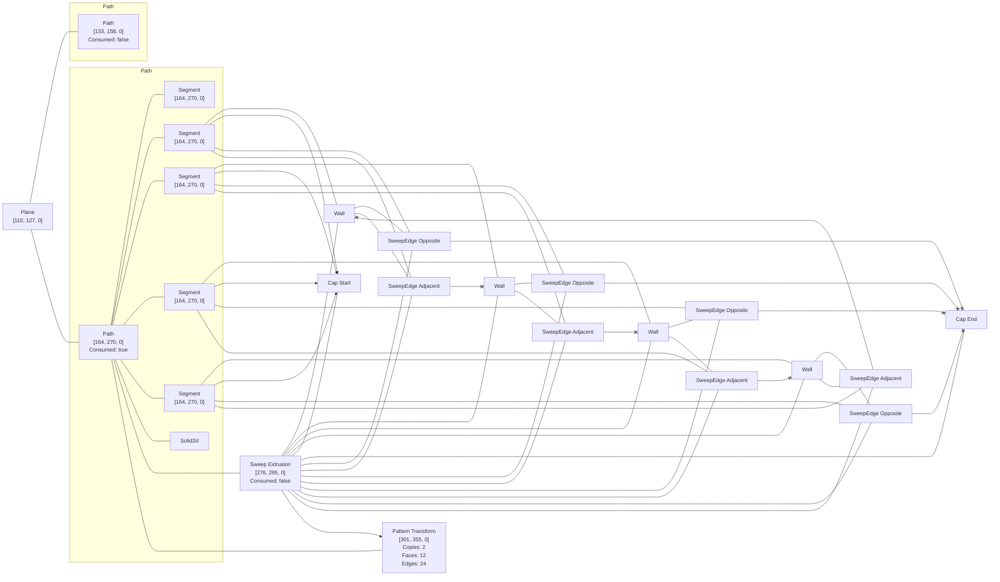

```mermaid
flowchart LR
  subgraph path2 [Path]
    2["Path<br>[133, 158, 0]<br>Consumed: false"]
      %% [ProgramBodyItem { index: 1 }, ExpressionStatementExpr, PipeBodyItem { index: 1 }]
  end
  subgraph path3 [Path]
    3["Path<br>[164, 270, 0]<br>Consumed: true"]
      %% [ProgramBodyItem { index: 1 }, ExpressionStatementExpr, PipeBodyItem { index: 2 }]
    4["Segment<br>[164, 270, 0]"]
      %% [ProgramBodyItem { index: 1 }, ExpressionStatementExpr, PipeBodyItem { index: 2 }]
    5["Segment<br>[164, 270, 0]"]
      %% [ProgramBodyItem { index: 1 }, ExpressionStatementExpr, PipeBodyItem { index: 2 }]
    6["Segment<br>[164, 270, 0]"]
      %% [ProgramBodyItem { index: 1 }, ExpressionStatementExpr, PipeBodyItem { index: 2 }]
    7["Segment<br>[164, 270, 0]"]
      %% [ProgramBodyItem { index: 1 }, ExpressionStatementExpr, PipeBodyItem { index: 2 }]
    8["Segment<br>[164, 270, 0]"]
      %% [ProgramBodyItem { index: 1 }, ExpressionStatementExpr, PipeBodyItem { index: 2 }]
    9[Solid2d]
  end
  1["Plane<br>[110, 127, 0]"]
    %% [ProgramBodyItem { index: 1 }, ExpressionStatementExpr, PipeBodyItem { index: 0 }]
  10["Sweep Extrusion<br>[276, 295, 0]<br>Consumed: false"]
    %% [ProgramBodyItem { index: 1 }, ExpressionStatementExpr, PipeBodyItem { index: 3 }]
  11[Wall]
    %% face_code_ref=Missing NodePath
  12[Wall]
    %% face_code_ref=Missing NodePath
  13[Wall]
    %% face_code_ref=Missing NodePath
  14[Wall]
    %% face_code_ref=Missing NodePath
  15["Cap Start"]
    %% face_code_ref=Missing NodePath
  16["Cap End"]
    %% face_code_ref=Missing NodePath
  17["SweepEdge Opposite"]
  18["SweepEdge Adjacent"]
  19["SweepEdge Opposite"]
  20["SweepEdge Adjacent"]
  21["SweepEdge Opposite"]
  22["SweepEdge Adjacent"]
  23["SweepEdge Opposite"]
  24["SweepEdge Adjacent"]
  25["Pattern Transform<br>[301, 355, 0]<br>Copies: 2<br>Faces: 12<br>Edges: 24"]
    %% [ProgramBodyItem { index: 1 }, ExpressionStatementExpr, PipeBodyItem { index: 4 }]
  1 --- 2
  1 --- 3
  3 --- 4
  3 --- 5
  3 --- 6
  3 --- 7
  3 --- 8
  3 --- 9
  3 ---- 10
  3 --- 25
  5 --- 11
  5 x--> 15
  5 --- 17
  5 --- 18
  6 --- 12
  6 x--> 15
  6 --- 19
  6 --- 20
  7 --- 13
  7 x--> 15
  7 --- 21
  7 --- 22
  8 --- 14
  8 x--> 15
  8 --- 23
  8 --- 24
  10 --- 11
  10 --- 12
  10 --- 13
  10 --- 14
  10 --- 15
  10 --- 16
  10 --- 17
  10 --- 18
  10 --- 19
  10 --- 20
  10 --- 21
  10 --- 22
  10 --- 23
  10 --- 24
  10 x--> 25
  11 --- 17
  11 --- 18
  24 <--x 11
  18 <--x 12
  12 --- 19
  12 --- 20
  20 <--x 13
  13 --- 21
  13 --- 22
  22 <--x 14
  14 --- 23
  14 --- 24
  17 <--x 16
  19 <--x 16
  21 <--x 16
  23 <--x 16
```
