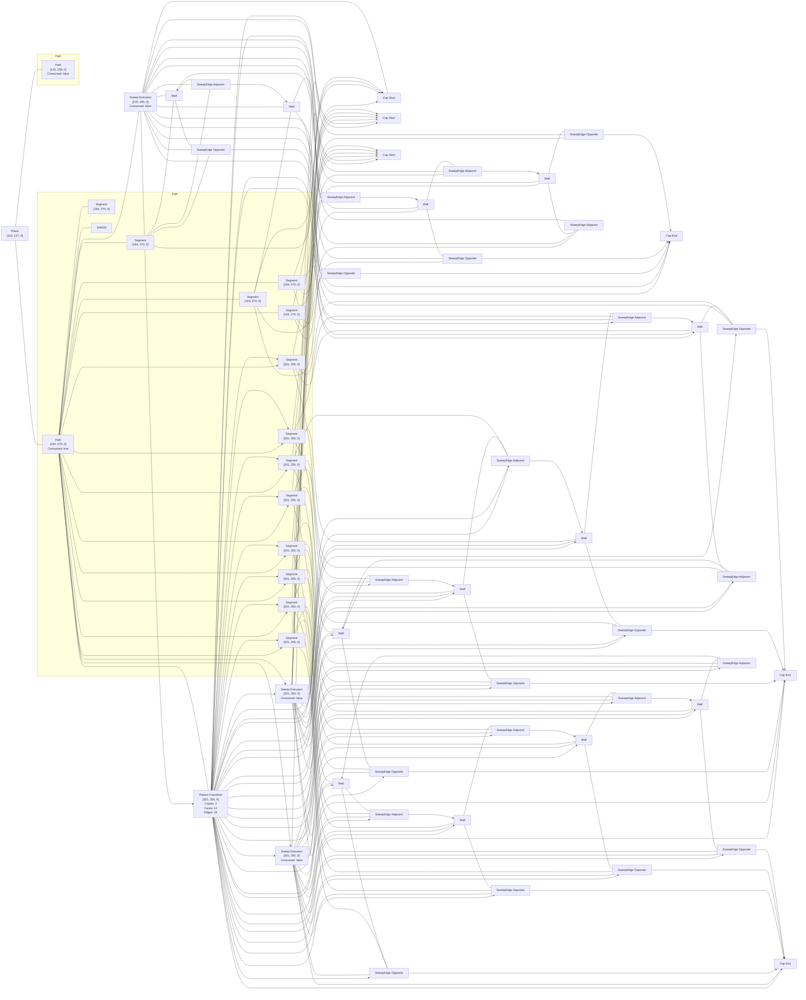

```mermaid
flowchart LR
  subgraph path2 [Path]
    2["Path<br>[133, 158, 0]<br>Consumed: false"]
      %% [ProgramBodyItem { index: 1 }, ExpressionStatementExpr, PipeBodyItem { index: 1 }]
  end
  subgraph path3 [Path]
    3["Path<br>[164, 270, 0]<br>Consumed: true"]
      %% [ProgramBodyItem { index: 1 }, ExpressionStatementExpr, PipeBodyItem { index: 2 }]
    4["Segment<br>[164, 270, 0]"]
      %% [ProgramBodyItem { index: 1 }, ExpressionStatementExpr, PipeBodyItem { index: 2 }]
    5["Segment<br>[164, 270, 0]"]
      %% [ProgramBodyItem { index: 1 }, ExpressionStatementExpr, PipeBodyItem { index: 2 }]
    6["Segment<br>[164, 270, 0]"]
      %% [ProgramBodyItem { index: 1 }, ExpressionStatementExpr, PipeBodyItem { index: 2 }]
    7["Segment<br>[164, 270, 0]"]
      %% [ProgramBodyItem { index: 1 }, ExpressionStatementExpr, PipeBodyItem { index: 2 }]
    8["Segment<br>[164, 270, 0]"]
      %% [ProgramBodyItem { index: 1 }, ExpressionStatementExpr, PipeBodyItem { index: 2 }]
    9[Solid2d]
    27["Segment<br>[301, 355, 0]"]
      %% [ProgramBodyItem { index: 1 }, ExpressionStatementExpr, PipeBodyItem { index: 4 }]
    28["Segment<br>[301, 355, 0]"]
      %% [ProgramBodyItem { index: 1 }, ExpressionStatementExpr, PipeBodyItem { index: 4 }]
    29["Segment<br>[301, 355, 0]"]
      %% [ProgramBodyItem { index: 1 }, ExpressionStatementExpr, PipeBodyItem { index: 4 }]
    30["Segment<br>[301, 355, 0]"]
      %% [ProgramBodyItem { index: 1 }, ExpressionStatementExpr, PipeBodyItem { index: 4 }]
    46["Segment<br>[301, 355, 0]"]
      %% [ProgramBodyItem { index: 1 }, ExpressionStatementExpr, PipeBodyItem { index: 4 }]
    47["Segment<br>[301, 355, 0]"]
      %% [ProgramBodyItem { index: 1 }, ExpressionStatementExpr, PipeBodyItem { index: 4 }]
    48["Segment<br>[301, 355, 0]"]
      %% [ProgramBodyItem { index: 1 }, ExpressionStatementExpr, PipeBodyItem { index: 4 }]
    49["Segment<br>[301, 355, 0]"]
      %% [ProgramBodyItem { index: 1 }, ExpressionStatementExpr, PipeBodyItem { index: 4 }]
  end
  1["Plane<br>[110, 127, 0]"]
    %% [ProgramBodyItem { index: 1 }, ExpressionStatementExpr, PipeBodyItem { index: 0 }]
  10["Sweep Extrusion<br>[276, 295, 0]<br>Consumed: false"]
    %% [ProgramBodyItem { index: 1 }, ExpressionStatementExpr, PipeBodyItem { index: 3 }]
  11[Wall]
    %% face_code_ref=Missing NodePath
  12[Wall]
    %% face_code_ref=Missing NodePath
  13[Wall]
    %% face_code_ref=Missing NodePath
  14[Wall]
    %% face_code_ref=Missing NodePath
  15["Cap Start"]
    %% face_code_ref=Missing NodePath
  16["Cap End"]
    %% face_code_ref=Missing NodePath
  17["SweepEdge Opposite"]
  18["SweepEdge Adjacent"]
  19["SweepEdge Opposite"]
  20["SweepEdge Adjacent"]
  21["SweepEdge Opposite"]
  22["SweepEdge Adjacent"]
  23["SweepEdge Opposite"]
  24["SweepEdge Adjacent"]
  25["Pattern Transform<br>[301, 355, 0]<br>Copies: 2<br>Faces: 12<br>Edges: 24"]
    %% [ProgramBodyItem { index: 1 }, ExpressionStatementExpr, PipeBodyItem { index: 4 }]
  26["Sweep Extrusion<br>[301, 355, 0]<br>Consumed: false"]
    %% [ProgramBodyItem { index: 1 }, ExpressionStatementExpr, PipeBodyItem { index: 4 }]
  31[Wall]
    %% face_code_ref=Missing NodePath
  32[Wall]
    %% face_code_ref=Missing NodePath
  33[Wall]
    %% face_code_ref=Missing NodePath
  34[Wall]
    %% face_code_ref=Missing NodePath
  35["Cap Start"]
    %% face_code_ref=Missing NodePath
  36["Cap End"]
    %% face_code_ref=Missing NodePath
  37["SweepEdge Opposite"]
  38["SweepEdge Adjacent"]
  39["SweepEdge Opposite"]
  40["SweepEdge Adjacent"]
  41["SweepEdge Opposite"]
  42["SweepEdge Adjacent"]
  43["SweepEdge Opposite"]
  44["SweepEdge Adjacent"]
  45["Sweep Extrusion<br>[301, 355, 0]<br>Consumed: false"]
    %% [ProgramBodyItem { index: 1 }, ExpressionStatementExpr, PipeBodyItem { index: 4 }]
  50[Wall]
    %% face_code_ref=Missing NodePath
  51[Wall]
    %% face_code_ref=Missing NodePath
  52[Wall]
    %% face_code_ref=Missing NodePath
  53[Wall]
    %% face_code_ref=Missing NodePath
  54["Cap Start"]
    %% face_code_ref=Missing NodePath
  55["Cap End"]
    %% face_code_ref=Missing NodePath
  56["SweepEdge Opposite"]
  57["SweepEdge Adjacent"]
  58["SweepEdge Opposite"]
  59["SweepEdge Adjacent"]
  60["SweepEdge Opposite"]
  61["SweepEdge Adjacent"]
  62["SweepEdge Opposite"]
  63["SweepEdge Adjacent"]
  1 --- 2
  1 --- 3
  3 --- 4
  3 --- 5
  3 --- 6
  3 --- 7
  3 --- 8
  3 --- 9
  3 ---- 10
  3 --- 25
  3 <---x 26
  3 <--x 27
  3 <--x 28
  3 <--x 29
  3 <--x 30
  3 <---x 45
  3 <--x 46
  3 <--x 47
  3 <--x 48
  3 <--x 49
  5 --- 11
  5 x--> 15
  5 --- 17
  5 --- 18
  6 --- 12
  6 x--> 15
  6 --- 19
  6 --- 20
  7 --- 13
  7 x--> 15
  7 --- 21
  7 --- 22
  8 --- 14
  8 x--> 15
  8 --- 23
  8 --- 24
  10 --- 11
  10 --- 12
  10 --- 13
  10 --- 14
  10 --- 15
  10 --- 16
  10 --- 17
  10 --- 18
  10 --- 19
  10 --- 20
  10 --- 21
  10 --- 22
  10 --- 23
  10 --- 24
  10 x--> 25
  11 --- 17
  11 --- 18
  24 <--x 11
  18 <--x 12
  12 --- 19
  12 --- 20
  20 <--x 13
  13 --- 21
  13 --- 22
  22 <--x 14
  14 --- 23
  14 --- 24
  17 <--x 16
  19 <--x 16
  21 <--x 16
  23 <--x 16
  25 x--> 26
  25 x--> 27
  25 x--> 28
  25 x--> 29
  25 x--> 30
  25 x--> 31
  25 x--> 32
  25 x--> 33
  25 x--> 34
  25 x--> 35
  25 x--> 36
  25 x--> 37
  25 x--> 38
  25 x--> 39
  25 x--> 40
  25 x--> 41
  25 x--> 42
  25 x--> 43
  25 x--> 44
  25 x--> 45
  25 x--> 46
  25 x--> 47
  25 x--> 48
  25 x--> 49
  25 x--> 50
  25 x--> 51
  25 x--> 52
  25 x--> 53
  25 x--> 54
  25 x--> 55
  25 x--> 56
  25 x--> 57
  25 x--> 58
  25 x--> 59
  25 x--> 60
  25 x--> 61
  25 x--> 62
  25 x--> 63
  26 --- 31
  26 --- 32
  26 --- 33
  26 --- 34
  26 --- 35
  26 --- 36
  26 --- 37
  26 --- 38
  26 --- 39
  26 --- 40
  26 --- 41
  26 --- 42
  26 --- 43
  26 --- 44
  27 --- 31
  27 x--> 35
  27 --- 37
  27 --- 38
  28 --- 32
  28 x--> 35
  28 --- 39
  28 --- 40
  29 --- 33
  29 x--> 35
  29 --- 41
  29 --- 42
  30 --- 34
  30 x--> 35
  30 --- 43
  30 --- 44
  31 --- 37
  31 --- 38
  44 <--x 31
  38 <--x 32
  32 --- 39
  32 --- 40
  40 <--x 33
  33 --- 41
  33 --- 42
  42 <--x 34
  34 --- 43
  34 --- 44
  37 <--x 36
  39 <--x 36
  41 <--x 36
  43 <--x 36
  45 --- 50
  45 --- 51
  45 --- 52
  45 --- 53
  45 --- 54
  45 --- 55
  45 --- 56
  45 --- 57
  45 --- 58
  45 --- 59
  45 --- 60
  45 --- 61
  45 --- 62
  45 --- 63
  46 --- 50
  46 x--> 54
  46 --- 56
  46 --- 57
  47 --- 51
  47 x--> 54
  47 --- 58
  47 --- 59
  48 --- 52
  48 x--> 54
  48 --- 60
  48 --- 61
  49 --- 53
  49 x--> 54
  49 --- 62
  49 --- 63
  50 --- 56
  50 --- 57
  63 <--x 50
  57 <--x 51
  51 --- 58
  51 --- 59
  59 <--x 52
  52 --- 60
  52 --- 61
  61 <--x 53
  53 --- 62
  53 --- 63
  56 <--x 55
  58 <--x 55
  60 <--x 55
  62 <--x 55
```
