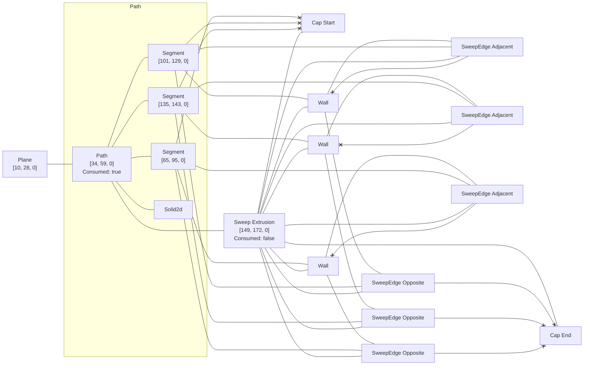

```mermaid
flowchart LR
  subgraph path7 [Path]
    7["Path<br>[34, 59, 0]<br>Consumed: true"]
      %% [ProgramBodyItem { index: 0 }, VariableDeclarationDeclaration, VariableDeclarationInit, PipeBodyItem { index: 1 }]
    8["Segment<br>[65, 95, 0]"]
      %% [ProgramBodyItem { index: 0 }, VariableDeclarationDeclaration, VariableDeclarationInit, PipeBodyItem { index: 2 }]
    9["Segment<br>[101, 129, 0]"]
      %% [ProgramBodyItem { index: 0 }, VariableDeclarationDeclaration, VariableDeclarationInit, PipeBodyItem { index: 3 }]
    10["Segment<br>[135, 143, 0]"]
      %% [ProgramBodyItem { index: 0 }, VariableDeclarationDeclaration, VariableDeclarationInit, PipeBodyItem { index: 4 }]
    12[Solid2d]
  end
  1["Cap End"]
    %% face_code_ref=Missing NodePath
  2["Cap Start"]
    %% face_code_ref=Missing NodePath
  3[Wall]
    %% face_code_ref=Missing NodePath
  4[Wall]
    %% face_code_ref=Missing NodePath
  5[Wall]
    %% face_code_ref=Missing NodePath
  6["Plane<br>[10, 28, 0]"]
    %% [ProgramBodyItem { index: 0 }, VariableDeclarationDeclaration, VariableDeclarationInit, PipeBodyItem { index: 0 }]
  11["Sweep Extrusion<br>[149, 172, 0]<br>Consumed: false"]
    %% [ProgramBodyItem { index: 0 }, VariableDeclarationDeclaration, VariableDeclarationInit, PipeBodyItem { index: 5 }]
  13["SweepEdge Adjacent"]
  14["SweepEdge Adjacent"]
  15["SweepEdge Adjacent"]
  16["SweepEdge Opposite"]
  17["SweepEdge Opposite"]
  18["SweepEdge Opposite"]
  11 --- 1
  16 <--x 1
  17 <--x 1
  18 <--x 1
  8 <--x 2
  9 <--x 2
  10 <--x 2
  11 --- 2
  9 --- 3
  11 --- 3
  3 --- 13
  13 <--x 3
  3 --- 16
  10 --- 4
  11 --- 4
  4 --- 14
  14 <--x 4
  4 --- 17
  8 --- 5
  11 --- 5
  5 --- 15
  15 <--x 5
  5 --- 18
  6 --- 7
  7 --- 8
  7 --- 9
  7 --- 10
  7 ---- 11
  7 --- 12
  8 --- 15
  8 --- 18
  9 --- 13
  9 --- 16
  10 --- 14
  10 --- 17
  11 --- 13
  11 --- 14
  11 --- 15
  11 --- 16
  11 --- 17
  11 --- 18
```
