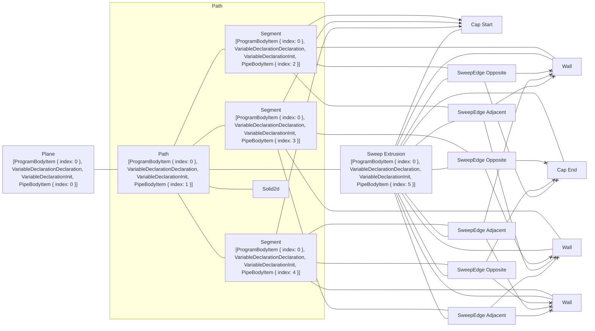

```mermaid
flowchart LR
  subgraph path2 [Path]
    2["Path<br>[ProgramBodyItem { index: 0 }, VariableDeclarationDeclaration, VariableDeclarationInit, PipeBodyItem { index: 1 }]"]
    3["Segment<br>[ProgramBodyItem { index: 0 }, VariableDeclarationDeclaration, VariableDeclarationInit, PipeBodyItem { index: 2 }]"]
    4["Segment<br>[ProgramBodyItem { index: 0 }, VariableDeclarationDeclaration, VariableDeclarationInit, PipeBodyItem { index: 3 }]"]
    5["Segment<br>[ProgramBodyItem { index: 0 }, VariableDeclarationDeclaration, VariableDeclarationInit, PipeBodyItem { index: 4 }]"]
    6[Solid2d]
  end
  1["Plane<br>[ProgramBodyItem { index: 0 }, VariableDeclarationDeclaration, VariableDeclarationInit, PipeBodyItem { index: 0 }]"]
  7["Sweep Extrusion<br>[ProgramBodyItem { index: 0 }, VariableDeclarationDeclaration, VariableDeclarationInit, PipeBodyItem { index: 5 }]"]
  8[Wall]
  9[Wall]
  10[Wall]
  11["Cap Start"]
  12["Cap End"]
  13["SweepEdge Opposite"]
  14["SweepEdge Opposite"]
  15["SweepEdge Opposite"]
  16["SweepEdge Adjacent"]
  17["SweepEdge Adjacent"]
  18["SweepEdge Adjacent"]
  1 --- 2
  2 --- 3
  2 --- 4
  2 --- 5
  2 --- 6
  2 ---- 7
  3 --- 9
  3 x--> 11
  3 --- 15
  3 --- 17
  4 --- 8
  4 x--> 11
  4 --- 13
  4 --- 18
  5 --- 10
  5 x--> 11
  5 --- 14
  5 --- 16
  7 --- 8
  7 --- 9
  7 --- 10
  7 --- 11
  7 --- 12
  7 --- 13
  7 --- 14
  7 --- 15
  7 --- 16
  7 --- 17
  7 --- 18
  13 <--x 8
  17 <--x 8
  18 <--x 8
  15 <--x 9
  16 <--x 9
  17 <--x 9
  14 <--x 10
  16 <--x 10
  18 <--x 10
  13 <--x 12
  14 <--x 12
  15 <--x 12
```
