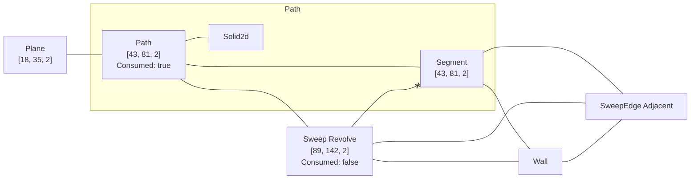

```mermaid
flowchart LR
  subgraph path1 [Path]
    1["Path<br>[43, 81, 2]<br>Consumed: true"]
      %% [ProgramBodyItem { index: 0 }, ExpressionStatementExpr, PipeBodyItem { index: 1 }]
    3["Segment<br>[43, 81, 2]"]
      %% [ProgramBodyItem { index: 0 }, ExpressionStatementExpr, PipeBodyItem { index: 1 }]
    4[Solid2d]
  end
  2["Plane<br>[18, 35, 2]"]
    %% [ProgramBodyItem { index: 0 }, ExpressionStatementExpr, PipeBodyItem { index: 0 }]
  5["Sweep Revolve<br>[89, 142, 2]<br>Consumed: false"]
    %% [ProgramBodyItem { index: 0 }, ExpressionStatementExpr, PipeBodyItem { index: 2 }]
  7[Wall]
    %% face_code_ref=Missing NodePath
  6["SweepEdge Adjacent"]
  2 --- 1
  1 --- 3
  1 --- 4
  1 ---- 5
  5 <--x 3
  3 --- 6
  3 --- 7
  5 --- 6
  5 --- 7
  7 --- 6
```
