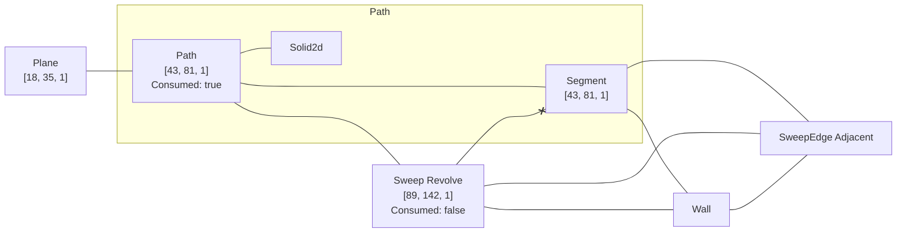

```mermaid
flowchart LR
  subgraph path2 [Path]
    2["Path<br>[43, 81, 1]<br>Consumed: true"]
      %% [ProgramBodyItem { index: 0 }]
    3["Segment<br>[43, 81, 1]"]
      %% [ProgramBodyItem { index: 0 }]
    4[Solid2d]
  end
  1["Plane<br>[18, 35, 1]"]
    %% [ProgramBodyItem { index: 0 }]
  5["Sweep Revolve<br>[89, 142, 1]<br>Consumed: false"]
    %% [ProgramBodyItem { index: 0 }]
  6[Wall]
    %% face_code_ref=Missing NodePath
  7["SweepEdge Adjacent"]
  1 --- 2
  2 --- 3
  2 --- 4
  2 ---- 5
  5 <--x 3
  3 --- 6
  3 --- 7
  5 --- 6
  5 --- 7
  6 --- 7
```
