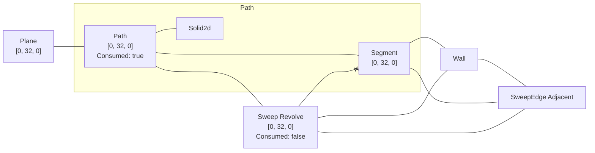

```mermaid
flowchart LR
  subgraph path2 [Path]
    2["Path<br>[0, 32, 0]<br>Consumed: true"]
      %% [ProgramBodyItem { index: 0 }]
    4["Segment<br>[0, 32, 0]"]
      %% [ProgramBodyItem { index: 0 }]
    6[Solid2d]
  end
  1[Wall]
    %% face_code_ref=Missing NodePath
  3["Plane<br>[0, 32, 0]"]
    %% [ProgramBodyItem { index: 0 }]
  5["Sweep Revolve<br>[0, 32, 0]<br>Consumed: false"]
    %% [ProgramBodyItem { index: 0 }]
  7["SweepEdge Adjacent"]
  4 --- 1
  5 --- 1
  1 --- 7
  3 --- 2
  2 --- 4
  2 ---- 5
  2 --- 6
  5 <--x 4
  4 --- 7
  5 --- 7
```
