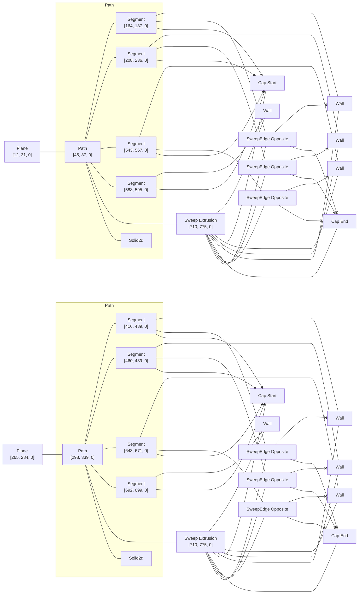

```mermaid
flowchart LR
  subgraph path2 [Path]
    2["Path<br>[45, 87, 0]"]
    3["Segment<br>[164, 187, 0]"]
    4["Segment<br>[208, 236, 0]"]
    9["Segment<br>[543, 567, 0]"]
    10["Segment<br>[588, 595, 0]"]
    11[Solid2d]
  end
  subgraph path6 [Path]
    6["Path<br>[298, 339, 0]"]
    7["Segment<br>[416, 439, 0]"]
    8["Segment<br>[460, 489, 0]"]
    12["Segment<br>[643, 671, 0]"]
    13["Segment<br>[692, 699, 0]"]
    14[Solid2d]
  end
  1["Plane<br>[12, 31, 0]"]
  5["Plane<br>[265, 284, 0]"]
  15["Sweep Extrusion<br>[710, 775, 0]"]
  16[Wall]
  17[Wall]
  18[Wall]
  19[Wall]
  20["Cap Start"]
  21["Cap End"]
  22["SweepEdge Opposite"]
  23["SweepEdge Opposite"]
  24["SweepEdge Opposite"]
  25["Sweep Extrusion<br>[710, 775, 0]"]
  26[Wall]
  27[Wall]
  28[Wall]
  29[Wall]
  30["Cap Start"]
  31["Cap End"]
  32["SweepEdge Opposite"]
  33["SweepEdge Opposite"]
  34["SweepEdge Opposite"]
  1 --- 2
  2 --- 3
  2 --- 4
  2 --- 9
  2 --- 10
  2 ---- 15
  2 --- 11
  3 --- 19
  3 --- 24
  3 x--> 20
  4 --- 18
  4 --- 23
  4 x--> 20
  5 --- 6
  6 --- 7
  6 --- 8
  6 --- 12
  6 --- 13
  6 ---- 25
  6 --- 14
  7 --- 29
  7 --- 34
  7 x--> 30
  8 --- 28
  8 --- 33
  8 x--> 30
  9 --- 17
  9 --- 22
  9 x--> 20
  10 --- 16
  10 x--> 20
  12 --- 27
  12 --- 32
  12 x--> 30
  13 --- 26
  13 x--> 30
  15 --- 16
  15 --- 17
  15 --- 18
  15 --- 19
  15 --- 20
  15 --- 21
  15 --- 22
  15 --- 23
  15 --- 24
  22 <--x 17
  22 <--x 21
  23 <--x 18
  23 <--x 21
  24 <--x 19
  24 <--x 21
  25 --- 26
  25 --- 27
  25 --- 28
  25 --- 29
  25 --- 30
  25 --- 31
  25 --- 32
  25 --- 33
  25 --- 34
  32 <--x 27
  32 <--x 31
  33 <--x 28
  33 <--x 31
  34 <--x 29
  34 <--x 31
```
