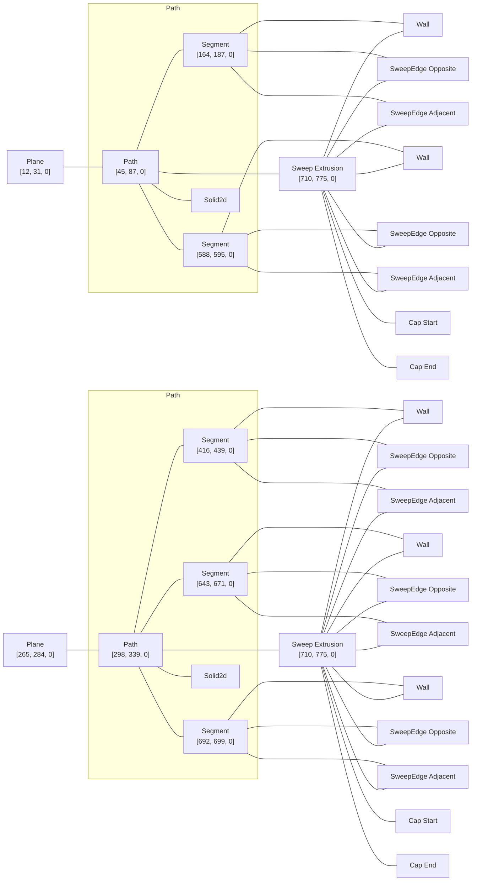

```mermaid
flowchart LR
  subgraph path2 [Path]
    2["Path<br>[45, 87, 0]"]
    3["Segment<br>[164, 187, 0]"]
    7["Segment<br>[588, 595, 0]"]
    8[Solid2d]
  end
  subgraph path5 [Path]
    5["Path<br>[298, 339, 0]"]
    6["Segment<br>[416, 439, 0]"]
    9["Segment<br>[643, 671, 0]"]
    10["Segment<br>[692, 699, 0]"]
    11[Solid2d]
  end
  1["Plane<br>[12, 31, 0]"]
  4["Plane<br>[265, 284, 0]"]
  12["Sweep Extrusion<br>[710, 775, 0]"]
  13[Wall]
  14[Wall]
  15["Cap Start"]
  16["Cap End"]
  17["SweepEdge Opposite"]
  18["SweepEdge Adjacent"]
  19["SweepEdge Opposite"]
  20["SweepEdge Adjacent"]
  21["Sweep Extrusion<br>[710, 775, 0]"]
  22[Wall]
  23[Wall]
  24[Wall]
  25["Cap Start"]
  26["Cap End"]
  27["SweepEdge Opposite"]
  28["SweepEdge Adjacent"]
  29["SweepEdge Opposite"]
  30["SweepEdge Adjacent"]
  31["SweepEdge Opposite"]
  32["SweepEdge Adjacent"]
  1 --- 2
  2 --- 3
  2 --- 7
  2 ---- 12
  2 --- 8
  3 --- 14
  3 --- 19
  3 --- 20
  4 --- 5
  5 --- 6
  5 --- 9
  5 --- 10
  5 ---- 21
  5 --- 11
  6 --- 24
  6 --- 31
  6 --- 32
  7 --- 13
  7 --- 17
  7 --- 18
  9 --- 23
  9 --- 29
  9 --- 30
  10 --- 22
  10 --- 27
  10 --- 28
  12 --- 13
  12 --- 14
  12 --- 15
  12 --- 16
  12 --- 17
  12 --- 18
  12 --- 19
  12 --- 20
  21 --- 22
  21 --- 23
  21 --- 24
  21 --- 25
  21 --- 26
  21 --- 27
  21 --- 28
  21 --- 29
  21 --- 30
  21 --- 31
  21 --- 32
```
