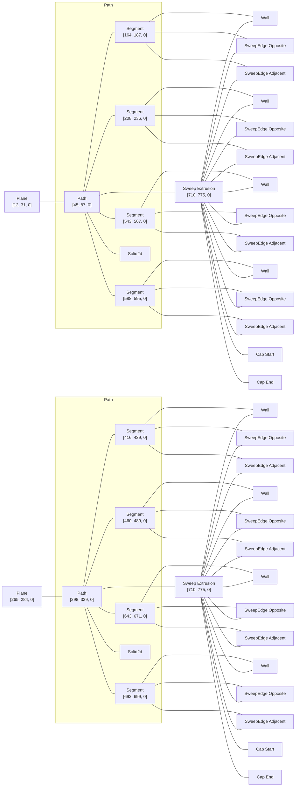

```mermaid
flowchart LR
  subgraph path2 [Path]
    2["Path<br>[45, 87, 0]"]
    3["Segment<br>[164, 187, 0]"]
    4["Segment<br>[208, 236, 0]"]
    9["Segment<br>[543, 567, 0]"]
    10["Segment<br>[588, 595, 0]"]
    11[Solid2d]
  end
  subgraph path6 [Path]
    6["Path<br>[298, 339, 0]"]
    7["Segment<br>[416, 439, 0]"]
    8["Segment<br>[460, 489, 0]"]
    12["Segment<br>[643, 671, 0]"]
    13["Segment<br>[692, 699, 0]"]
    14[Solid2d]
  end
  1["Plane<br>[12, 31, 0]"]
  5["Plane<br>[265, 284, 0]"]
  15["Sweep Extrusion<br>[710, 775, 0]"]
  16[Wall]
  17[Wall]
  18[Wall]
  19[Wall]
  20["Cap Start"]
  21["Cap End"]
  22["SweepEdge Opposite"]
  23["SweepEdge Adjacent"]
  24["SweepEdge Opposite"]
  25["SweepEdge Adjacent"]
  26["SweepEdge Opposite"]
  27["SweepEdge Adjacent"]
  28["SweepEdge Opposite"]
  29["SweepEdge Adjacent"]
  30["Sweep Extrusion<br>[710, 775, 0]"]
  31[Wall]
  32[Wall]
  33[Wall]
  34[Wall]
  35["Cap Start"]
  36["Cap End"]
  37["SweepEdge Opposite"]
  38["SweepEdge Adjacent"]
  39["SweepEdge Opposite"]
  40["SweepEdge Adjacent"]
  41["SweepEdge Opposite"]
  42["SweepEdge Adjacent"]
  43["SweepEdge Opposite"]
  44["SweepEdge Adjacent"]
  1 --- 2
  2 --- 3
  2 --- 4
  2 --- 9
  2 --- 10
  2 ---- 15
  2 --- 11
  3 --- 19
  3 --- 28
  3 --- 29
  4 --- 18
  4 --- 26
  4 --- 27
  5 --- 6
  6 --- 7
  6 --- 8
  6 --- 12
  6 --- 13
  6 ---- 30
  6 --- 14
  7 --- 34
  7 --- 43
  7 --- 44
  8 --- 33
  8 --- 41
  8 --- 42
  9 --- 17
  9 --- 24
  9 --- 25
  10 --- 16
  10 --- 22
  10 --- 23
  12 --- 32
  12 --- 39
  12 --- 40
  13 --- 31
  13 --- 37
  13 --- 38
  15 --- 16
  15 --- 17
  15 --- 18
  15 --- 19
  15 --- 20
  15 --- 21
  15 --- 22
  15 --- 23
  15 --- 24
  15 --- 25
  15 --- 26
  15 --- 27
  15 --- 28
  15 --- 29
  30 --- 31
  30 --- 32
  30 --- 33
  30 --- 34
  30 --- 35
  30 --- 36
  30 --- 37
  30 --- 38
  30 --- 39
  30 --- 40
  30 --- 41
  30 --- 42
  30 --- 43
  30 --- 44
```
