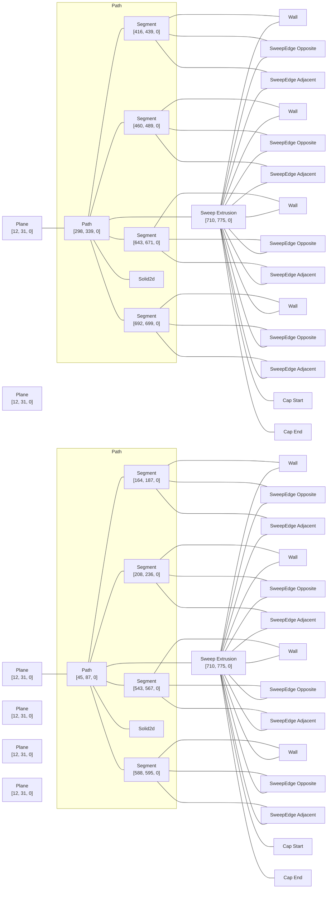

```mermaid
flowchart LR
  subgraph path7 [Path]
    7["Path<br>[45, 87, 0]"]
    8["Segment<br>[164, 187, 0]"]
    9["Segment<br>[208, 236, 0]"]
    13["Segment<br>[543, 567, 0]"]
    14["Segment<br>[588, 595, 0]"]
    15[Solid2d]
  end
  subgraph path10 [Path]
    10["Path<br>[298, 339, 0]"]
    11["Segment<br>[416, 439, 0]"]
    12["Segment<br>[460, 489, 0]"]
    16["Segment<br>[643, 671, 0]"]
    17["Segment<br>[692, 699, 0]"]
    18[Solid2d]
  end
  1["Plane<br>[12, 31, 0]"]
  2["Plane<br>[12, 31, 0]"]
  3["Plane<br>[12, 31, 0]"]
  4["Plane<br>[12, 31, 0]"]
  5["Plane<br>[12, 31, 0]"]
  6["Plane<br>[12, 31, 0]"]
  19["Sweep Extrusion<br>[710, 775, 0]"]
  20[Wall]
  21[Wall]
  22[Wall]
  23[Wall]
  24["Cap Start"]
  25["Cap End"]
  26["SweepEdge Opposite"]
  27["SweepEdge Adjacent"]
  28["SweepEdge Opposite"]
  29["SweepEdge Adjacent"]
  30["SweepEdge Opposite"]
  31["SweepEdge Adjacent"]
  32["SweepEdge Opposite"]
  33["SweepEdge Adjacent"]
  34["Sweep Extrusion<br>[710, 775, 0]"]
  35[Wall]
  36[Wall]
  37[Wall]
  38[Wall]
  39["Cap Start"]
  40["Cap End"]
  41["SweepEdge Opposite"]
  42["SweepEdge Adjacent"]
  43["SweepEdge Opposite"]
  44["SweepEdge Adjacent"]
  45["SweepEdge Opposite"]
  46["SweepEdge Adjacent"]
  47["SweepEdge Opposite"]
  48["SweepEdge Adjacent"]
  1 --- 10
  3 --- 7
  7 --- 8
  7 --- 9
  7 --- 13
  7 --- 14
  7 ---- 19
  7 --- 15
  8 --- 23
  8 --- 32
  8 --- 33
  9 --- 22
  9 --- 30
  9 --- 31
  10 --- 11
  10 --- 12
  10 --- 16
  10 --- 17
  10 ---- 34
  10 --- 18
  11 --- 38
  11 --- 47
  11 --- 48
  12 --- 37
  12 --- 45
  12 --- 46
  13 --- 21
  13 --- 28
  13 --- 29
  14 --- 20
  14 --- 26
  14 --- 27
  16 --- 36
  16 --- 43
  16 --- 44
  17 --- 35
  17 --- 41
  17 --- 42
  19 --- 20
  19 --- 21
  19 --- 22
  19 --- 23
  19 --- 24
  19 --- 25
  19 --- 26
  19 --- 27
  19 --- 28
  19 --- 29
  19 --- 30
  19 --- 31
  19 --- 32
  19 --- 33
  34 --- 35
  34 --- 36
  34 --- 37
  34 --- 38
  34 --- 39
  34 --- 40
  34 --- 41
  34 --- 42
  34 --- 43
  34 --- 44
  34 --- 45
  34 --- 46
  34 --- 47
  34 --- 48
```
