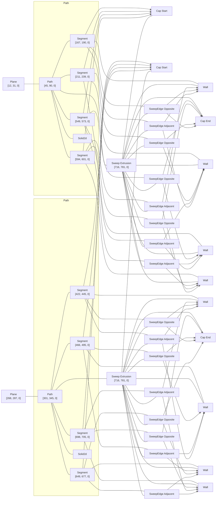

```mermaid
flowchart LR
  subgraph path3 [Path]
    3["Path<br>[45, 90, 0]"]
    5["Segment<br>[167, 190, 0]"]
    6["Segment<br>[211, 239, 0]"]
    9["Segment<br>[549, 573, 0]"]
    10["Segment<br>[594, 601, 0]"]
    14[Solid2d]
  end
  subgraph path4 [Path]
    4["Path<br>[301, 345, 0]"]
    7["Segment<br>[422, 445, 0]"]
    8["Segment<br>[466, 495, 0]"]
    11["Segment<br>[649, 677, 0]"]
    12["Segment<br>[698, 705, 0]"]
    13[Solid2d]
  end
  1["Plane<br>[12, 31, 0]"]
  2["Plane<br>[268, 287, 0]"]
  15["Sweep Extrusion<br>[716, 781, 0]"]
  16["Sweep Extrusion<br>[716, 781, 0]"]
  17[Wall]
  18[Wall]
  19[Wall]
  20[Wall]
  21[Wall]
  22[Wall]
  23[Wall]
  24[Wall]
  25["Cap Start"]
  26["Cap End"]
  27["Cap Start"]
  28["Cap End"]
  29["SweepEdge Opposite"]
  30["SweepEdge Adjacent"]
  31["SweepEdge Opposite"]
  32["SweepEdge Adjacent"]
  33["SweepEdge Opposite"]
  34["SweepEdge Adjacent"]
  35["SweepEdge Opposite"]
  36["SweepEdge Adjacent"]
  37["SweepEdge Opposite"]
  38["SweepEdge Adjacent"]
  39["SweepEdge Opposite"]
  40["SweepEdge Adjacent"]
  41["SweepEdge Opposite"]
  42["SweepEdge Adjacent"]
  43["SweepEdge Opposite"]
  44["SweepEdge Adjacent"]
  1 --- 3
  2 --- 4
  3 --- 5
  3 --- 6
  3 --- 9
  3 --- 10
  3 --- 14
  3 ---- 15
  4 --- 7
  4 --- 8
  4 --- 11
  4 --- 12
  4 --- 13
  4 ---- 16
  5 --- 20
  5 x--> 25
  5 --- 35
  5 --- 36
  6 --- 19
  6 x--> 25
  6 --- 33
  6 --- 34
  7 --- 23
  7 x--> 27
  7 --- 41
  7 --- 42
  8 --- 22
  8 x--> 27
  8 --- 39
  8 --- 40
  9 --- 17
  9 x--> 25
  9 --- 29
  9 --- 30
  10 --- 18
  10 x--> 25
  10 --- 31
  10 --- 32
  11 --- 24
  11 x--> 27
  11 --- 43
  11 --- 44
  12 --- 21
  12 x--> 27
  12 --- 37
  12 --- 38
  15 --- 17
  15 --- 18
  15 --- 19
  15 --- 20
  15 --- 25
  15 --- 26
  15 --- 29
  15 --- 30
  15 --- 31
  15 --- 32
  15 --- 33
  15 --- 34
  15 --- 35
  15 --- 36
  16 --- 21
  16 --- 22
  16 --- 23
  16 --- 24
  16 --- 27
  16 --- 28
  16 --- 37
  16 --- 38
  16 --- 39
  16 --- 40
  16 --- 41
  16 --- 42
  16 --- 43
  16 --- 44
  29 <--x 17
  30 <--x 17
  34 <--x 17
  30 <--x 18
  31 <--x 18
  32 <--x 18
  33 <--x 19
  34 <--x 19
  36 <--x 19
  32 <--x 20
  35 <--x 20
  36 <--x 20
  37 <--x 21
  38 <--x 21
  44 <--x 21
  39 <--x 22
  40 <--x 22
  42 <--x 22
  38 <--x 23
  41 <--x 23
  42 <--x 23
  40 <--x 24
  43 <--x 24
  44 <--x 24
  29 <--x 26
  31 <--x 26
  33 <--x 26
  35 <--x 26
  37 <--x 28
  39 <--x 28
  41 <--x 28
  43 <--x 28
```
