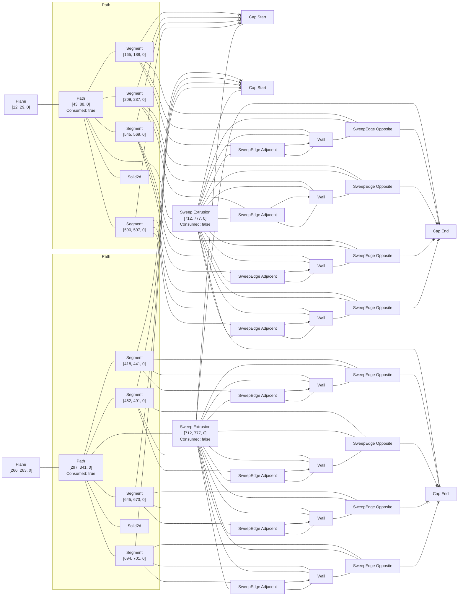

```mermaid
flowchart LR
  subgraph path5 [Path]
    5["Path<br>[297, 341, 0]<br>Consumed: true"]
      %% [ProgramBodyItem { index: 3 }, VariableDeclarationDeclaration, VariableDeclarationInit, PipeBodyItem { index: 0 }]
    11["Segment<br>[418, 441, 0]"]
      %% [ProgramBodyItem { index: 3 }, VariableDeclarationDeclaration, VariableDeclarationInit, PipeBodyItem { index: 1 }]
    12["Segment<br>[462, 491, 0]"]
      %% [ProgramBodyItem { index: 3 }, VariableDeclarationDeclaration, VariableDeclarationInit, PipeBodyItem { index: 2 }]
    15["Segment<br>[645, 673, 0]"]
      %% [ProgramBodyItem { index: 5 }, VariableDeclarationDeclaration, VariableDeclarationInit, PipeBodyItem { index: 1 }]
    16["Segment<br>[694, 701, 0]"]
      %% [ProgramBodyItem { index: 5 }, VariableDeclarationDeclaration, VariableDeclarationInit, PipeBodyItem { index: 2 }]
    17[Solid2d]
  end
  subgraph path6 [Path]
    6["Path<br>[43, 88, 0]<br>Consumed: true"]
      %% [ProgramBodyItem { index: 1 }, VariableDeclarationDeclaration, VariableDeclarationInit, PipeBodyItem { index: 0 }]
    9["Segment<br>[165, 188, 0]"]
      %% [ProgramBodyItem { index: 1 }, VariableDeclarationDeclaration, VariableDeclarationInit, PipeBodyItem { index: 1 }]
    10["Segment<br>[209, 237, 0]"]
      %% [ProgramBodyItem { index: 1 }, VariableDeclarationDeclaration, VariableDeclarationInit, PipeBodyItem { index: 2 }]
    13["Segment<br>[545, 569, 0]"]
      %% [ProgramBodyItem { index: 4 }, VariableDeclarationDeclaration, VariableDeclarationInit, PipeBodyItem { index: 1 }]
    14["Segment<br>[590, 597, 0]"]
      %% [ProgramBodyItem { index: 4 }, VariableDeclarationDeclaration, VariableDeclarationInit, PipeBodyItem { index: 2 }]
    18[Solid2d]
  end
  1["Cap End"]
    %% face_code_ref=Missing NodePath
  2["Cap End"]
    %% face_code_ref=Missing NodePath
  3["Cap Start"]
    %% face_code_ref=Missing NodePath
  4["Cap Start"]
    %% face_code_ref=Missing NodePath
  7["Plane<br>[12, 29, 0]"]
    %% [ProgramBodyItem { index: 0 }, VariableDeclarationDeclaration, VariableDeclarationInit]
  8["Plane<br>[266, 283, 0]"]
    %% [ProgramBodyItem { index: 2 }, VariableDeclarationDeclaration, VariableDeclarationInit]
  19["Sweep Extrusion<br>[712, 777, 0]<br>Consumed: false"]
    %% [ProgramBodyItem { index: 6 }, ExpressionStatementExpr]
  20["Sweep Extrusion<br>[712, 777, 0]<br>Consumed: false"]
    %% [ProgramBodyItem { index: 6 }, ExpressionStatementExpr]
  21["SweepEdge Adjacent"]
  22["SweepEdge Adjacent"]
  23["SweepEdge Adjacent"]
  24["SweepEdge Adjacent"]
  25["SweepEdge Adjacent"]
  26["SweepEdge Adjacent"]
  27["SweepEdge Adjacent"]
  28["SweepEdge Adjacent"]
  29["SweepEdge Opposite"]
  30["SweepEdge Opposite"]
  31["SweepEdge Opposite"]
  32["SweepEdge Opposite"]
  33["SweepEdge Opposite"]
  34["SweepEdge Opposite"]
  35["SweepEdge Opposite"]
  36["SweepEdge Opposite"]
  37[Wall]
    %% face_code_ref=Missing NodePath
  38[Wall]
    %% face_code_ref=Missing NodePath
  39[Wall]
    %% face_code_ref=Missing NodePath
  40[Wall]
    %% face_code_ref=Missing NodePath
  41[Wall]
    %% face_code_ref=Missing NodePath
  42[Wall]
    %% face_code_ref=Missing NodePath
  43[Wall]
    %% face_code_ref=Missing NodePath
  44[Wall]
    %% face_code_ref=Missing NodePath
  19 --- 1
  29 <--x 1
  30 <--x 1
  33 <--x 1
  34 <--x 1
  20 --- 2
  31 <--x 2
  32 <--x 2
  35 <--x 2
  36 <--x 2
  9 <--x 3
  10 <--x 3
  13 <--x 3
  14 <--x 3
  19 --- 3
  11 <--x 4
  12 <--x 4
  15 <--x 4
  16 <--x 4
  20 --- 4
  8 --- 5
  5 --- 11
  5 --- 12
  5 --- 15
  5 --- 16
  5 --- 17
  5 ---- 19
  7 --- 6
  6 --- 9
  6 --- 10
  6 --- 13
  6 --- 14
  6 --- 18
  6 ---- 20
  9 --- 21
  9 --- 29
  9 --- 37
  10 --- 22
  10 --- 30
  10 --- 38
  11 --- 23
  11 --- 31
  11 --- 39
  12 --- 24
  12 --- 32
  12 --- 40
  13 --- 25
  13 --- 33
  13 --- 41
  14 --- 26
  14 --- 34
  14 --- 42
  15 --- 27
  15 --- 35
  15 --- 43
  16 --- 28
  16 --- 36
  16 --- 44
  19 --- 23
  19 --- 24
  19 --- 27
  19 --- 28
  19 --- 31
  19 --- 32
  19 --- 35
  19 --- 36
  19 --- 39
  19 --- 40
  19 --- 43
  19 --- 44
  20 --- 21
  20 --- 22
  20 --- 25
  20 --- 26
  20 --- 29
  20 --- 30
  20 --- 33
  20 --- 34
  20 --- 37
  20 --- 38
  20 --- 41
  20 --- 42
  37 --- 21
  21 x--> 37
  38 --- 22
  22 x--> 38
  39 --- 23
  23 x--> 39
  40 --- 24
  24 x--> 40
  41 --- 25
  25 x--> 41
  26 x--> 42
  42 --- 26
  43 --- 27
  27 x--> 43
  28 x--> 44
  44 --- 28
  37 --- 29
  38 --- 30
  39 --- 31
  40 --- 32
  41 --- 33
  42 --- 34
  43 --- 35
  44 --- 36
```
