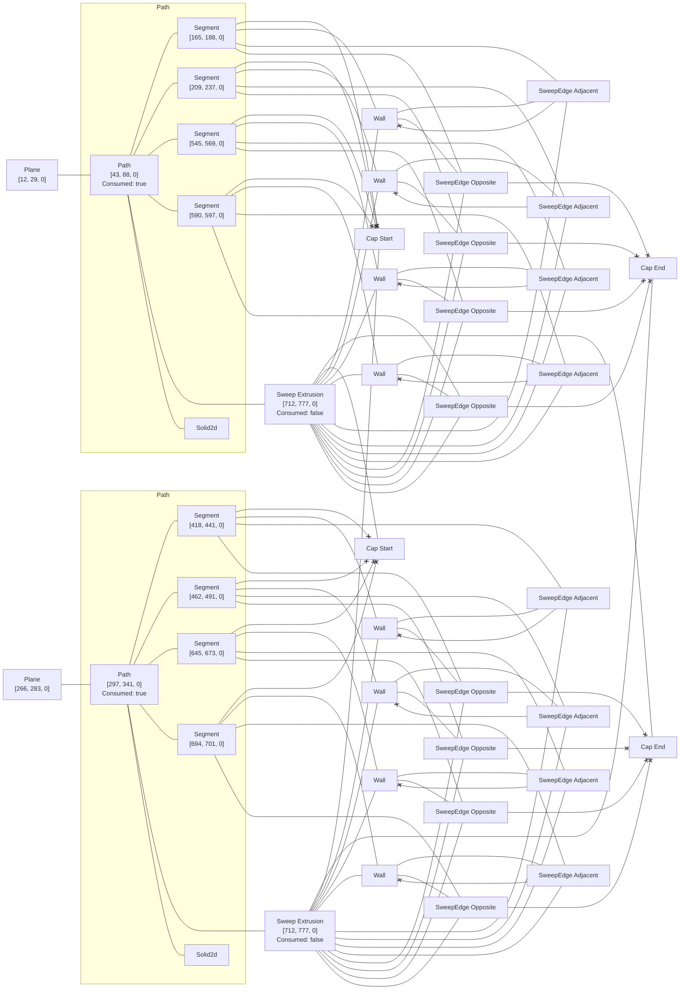

```mermaid
flowchart LR
  subgraph path14 [Path]
    14["Path<br>[43, 88, 0]<br>Consumed: true"]
      %% [ProgramBodyItem { index: 1 }, VariableDeclarationDeclaration, VariableDeclarationInit, PipeBodyItem { index: 0 }]
    15["Segment<br>[165, 188, 0]"]
      %% [ProgramBodyItem { index: 1 }, VariableDeclarationDeclaration, VariableDeclarationInit, PipeBodyItem { index: 1 }]
    16["Segment<br>[209, 237, 0]"]
      %% [ProgramBodyItem { index: 1 }, VariableDeclarationDeclaration, VariableDeclarationInit, PipeBodyItem { index: 2 }]
    21["Segment<br>[545, 569, 0]"]
      %% [ProgramBodyItem { index: 4 }, VariableDeclarationDeclaration, VariableDeclarationInit, PipeBodyItem { index: 1 }]
    22["Segment<br>[590, 597, 0]"]
      %% [ProgramBodyItem { index: 4 }, VariableDeclarationDeclaration, VariableDeclarationInit, PipeBodyItem { index: 2 }]
    28[Solid2d]
  end
  subgraph path18 [Path]
    18["Path<br>[297, 341, 0]<br>Consumed: true"]
      %% [ProgramBodyItem { index: 3 }, VariableDeclarationDeclaration, VariableDeclarationInit, PipeBodyItem { index: 0 }]
    19["Segment<br>[418, 441, 0]"]
      %% [ProgramBodyItem { index: 3 }, VariableDeclarationDeclaration, VariableDeclarationInit, PipeBodyItem { index: 1 }]
    20["Segment<br>[462, 491, 0]"]
      %% [ProgramBodyItem { index: 3 }, VariableDeclarationDeclaration, VariableDeclarationInit, PipeBodyItem { index: 2 }]
    23["Segment<br>[645, 673, 0]"]
      %% [ProgramBodyItem { index: 5 }, VariableDeclarationDeclaration, VariableDeclarationInit, PipeBodyItem { index: 1 }]
    24["Segment<br>[694, 701, 0]"]
      %% [ProgramBodyItem { index: 5 }, VariableDeclarationDeclaration, VariableDeclarationInit, PipeBodyItem { index: 2 }]
    27[Solid2d]
  end
  1["Cap End"]
    %% face_code_ref=Missing NodePath
  2["Cap End"]
    %% face_code_ref=Missing NodePath
  3["Cap Start"]
    %% face_code_ref=Missing NodePath
  4["Cap Start"]
    %% face_code_ref=Missing NodePath
  5[Wall]
    %% face_code_ref=Missing NodePath
  6[Wall]
    %% face_code_ref=Missing NodePath
  7[Wall]
    %% face_code_ref=Missing NodePath
  8[Wall]
    %% face_code_ref=Missing NodePath
  9[Wall]
    %% face_code_ref=Missing NodePath
  10[Wall]
    %% face_code_ref=Missing NodePath
  11[Wall]
    %% face_code_ref=Missing NodePath
  12[Wall]
    %% face_code_ref=Missing NodePath
  13["Plane<br>[12, 29, 0]"]
    %% [ProgramBodyItem { index: 0 }, VariableDeclarationDeclaration, VariableDeclarationInit]
  17["Plane<br>[266, 283, 0]"]
    %% [ProgramBodyItem { index: 2 }, VariableDeclarationDeclaration, VariableDeclarationInit]
  25["Sweep Extrusion<br>[712, 777, 0]<br>Consumed: false"]
    %% [ProgramBodyItem { index: 6 }, ExpressionStatementExpr]
  26["Sweep Extrusion<br>[712, 777, 0]<br>Consumed: false"]
    %% [ProgramBodyItem { index: 6 }, ExpressionStatementExpr]
  29["SweepEdge Adjacent"]
  30["SweepEdge Adjacent"]
  31["SweepEdge Adjacent"]
  32["SweepEdge Adjacent"]
  33["SweepEdge Adjacent"]
  34["SweepEdge Adjacent"]
  35["SweepEdge Adjacent"]
  36["SweepEdge Adjacent"]
  37["SweepEdge Opposite"]
  38["SweepEdge Opposite"]
  39["SweepEdge Opposite"]
  40["SweepEdge Opposite"]
  41["SweepEdge Opposite"]
  42["SweepEdge Opposite"]
  43["SweepEdge Opposite"]
  44["SweepEdge Opposite"]
  25 --- 1
  37 <--x 1
  38 <--x 1
  41 <--x 1
  42 <--x 1
  26 --- 2
  39 <--x 2
  40 <--x 2
  43 <--x 2
  44 <--x 2
  15 <--x 3
  16 <--x 3
  21 <--x 3
  22 <--x 3
  25 --- 3
  19 <--x 4
  20 <--x 4
  23 <--x 4
  24 <--x 4
  26 --- 4
  15 --- 5
  26 --- 5
  5 --- 29
  29 <--x 5
  5 --- 37
  16 --- 6
  26 --- 6
  6 --- 30
  30 <--x 6
  6 --- 38
  19 --- 7
  25 --- 7
  7 --- 31
  31 <--x 7
  7 --- 39
  20 --- 8
  25 --- 8
  8 --- 32
  32 <--x 8
  8 --- 40
  21 --- 9
  26 --- 9
  9 --- 33
  33 <--x 9
  9 --- 41
  22 --- 10
  26 --- 10
  10 --- 34
  34 <--x 10
  10 --- 42
  23 --- 11
  25 --- 11
  11 --- 35
  35 <--x 11
  11 --- 43
  24 --- 12
  25 --- 12
  12 --- 36
  36 <--x 12
  12 --- 44
  13 --- 14
  14 --- 15
  14 --- 16
  14 --- 21
  14 --- 22
  14 ---- 26
  14 --- 28
  15 --- 29
  15 --- 37
  16 --- 30
  16 --- 38
  17 --- 18
  18 --- 19
  18 --- 20
  18 --- 23
  18 --- 24
  18 ---- 25
  18 --- 27
  19 --- 31
  19 --- 39
  20 --- 32
  20 --- 40
  21 --- 33
  21 --- 41
  22 --- 34
  22 --- 42
  23 --- 35
  23 --- 43
  24 --- 36
  24 --- 44
  25 --- 31
  25 --- 32
  25 --- 35
  25 --- 36
  25 --- 39
  25 --- 40
  25 --- 43
  25 --- 44
  26 --- 29
  26 --- 30
  26 --- 33
  26 --- 34
  26 --- 37
  26 --- 38
  26 --- 41
  26 --- 42
```
