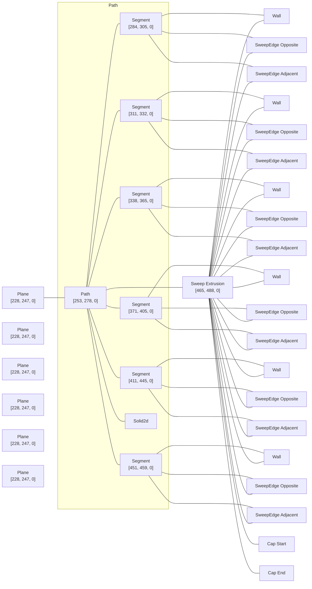

```mermaid
flowchart LR
  subgraph path7 [Path]
    7["Path<br>[253, 278, 0]"]
    8["Segment<br>[284, 305, 0]"]
    9["Segment<br>[311, 332, 0]"]
    10["Segment<br>[338, 365, 0]"]
    11["Segment<br>[371, 405, 0]"]
    12["Segment<br>[411, 445, 0]"]
    13["Segment<br>[451, 459, 0]"]
    14[Solid2d]
  end
  1["Plane<br>[228, 247, 0]"]
  2["Plane<br>[228, 247, 0]"]
  3["Plane<br>[228, 247, 0]"]
  4["Plane<br>[228, 247, 0]"]
  5["Plane<br>[228, 247, 0]"]
  6["Plane<br>[228, 247, 0]"]
  15["Sweep Extrusion<br>[465, 488, 0]"]
  16[Wall]
  17[Wall]
  18[Wall]
  19[Wall]
  20[Wall]
  21[Wall]
  22["Cap Start"]
  23["Cap End"]
  24["SweepEdge Opposite"]
  25["SweepEdge Adjacent"]
  26["SweepEdge Opposite"]
  27["SweepEdge Adjacent"]
  28["SweepEdge Opposite"]
  29["SweepEdge Adjacent"]
  30["SweepEdge Opposite"]
  31["SweepEdge Adjacent"]
  32["SweepEdge Opposite"]
  33["SweepEdge Adjacent"]
  34["SweepEdge Opposite"]
  35["SweepEdge Adjacent"]
  1 --- 7
  7 --- 8
  7 --- 9
  7 --- 10
  7 --- 11
  7 --- 12
  7 --- 13
  7 ---- 15
  7 --- 14
  8 --- 21
  8 --- 34
  8 --- 35
  9 --- 20
  9 --- 32
  9 --- 33
  10 --- 19
  10 --- 30
  10 --- 31
  11 --- 18
  11 --- 28
  11 --- 29
  12 --- 17
  12 --- 26
  12 --- 27
  13 --- 16
  13 --- 24
  13 --- 25
  15 --- 16
  15 --- 17
  15 --- 18
  15 --- 19
  15 --- 20
  15 --- 21
  15 --- 22
  15 --- 23
  15 --- 24
  15 --- 25
  15 --- 26
  15 --- 27
  15 --- 28
  15 --- 29
  15 --- 30
  15 --- 31
  15 --- 32
  15 --- 33
  15 --- 34
  15 --- 35
```
