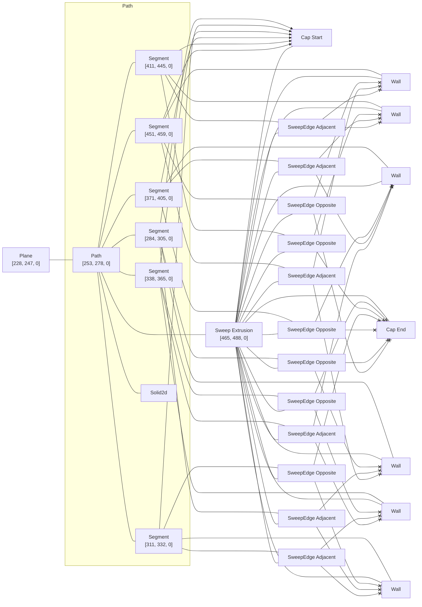

```mermaid
flowchart LR
  subgraph path2 [Path]
    2["Path<br>[253, 278, 0]"]
    3["Segment<br>[284, 305, 0]"]
    4["Segment<br>[311, 332, 0]"]
    5["Segment<br>[338, 365, 0]"]
    6["Segment<br>[371, 405, 0]"]
    7["Segment<br>[411, 445, 0]"]
    8["Segment<br>[451, 459, 0]"]
    9[Solid2d]
  end
  1["Plane<br>[228, 247, 0]"]
  10["Sweep Extrusion<br>[465, 488, 0]"]
  11[Wall]
  12[Wall]
  13[Wall]
  14[Wall]
  15[Wall]
  16[Wall]
  17["Cap Start"]
  18["Cap End"]
  19["SweepEdge Opposite"]
  20["SweepEdge Opposite"]
  21["SweepEdge Opposite"]
  22["SweepEdge Opposite"]
  23["SweepEdge Opposite"]
  24["SweepEdge Opposite"]
  25["SweepEdge Adjacent"]
  26["SweepEdge Adjacent"]
  27["SweepEdge Adjacent"]
  28["SweepEdge Adjacent"]
  29["SweepEdge Adjacent"]
  30["SweepEdge Adjacent"]
  1 --- 2
  2 --- 3
  2 --- 4
  2 --- 5
  2 --- 6
  2 --- 7
  2 --- 8
  2 --- 9
  2 ---- 10
  3 --- 16
  3 x--> 17
  3 --- 23
  3 --- 25
  4 --- 14
  4 x--> 17
  4 --- 21
  4 --- 27
  5 --- 13
  5 x--> 17
  5 --- 19
  5 --- 29
  6 --- 15
  6 x--> 17
  6 --- 22
  6 --- 26
  7 --- 12
  7 x--> 17
  7 --- 20
  7 --- 30
  8 --- 11
  8 x--> 17
  8 --- 24
  8 --- 28
  10 --- 11
  10 --- 12
  10 --- 13
  10 --- 14
  10 --- 15
  10 --- 16
  10 --- 17
  10 --- 18
  10 --- 19
  10 --- 20
  10 --- 21
  10 --- 22
  10 --- 23
  10 --- 24
  10 --- 25
  10 --- 26
  10 --- 27
  10 --- 28
  10 --- 29
  10 --- 30
  24 <--x 11
  28 <--x 11
  30 <--x 11
  20 <--x 12
  26 <--x 12
  30 <--x 12
  19 <--x 13
  27 <--x 13
  29 <--x 13
  21 <--x 14
  25 <--x 14
  27 <--x 14
  22 <--x 15
  26 <--x 15
  29 <--x 15
  23 <--x 16
  25 <--x 16
  28 <--x 16
  19 <--x 18
  20 <--x 18
  21 <--x 18
  22 <--x 18
  23 <--x 18
  24 <--x 18
```
