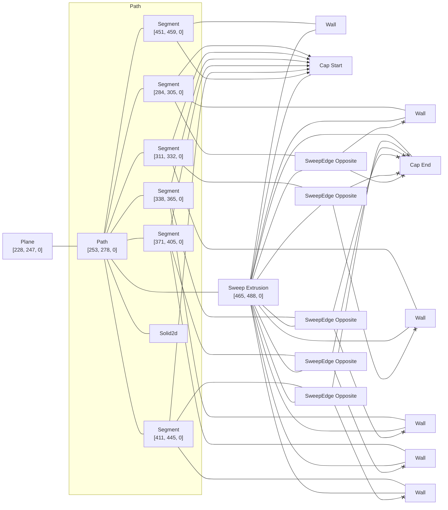

```mermaid
flowchart LR
  subgraph path2 [Path]
    2["Path<br>[253, 278, 0]"]
    3["Segment<br>[284, 305, 0]"]
    4["Segment<br>[311, 332, 0]"]
    5["Segment<br>[338, 365, 0]"]
    6["Segment<br>[371, 405, 0]"]
    7["Segment<br>[411, 445, 0]"]
    8["Segment<br>[451, 459, 0]"]
    9[Solid2d]
  end
  1["Plane<br>[228, 247, 0]"]
  10["Sweep Extrusion<br>[465, 488, 0]"]
  11[Wall]
  12[Wall]
  13[Wall]
  14[Wall]
  15[Wall]
  16[Wall]
  17["Cap Start"]
  18["Cap End"]
  19["SweepEdge Opposite"]
  20["SweepEdge Opposite"]
  21["SweepEdge Opposite"]
  22["SweepEdge Opposite"]
  23["SweepEdge Opposite"]
  1 --- 2
  2 --- 3
  2 --- 4
  2 --- 5
  2 --- 6
  2 --- 7
  2 --- 8
  2 ---- 10
  2 --- 9
  3 --- 16
  3 --- 23
  3 x--> 17
  4 --- 15
  4 --- 22
  4 x--> 17
  5 --- 14
  5 --- 21
  5 x--> 17
  6 --- 13
  6 --- 20
  6 x--> 17
  7 --- 12
  7 --- 19
  7 x--> 17
  8 --- 11
  8 x--> 17
  10 --- 11
  10 --- 12
  10 --- 13
  10 --- 14
  10 --- 15
  10 --- 16
  10 --- 17
  10 --- 18
  10 --- 19
  10 --- 20
  10 --- 21
  10 --- 22
  10 --- 23
  19 <--x 12
  19 <--x 18
  20 <--x 13
  20 <--x 18
  21 <--x 14
  21 <--x 18
  22 <--x 15
  22 <--x 18
  23 <--x 16
  23 <--x 18
```
