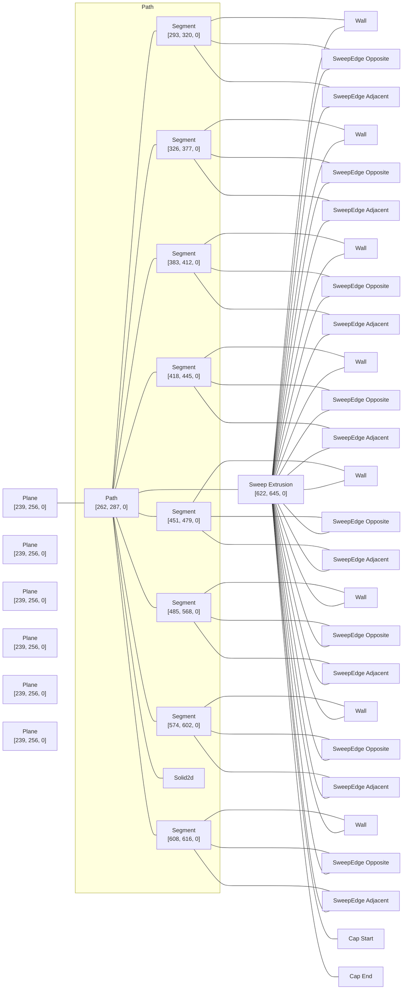

```mermaid
flowchart LR
  subgraph path7 [Path]
    7["Path<br>[262, 287, 0]"]
    8["Segment<br>[293, 320, 0]"]
    9["Segment<br>[326, 377, 0]"]
    10["Segment<br>[383, 412, 0]"]
    11["Segment<br>[418, 445, 0]"]
    12["Segment<br>[451, 479, 0]"]
    13["Segment<br>[485, 568, 0]"]
    14["Segment<br>[574, 602, 0]"]
    15["Segment<br>[608, 616, 0]"]
    16[Solid2d]
  end
  1["Plane<br>[239, 256, 0]"]
  2["Plane<br>[239, 256, 0]"]
  3["Plane<br>[239, 256, 0]"]
  4["Plane<br>[239, 256, 0]"]
  5["Plane<br>[239, 256, 0]"]
  6["Plane<br>[239, 256, 0]"]
  17["Sweep Extrusion<br>[622, 645, 0]"]
  18[Wall]
  19[Wall]
  20[Wall]
  21[Wall]
  22[Wall]
  23[Wall]
  24[Wall]
  25[Wall]
  26["Cap Start"]
  27["Cap End"]
  28["SweepEdge Opposite"]
  29["SweepEdge Adjacent"]
  30["SweepEdge Opposite"]
  31["SweepEdge Adjacent"]
  32["SweepEdge Opposite"]
  33["SweepEdge Adjacent"]
  34["SweepEdge Opposite"]
  35["SweepEdge Adjacent"]
  36["SweepEdge Opposite"]
  37["SweepEdge Adjacent"]
  38["SweepEdge Opposite"]
  39["SweepEdge Adjacent"]
  40["SweepEdge Opposite"]
  41["SweepEdge Adjacent"]
  42["SweepEdge Opposite"]
  43["SweepEdge Adjacent"]
  1 --- 7
  7 --- 8
  7 --- 9
  7 --- 10
  7 --- 11
  7 --- 12
  7 --- 13
  7 --- 14
  7 --- 15
  7 ---- 17
  7 --- 16
  8 --- 18
  8 --- 28
  8 --- 29
  9 --- 19
  9 --- 30
  9 --- 31
  10 --- 20
  10 --- 32
  10 --- 33
  11 --- 21
  11 --- 34
  11 --- 35
  12 --- 22
  12 --- 36
  12 --- 37
  13 --- 23
  13 --- 38
  13 --- 39
  14 --- 24
  14 --- 40
  14 --- 41
  15 --- 25
  15 --- 42
  15 --- 43
  17 --- 18
  17 --- 19
  17 --- 20
  17 --- 21
  17 --- 22
  17 --- 23
  17 --- 24
  17 --- 25
  17 --- 26
  17 --- 27
  17 --- 28
  17 --- 29
  17 --- 30
  17 --- 31
  17 --- 32
  17 --- 33
  17 --- 34
  17 --- 35
  17 --- 36
  17 --- 37
  17 --- 38
  17 --- 39
  17 --- 40
  17 --- 41
  17 --- 42
  17 --- 43
```
