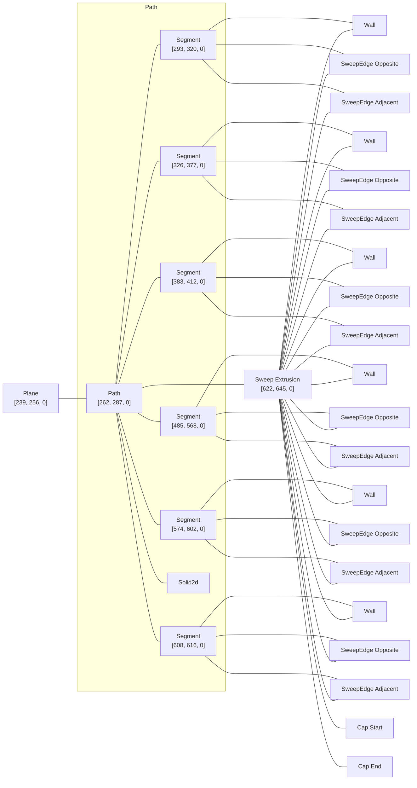

```mermaid
flowchart LR
  subgraph path2 [Path]
    2["Path<br>[262, 287, 0]"]
    3["Segment<br>[293, 320, 0]"]
    4["Segment<br>[326, 377, 0]"]
    5["Segment<br>[383, 412, 0]"]
    6["Segment<br>[485, 568, 0]"]
    7["Segment<br>[574, 602, 0]"]
    8["Segment<br>[608, 616, 0]"]
    9[Solid2d]
  end
  1["Plane<br>[239, 256, 0]"]
  10["Sweep Extrusion<br>[622, 645, 0]"]
  11[Wall]
  12[Wall]
  13[Wall]
  14[Wall]
  15[Wall]
  16[Wall]
  17["Cap Start"]
  18["Cap End"]
  19["SweepEdge Opposite"]
  20["SweepEdge Adjacent"]
  21["SweepEdge Opposite"]
  22["SweepEdge Adjacent"]
  23["SweepEdge Opposite"]
  24["SweepEdge Adjacent"]
  25["SweepEdge Opposite"]
  26["SweepEdge Adjacent"]
  27["SweepEdge Opposite"]
  28["SweepEdge Adjacent"]
  29["SweepEdge Opposite"]
  30["SweepEdge Adjacent"]
  1 --- 2
  2 --- 3
  2 --- 4
  2 --- 5
  2 --- 6
  2 --- 7
  2 --- 8
  2 ---- 10
  2 --- 9
  3 --- 11
  3 --- 19
  3 --- 20
  4 --- 12
  4 --- 21
  4 --- 22
  5 --- 13
  5 --- 23
  5 --- 24
  6 --- 14
  6 --- 25
  6 --- 26
  7 --- 15
  7 --- 27
  7 --- 28
  8 --- 16
  8 --- 29
  8 --- 30
  10 --- 11
  10 --- 12
  10 --- 13
  10 --- 14
  10 --- 15
  10 --- 16
  10 --- 17
  10 --- 18
  10 --- 19
  10 --- 20
  10 --- 21
  10 --- 22
  10 --- 23
  10 --- 24
  10 --- 25
  10 --- 26
  10 --- 27
  10 --- 28
  10 --- 29
  10 --- 30
```
