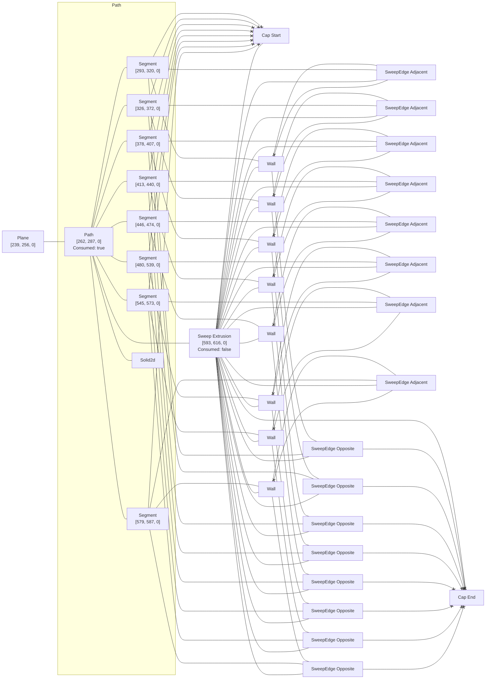

```mermaid
flowchart LR
  subgraph path12 [Path]
    12["Path<br>[262, 287, 0]<br>Consumed: true"]
      %% [ProgramBodyItem { index: 9 }, VariableDeclarationDeclaration, VariableDeclarationInit, PipeBodyItem { index: 1 }]
    13["Segment<br>[293, 320, 0]"]
      %% [ProgramBodyItem { index: 9 }, VariableDeclarationDeclaration, VariableDeclarationInit, PipeBodyItem { index: 2 }]
    14["Segment<br>[326, 372, 0]"]
      %% [ProgramBodyItem { index: 9 }, VariableDeclarationDeclaration, VariableDeclarationInit, PipeBodyItem { index: 3 }]
    15["Segment<br>[378, 407, 0]"]
      %% [ProgramBodyItem { index: 9 }, VariableDeclarationDeclaration, VariableDeclarationInit, PipeBodyItem { index: 4 }]
    16["Segment<br>[413, 440, 0]"]
      %% [ProgramBodyItem { index: 9 }, VariableDeclarationDeclaration, VariableDeclarationInit, PipeBodyItem { index: 5 }]
    17["Segment<br>[446, 474, 0]"]
      %% [ProgramBodyItem { index: 9 }, VariableDeclarationDeclaration, VariableDeclarationInit, PipeBodyItem { index: 6 }]
    18["Segment<br>[480, 539, 0]"]
      %% [ProgramBodyItem { index: 9 }, VariableDeclarationDeclaration, VariableDeclarationInit, PipeBodyItem { index: 7 }]
    19["Segment<br>[545, 573, 0]"]
      %% [ProgramBodyItem { index: 9 }, VariableDeclarationDeclaration, VariableDeclarationInit, PipeBodyItem { index: 8 }]
    20["Segment<br>[579, 587, 0]"]
      %% [ProgramBodyItem { index: 9 }, VariableDeclarationDeclaration, VariableDeclarationInit, PipeBodyItem { index: 9 }]
    22[Solid2d]
  end
  1["Cap End"]
    %% face_code_ref=Missing NodePath
  2["Cap Start"]
    %% face_code_ref=Missing NodePath
  3[Wall]
    %% face_code_ref=Missing NodePath
  4[Wall]
    %% face_code_ref=Missing NodePath
  5[Wall]
    %% face_code_ref=Missing NodePath
  6[Wall]
    %% face_code_ref=Missing NodePath
  7[Wall]
    %% face_code_ref=Missing NodePath
  8[Wall]
    %% face_code_ref=Missing NodePath
  9[Wall]
    %% face_code_ref=Missing NodePath
  10[Wall]
    %% face_code_ref=Missing NodePath
  11["Plane<br>[239, 256, 0]"]
    %% [ProgramBodyItem { index: 9 }, VariableDeclarationDeclaration, VariableDeclarationInit, PipeBodyItem { index: 0 }]
  21["Sweep Extrusion<br>[593, 616, 0]<br>Consumed: false"]
    %% [ProgramBodyItem { index: 9 }, VariableDeclarationDeclaration, VariableDeclarationInit, PipeBodyItem { index: 10 }]
  23["SweepEdge Adjacent"]
  24["SweepEdge Adjacent"]
  25["SweepEdge Adjacent"]
  26["SweepEdge Adjacent"]
  27["SweepEdge Adjacent"]
  28["SweepEdge Adjacent"]
  29["SweepEdge Adjacent"]
  30["SweepEdge Adjacent"]
  31["SweepEdge Opposite"]
  32["SweepEdge Opposite"]
  33["SweepEdge Opposite"]
  34["SweepEdge Opposite"]
  35["SweepEdge Opposite"]
  36["SweepEdge Opposite"]
  37["SweepEdge Opposite"]
  38["SweepEdge Opposite"]
  21 --- 1
  31 <--x 1
  32 <--x 1
  33 <--x 1
  34 <--x 1
  35 <--x 1
  36 <--x 1
  37 <--x 1
  38 <--x 1
  13 <--x 2
  14 <--x 2
  15 <--x 2
  16 <--x 2
  17 <--x 2
  18 <--x 2
  19 <--x 2
  20 <--x 2
  21 --- 2
  13 --- 3
  21 --- 3
  3 --- 23
  23 <--x 3
  3 --- 31
  14 --- 4
  21 --- 4
  4 --- 24
  24 <--x 4
  4 --- 32
  15 --- 5
  21 --- 5
  5 --- 25
  25 <--x 5
  5 --- 33
  16 --- 6
  21 --- 6
  6 --- 26
  26 <--x 6
  6 --- 34
  17 --- 7
  21 --- 7
  7 --- 27
  27 <--x 7
  7 --- 35
  18 --- 8
  21 --- 8
  8 --- 28
  28 <--x 8
  8 --- 36
  19 --- 9
  21 --- 9
  9 --- 29
  29 <--x 9
  9 --- 37
  20 --- 10
  21 --- 10
  10 --- 30
  30 <--x 10
  10 --- 38
  11 --- 12
  12 --- 13
  12 --- 14
  12 --- 15
  12 --- 16
  12 --- 17
  12 --- 18
  12 --- 19
  12 --- 20
  12 ---- 21
  12 --- 22
  13 --- 23
  13 --- 31
  14 --- 24
  14 --- 32
  15 --- 25
  15 --- 33
  16 --- 26
  16 --- 34
  17 --- 27
  17 --- 35
  18 --- 28
  18 --- 36
  19 --- 29
  19 --- 37
  20 --- 30
  20 --- 38
  21 --- 23
  21 --- 24
  21 --- 25
  21 --- 26
  21 --- 27
  21 --- 28
  21 --- 29
  21 --- 30
  21 --- 31
  21 --- 32
  21 --- 33
  21 --- 34
  21 --- 35
  21 --- 36
  21 --- 37
  21 --- 38
```
