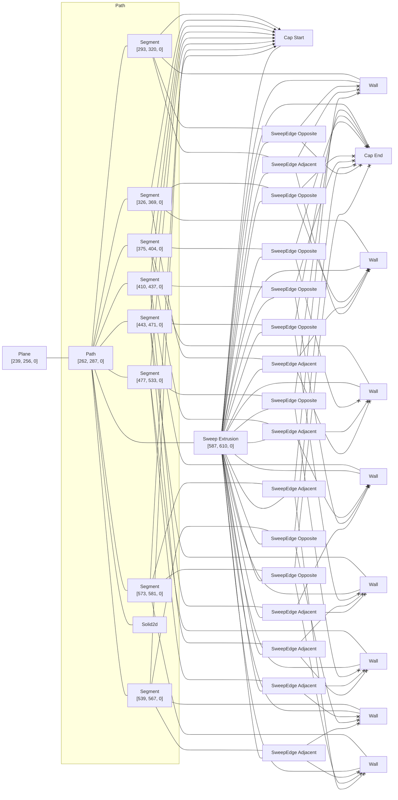

```mermaid
flowchart LR
  subgraph path2 [Path]
    2["Path<br>[262, 287, 0]"]
    3["Segment<br>[293, 320, 0]"]
    4["Segment<br>[326, 369, 0]"]
    5["Segment<br>[375, 404, 0]"]
    6["Segment<br>[410, 437, 0]"]
    7["Segment<br>[443, 471, 0]"]
    8["Segment<br>[477, 533, 0]"]
    9["Segment<br>[539, 567, 0]"]
    10["Segment<br>[573, 581, 0]"]
    11[Solid2d]
  end
  1["Plane<br>[239, 256, 0]"]
  12["Sweep Extrusion<br>[587, 610, 0]"]
  13[Wall]
  14[Wall]
  15[Wall]
  16[Wall]
  17[Wall]
  18[Wall]
  19[Wall]
  20[Wall]
  21["Cap Start"]
  22["Cap End"]
  23["SweepEdge Opposite"]
  24["SweepEdge Adjacent"]
  25["SweepEdge Opposite"]
  26["SweepEdge Adjacent"]
  27["SweepEdge Opposite"]
  28["SweepEdge Adjacent"]
  29["SweepEdge Opposite"]
  30["SweepEdge Adjacent"]
  31["SweepEdge Opposite"]
  32["SweepEdge Adjacent"]
  33["SweepEdge Opposite"]
  34["SweepEdge Adjacent"]
  35["SweepEdge Opposite"]
  36["SweepEdge Adjacent"]
  37["SweepEdge Opposite"]
  38["SweepEdge Adjacent"]
  1 --- 2
  2 --- 3
  2 --- 4
  2 --- 5
  2 --- 6
  2 --- 7
  2 --- 8
  2 --- 9
  2 --- 10
  2 --- 11
  2 ---- 12
  3 --- 19
  3 x--> 21
  3 --- 35
  3 --- 36
  4 --- 16
  4 x--> 21
  4 --- 29
  4 --- 30
  5 --- 15
  5 x--> 21
  5 --- 27
  5 --- 28
  6 --- 17
  6 x--> 21
  6 --- 31
  6 --- 32
  7 --- 14
  7 x--> 21
  7 --- 25
  7 --- 26
  8 --- 13
  8 x--> 21
  8 --- 23
  8 --- 24
  9 --- 18
  9 x--> 21
  9 --- 33
  9 --- 34
  10 --- 20
  10 x--> 21
  10 --- 37
  10 --- 38
  12 --- 13
  12 --- 14
  12 --- 15
  12 --- 16
  12 --- 17
  12 --- 18
  12 --- 19
  12 --- 20
  12 --- 21
  12 --- 22
  12 --- 23
  12 --- 24
  12 --- 25
  12 --- 26
  12 --- 27
  12 --- 28
  12 --- 29
  12 --- 30
  12 --- 31
  12 --- 32
  12 --- 33
  12 --- 34
  12 --- 35
  12 --- 36
  12 --- 37
  12 --- 38
  23 <--x 13
  24 <--x 13
  26 <--x 13
  25 <--x 14
  26 <--x 14
  32 <--x 14
  27 <--x 15
  28 <--x 15
  30 <--x 15
  29 <--x 16
  30 <--x 16
  36 <--x 16
  28 <--x 17
  31 <--x 17
  32 <--x 17
  24 <--x 18
  33 <--x 18
  34 <--x 18
  35 <--x 19
  36 <--x 19
  38 <--x 19
  34 <--x 20
  37 <--x 20
  38 <--x 20
  23 <--x 22
  25 <--x 22
  27 <--x 22
  29 <--x 22
  31 <--x 22
  33 <--x 22
  35 <--x 22
  37 <--x 22
```
