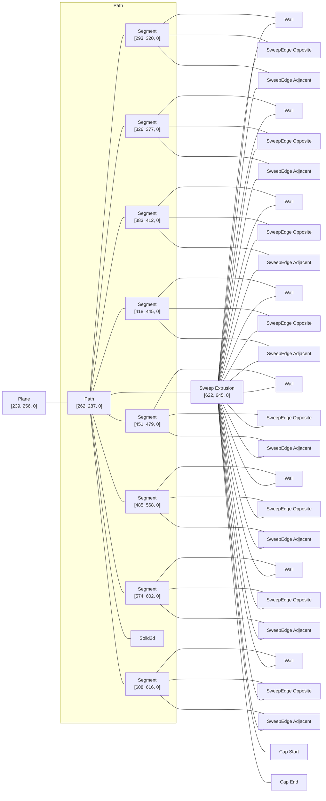

```mermaid
flowchart LR
  subgraph path2 [Path]
    2["Path<br>[262, 287, 0]"]
    3["Segment<br>[293, 320, 0]"]
    4["Segment<br>[326, 377, 0]"]
    5["Segment<br>[383, 412, 0]"]
    6["Segment<br>[418, 445, 0]"]
    7["Segment<br>[451, 479, 0]"]
    8["Segment<br>[485, 568, 0]"]
    9["Segment<br>[574, 602, 0]"]
    10["Segment<br>[608, 616, 0]"]
    11[Solid2d]
  end
  1["Plane<br>[239, 256, 0]"]
  12["Sweep Extrusion<br>[622, 645, 0]"]
  13[Wall]
  14[Wall]
  15[Wall]
  16[Wall]
  17[Wall]
  18[Wall]
  19[Wall]
  20[Wall]
  21["Cap Start"]
  22["Cap End"]
  23["SweepEdge Opposite"]
  24["SweepEdge Adjacent"]
  25["SweepEdge Opposite"]
  26["SweepEdge Adjacent"]
  27["SweepEdge Opposite"]
  28["SweepEdge Adjacent"]
  29["SweepEdge Opposite"]
  30["SweepEdge Adjacent"]
  31["SweepEdge Opposite"]
  32["SweepEdge Adjacent"]
  33["SweepEdge Opposite"]
  34["SweepEdge Adjacent"]
  35["SweepEdge Opposite"]
  36["SweepEdge Adjacent"]
  37["SweepEdge Opposite"]
  38["SweepEdge Adjacent"]
  1 --- 2
  2 --- 3
  2 --- 4
  2 --- 5
  2 --- 6
  2 --- 7
  2 --- 8
  2 --- 9
  2 --- 10
  2 ---- 12
  2 --- 11
  3 --- 13
  3 --- 23
  3 --- 24
  4 --- 14
  4 --- 25
  4 --- 26
  5 --- 15
  5 --- 27
  5 --- 28
  6 --- 16
  6 --- 29
  6 --- 30
  7 --- 17
  7 --- 31
  7 --- 32
  8 --- 18
  8 --- 33
  8 --- 34
  9 --- 19
  9 --- 35
  9 --- 36
  10 --- 20
  10 --- 37
  10 --- 38
  12 --- 13
  12 --- 14
  12 --- 15
  12 --- 16
  12 --- 17
  12 --- 18
  12 --- 19
  12 --- 20
  12 --- 21
  12 --- 22
  12 --- 23
  12 --- 24
  12 --- 25
  12 --- 26
  12 --- 27
  12 --- 28
  12 --- 29
  12 --- 30
  12 --- 31
  12 --- 32
  12 --- 33
  12 --- 34
  12 --- 35
  12 --- 36
  12 --- 37
  12 --- 38
```
