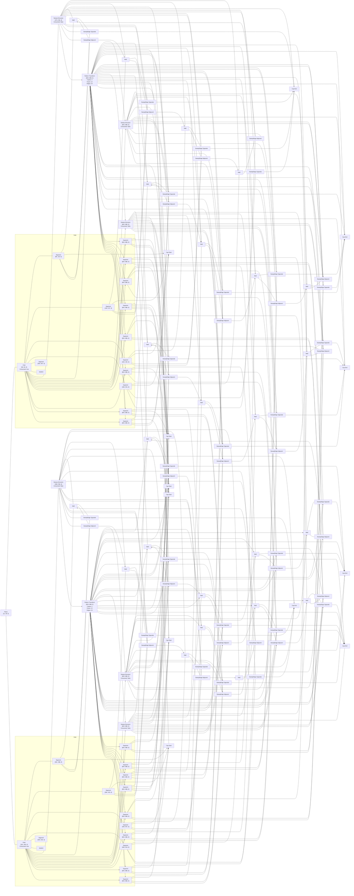

```mermaid
flowchart LR
  subgraph path2 [Path]
    2["Path<br>[56, 90, 0]<br>Consumed: true"]
      %% [ProgramBodyItem { index: 1 }, VariableDeclarationDeclaration, VariableDeclarationInit, PipeBodyItem { index: 1 }]
    3["Segment<br>[96, 123, 0]"]
      %% [ProgramBodyItem { index: 1 }, VariableDeclarationDeclaration, VariableDeclarationInit, PipeBodyItem { index: 2 }]
    4["Segment<br>[129, 157, 0]"]
      %% [ProgramBodyItem { index: 1 }, VariableDeclarationDeclaration, VariableDeclarationInit, PipeBodyItem { index: 3 }]
    5["Segment<br>[163, 192, 0]"]
      %% [ProgramBodyItem { index: 1 }, VariableDeclarationDeclaration, VariableDeclarationInit, PipeBodyItem { index: 4 }]
    6["Segment<br>[198, 254, 0]"]
      %% [ProgramBodyItem { index: 1 }, VariableDeclarationDeclaration, VariableDeclarationInit, PipeBodyItem { index: 5 }]
    7["Segment<br>[260, 267, 0]"]
      %% [ProgramBodyItem { index: 1 }, VariableDeclarationDeclaration, VariableDeclarationInit, PipeBodyItem { index: 6 }]
    8[Solid2d]
    48["Segment<br>[604, 688, 0]"]
      %% [ProgramBodyItem { index: 4 }, VariableDeclarationDeclaration, VariableDeclarationInit]
    49["Segment<br>[604, 688, 0]"]
      %% [ProgramBodyItem { index: 4 }, VariableDeclarationDeclaration, VariableDeclarationInit]
    50["Segment<br>[604, 688, 0]"]
      %% [ProgramBodyItem { index: 4 }, VariableDeclarationDeclaration, VariableDeclarationInit]
    51["Segment<br>[604, 688, 0]"]
      %% [ProgramBodyItem { index: 4 }, VariableDeclarationDeclaration, VariableDeclarationInit]
    67["Segment<br>[604, 688, 0]"]
      %% [ProgramBodyItem { index: 4 }, VariableDeclarationDeclaration, VariableDeclarationInit]
    68["Segment<br>[604, 688, 0]"]
      %% [ProgramBodyItem { index: 4 }, VariableDeclarationDeclaration, VariableDeclarationInit]
    69["Segment<br>[604, 688, 0]"]
      %% [ProgramBodyItem { index: 4 }, VariableDeclarationDeclaration, VariableDeclarationInit]
    70["Segment<br>[604, 688, 0]"]
      %% [ProgramBodyItem { index: 4 }, VariableDeclarationDeclaration, VariableDeclarationInit]
  end
  subgraph path24 [Path]
    24["Path<br>[321, 355, 0]<br>Consumed: true"]
      %% [ProgramBodyItem { index: 2 }, VariableDeclarationDeclaration, VariableDeclarationInit, PipeBodyItem { index: 1 }]
    25["Segment<br>[361, 388, 0]"]
      %% [ProgramBodyItem { index: 2 }, VariableDeclarationDeclaration, VariableDeclarationInit, PipeBodyItem { index: 2 }]
    26["Segment<br>[394, 423, 0]"]
      %% [ProgramBodyItem { index: 2 }, VariableDeclarationDeclaration, VariableDeclarationInit, PipeBodyItem { index: 3 }]
    27["Segment<br>[429, 457, 0]"]
      %% [ProgramBodyItem { index: 2 }, VariableDeclarationDeclaration, VariableDeclarationInit, PipeBodyItem { index: 4 }]
    28["Segment<br>[463, 519, 0]"]
      %% [ProgramBodyItem { index: 2 }, VariableDeclarationDeclaration, VariableDeclarationInit, PipeBodyItem { index: 5 }]
    29["Segment<br>[525, 532, 0]"]
      %% [ProgramBodyItem { index: 2 }, VariableDeclarationDeclaration, VariableDeclarationInit, PipeBodyItem { index: 6 }]
    30[Solid2d]
    87["Segment<br>[604, 688, 0]"]
      %% [ProgramBodyItem { index: 4 }, VariableDeclarationDeclaration, VariableDeclarationInit]
    88["Segment<br>[604, 688, 0]"]
      %% [ProgramBodyItem { index: 4 }, VariableDeclarationDeclaration, VariableDeclarationInit]
    89["Segment<br>[604, 688, 0]"]
      %% [ProgramBodyItem { index: 4 }, VariableDeclarationDeclaration, VariableDeclarationInit]
    90["Segment<br>[604, 688, 0]"]
      %% [ProgramBodyItem { index: 4 }, VariableDeclarationDeclaration, VariableDeclarationInit]
    106["Segment<br>[604, 688, 0]"]
      %% [ProgramBodyItem { index: 4 }, VariableDeclarationDeclaration, VariableDeclarationInit]
    107["Segment<br>[604, 688, 0]"]
      %% [ProgramBodyItem { index: 4 }, VariableDeclarationDeclaration, VariableDeclarationInit]
    108["Segment<br>[604, 688, 0]"]
      %% [ProgramBodyItem { index: 4 }, VariableDeclarationDeclaration, VariableDeclarationInit]
    109["Segment<br>[604, 688, 0]"]
      %% [ProgramBodyItem { index: 4 }, VariableDeclarationDeclaration, VariableDeclarationInit]
  end
  1["Plane<br>[11, 28, 0]"]
    %% [ProgramBodyItem { index: 0 }, VariableDeclarationDeclaration, VariableDeclarationInit]
  9["Sweep Extrusion<br>[273, 293, 0]<br>Consumed: false"]
    %% [ProgramBodyItem { index: 1 }, VariableDeclarationDeclaration, VariableDeclarationInit, PipeBodyItem { index: 7 }]
  10[Wall]
    %% face_code_ref=Missing NodePath
  11[Wall]
    %% face_code_ref=Missing NodePath
  12[Wall]
    %% face_code_ref=Missing NodePath
  13[Wall]
    %% face_code_ref=Missing NodePath
  14["Cap Start"]
    %% face_code_ref=Missing NodePath
  15["Cap End"]
    %% face_code_ref=Missing NodePath
  16["SweepEdge Opposite"]
  17["SweepEdge Adjacent"]
  18["SweepEdge Opposite"]
  19["SweepEdge Adjacent"]
  20["SweepEdge Opposite"]
  21["SweepEdge Adjacent"]
  22["SweepEdge Opposite"]
  23["SweepEdge Adjacent"]
  31["Sweep Extrusion<br>[538, 558, 0]<br>Consumed: false"]
    %% [ProgramBodyItem { index: 2 }, VariableDeclarationDeclaration, VariableDeclarationInit, PipeBodyItem { index: 7 }]
  32[Wall]
    %% face_code_ref=Missing NodePath
  33[Wall]
    %% face_code_ref=Missing NodePath
  34[Wall]
    %% face_code_ref=Missing NodePath
  35[Wall]
    %% face_code_ref=Missing NodePath
  36["Cap Start"]
    %% face_code_ref=Missing NodePath
  37["Cap End"]
    %% face_code_ref=Missing NodePath
  38["SweepEdge Opposite"]
  39["SweepEdge Adjacent"]
  40["SweepEdge Opposite"]
  41["SweepEdge Adjacent"]
  42["SweepEdge Opposite"]
  43["SweepEdge Adjacent"]
  44["SweepEdge Opposite"]
  45["SweepEdge Adjacent"]
  46["Pattern Transform<br>[604, 688, 0]<br>Copies: 2<br>Faces: 12<br>Edges: 24"]
    %% [ProgramBodyItem { index: 4 }, VariableDeclarationDeclaration, VariableDeclarationInit]
  47["Sweep Extrusion<br>[604, 688, 0]<br>Consumed: false"]
    %% [ProgramBodyItem { index: 4 }, VariableDeclarationDeclaration, VariableDeclarationInit]
  52[Wall]
    %% face_code_ref=Missing NodePath
  53[Wall]
    %% face_code_ref=Missing NodePath
  54[Wall]
    %% face_code_ref=Missing NodePath
  55[Wall]
    %% face_code_ref=Missing NodePath
  56["Cap Start"]
    %% face_code_ref=Missing NodePath
  57["Cap End"]
    %% face_code_ref=Missing NodePath
  58["SweepEdge Opposite"]
  59["SweepEdge Adjacent"]
  60["SweepEdge Opposite"]
  61["SweepEdge Adjacent"]
  62["SweepEdge Opposite"]
  63["SweepEdge Adjacent"]
  64["SweepEdge Opposite"]
  65["SweepEdge Adjacent"]
  66["Sweep Extrusion<br>[604, 688, 0]<br>Consumed: false"]
    %% [ProgramBodyItem { index: 4 }, VariableDeclarationDeclaration, VariableDeclarationInit]
  71[Wall]
    %% face_code_ref=Missing NodePath
  72[Wall]
    %% face_code_ref=Missing NodePath
  73[Wall]
    %% face_code_ref=Missing NodePath
  74[Wall]
    %% face_code_ref=Missing NodePath
  75["Cap Start"]
    %% face_code_ref=Missing NodePath
  76["Cap End"]
    %% face_code_ref=Missing NodePath
  77["SweepEdge Opposite"]
  78["SweepEdge Adjacent"]
  79["SweepEdge Opposite"]
  80["SweepEdge Adjacent"]
  81["SweepEdge Opposite"]
  82["SweepEdge Adjacent"]
  83["SweepEdge Opposite"]
  84["SweepEdge Adjacent"]
  85["Pattern Transform<br>[604, 688, 0]<br>Copies: 2<br>Faces: 12<br>Edges: 24"]
    %% [ProgramBodyItem { index: 4 }, VariableDeclarationDeclaration, VariableDeclarationInit]
  86["Sweep Extrusion<br>[604, 688, 0]<br>Consumed: false"]
    %% [ProgramBodyItem { index: 4 }, VariableDeclarationDeclaration, VariableDeclarationInit]
  91[Wall]
    %% face_code_ref=Missing NodePath
  92[Wall]
    %% face_code_ref=Missing NodePath
  93[Wall]
    %% face_code_ref=Missing NodePath
  94[Wall]
    %% face_code_ref=Missing NodePath
  95["Cap Start"]
    %% face_code_ref=Missing NodePath
  96["Cap End"]
    %% face_code_ref=Missing NodePath
  97["SweepEdge Opposite"]
  98["SweepEdge Adjacent"]
  99["SweepEdge Opposite"]
  100["SweepEdge Adjacent"]
  101["SweepEdge Opposite"]
  102["SweepEdge Adjacent"]
  103["SweepEdge Opposite"]
  104["SweepEdge Adjacent"]
  105["Sweep Extrusion<br>[604, 688, 0]<br>Consumed: false"]
    %% [ProgramBodyItem { index: 4 }, VariableDeclarationDeclaration, VariableDeclarationInit]
  110[Wall]
    %% face_code_ref=Missing NodePath
  111[Wall]
    %% face_code_ref=Missing NodePath
  112[Wall]
    %% face_code_ref=Missing NodePath
  113[Wall]
    %% face_code_ref=Missing NodePath
  114["Cap Start"]
    %% face_code_ref=Missing NodePath
  115["Cap End"]
    %% face_code_ref=Missing NodePath
  116["SweepEdge Opposite"]
  117["SweepEdge Adjacent"]
  118["SweepEdge Opposite"]
  119["SweepEdge Adjacent"]
  120["SweepEdge Opposite"]
  121["SweepEdge Adjacent"]
  122["SweepEdge Opposite"]
  123["SweepEdge Adjacent"]
  1 --- 2
  1 --- 24
  2 --- 3
  2 --- 4
  2 --- 5
  2 --- 6
  2 --- 7
  2 --- 8
  2 ---- 9
  2 --- 46
  2 <---x 47
  2 <--x 48
  2 <--x 49
  2 <--x 50
  2 <--x 51
  2 <---x 66
  2 <--x 67
  2 <--x 68
  2 <--x 69
  2 <--x 70
  3 --- 13
  3 x--> 14
  3 --- 22
  3 --- 23
  4 --- 12
  4 x--> 14
  4 --- 20
  4 --- 21
  5 --- 11
  5 x--> 14
  5 --- 18
  5 --- 19
  6 --- 10
  6 x--> 14
  6 --- 16
  6 --- 17
  9 --- 10
  9 --- 11
  9 --- 12
  9 --- 13
  9 --- 14
  9 --- 15
  9 --- 16
  9 --- 17
  9 --- 18
  9 --- 19
  9 --- 20
  9 --- 21
  9 --- 22
  9 --- 23
  9 x--> 46
  10 --- 16
  10 --- 17
  19 <--x 10
  11 --- 18
  11 --- 19
  21 <--x 11
  12 --- 20
  12 --- 21
  23 <--x 12
  17 <--x 13
  13 --- 22
  13 --- 23
  16 <--x 15
  18 <--x 15
  20 <--x 15
  22 <--x 15
  24 --- 25
  24 --- 26
  24 --- 27
  24 --- 28
  24 --- 29
  24 --- 30
  24 ---- 31
  24 --- 85
  24 <---x 86
  24 <--x 87
  24 <--x 88
  24 <--x 89
  24 <--x 90
  24 <---x 105
  24 <--x 106
  24 <--x 107
  24 <--x 108
  24 <--x 109
  25 --- 35
  25 x--> 36
  25 --- 44
  25 --- 45
  26 --- 34
  26 x--> 36
  26 --- 42
  26 --- 43
  27 --- 33
  27 x--> 36
  27 --- 40
  27 --- 41
  28 --- 32
  28 x--> 36
  28 --- 38
  28 --- 39
  31 --- 32
  31 --- 33
  31 --- 34
  31 --- 35
  31 --- 36
  31 --- 37
  31 --- 38
  31 --- 39
  31 --- 40
  31 --- 41
  31 --- 42
  31 --- 43
  31 --- 44
  31 --- 45
  31 x--> 85
  32 --- 38
  32 --- 39
  41 <--x 32
  33 --- 40
  33 --- 41
  43 <--x 33
  34 --- 42
  34 --- 43
  45 <--x 34
  39 <--x 35
  35 --- 44
  35 --- 45
  38 <--x 37
  40 <--x 37
  42 <--x 37
  44 <--x 37
  46 x--> 47
  46 x--> 48
  46 x--> 49
  46 x--> 50
  46 x--> 51
  46 x--> 52
  46 x--> 53
  46 x--> 54
  46 x--> 55
  46 x--> 56
  46 x--> 57
  46 x--> 58
  46 x--> 59
  46 x--> 60
  46 x--> 61
  46 x--> 62
  46 x--> 63
  46 x--> 64
  46 x--> 65
  46 x--> 66
  46 x--> 67
  46 x--> 68
  46 x--> 69
  46 x--> 70
  46 x--> 71
  46 x--> 72
  46 x--> 73
  46 x--> 74
  46 x--> 75
  46 x--> 76
  46 x--> 77
  46 x--> 78
  46 x--> 79
  46 x--> 80
  46 x--> 81
  46 x--> 82
  46 x--> 83
  46 x--> 84
  47 --- 52
  47 --- 53
  47 --- 54
  47 --- 55
  47 --- 56
  47 --- 57
  47 --- 58
  47 --- 59
  47 --- 60
  47 --- 61
  47 --- 62
  47 --- 63
  47 --- 64
  47 --- 65
  48 --- 92
  48 x--> 95
  48 --- 99
  48 --- 100
  49 --- 93
  49 x--> 95
  49 --- 101
  49 --- 102
  50 --- 94
  50 x--> 95
  50 --- 103
  50 --- 104
  51 --- 110
  51 x--> 114
  51 --- 116
  51 --- 117
  52 --- 58
  52 --- 59
  61 <--x 52
  53 --- 60
  53 --- 61
  63 <--x 53
  54 --- 62
  54 --- 63
  65 <--x 54
  59 <--x 55
  55 --- 64
  55 --- 65
  58 <--x 57
  60 <--x 57
  62 <--x 57
  64 <--x 57
  66 --- 71
  66 --- 72
  66 --- 73
  66 --- 74
  66 --- 75
  66 --- 76
  66 --- 77
  66 --- 78
  66 --- 79
  66 --- 80
  66 --- 81
  66 --- 82
  66 --- 83
  66 --- 84
  67 --- 111
  67 x--> 114
  67 --- 118
  67 --- 119
  68 --- 112
  68 x--> 114
  68 --- 120
  68 --- 121
  69 --- 113
  69 x--> 114
  69 --- 122
  69 --- 123
  70 --- 52
  70 x--> 56
  70 --- 58
  70 --- 59
  71 --- 77
  71 --- 78
  80 <--x 71
  72 --- 79
  72 --- 80
  82 <--x 72
  73 --- 81
  73 --- 82
  84 <--x 73
  78 <--x 74
  74 --- 83
  74 --- 84
  77 <--x 76
  79 <--x 76
  81 <--x 76
  83 <--x 76
  85 x--> 86
  85 x--> 87
  85 x--> 88
  85 x--> 89
  85 x--> 90
  85 x--> 91
  85 x--> 92
  85 x--> 93
  85 x--> 94
  85 x--> 95
  85 x--> 96
  85 x--> 97
  85 x--> 98
  85 x--> 99
  85 x--> 100
  85 x--> 101
  85 x--> 102
  85 x--> 103
  85 x--> 104
  85 x--> 105
  85 x--> 106
  85 x--> 107
  85 x--> 108
  85 x--> 109
  85 x--> 110
  85 x--> 111
  85 x--> 112
  85 x--> 113
  85 x--> 114
  85 x--> 115
  85 x--> 116
  85 x--> 117
  85 x--> 118
  85 x--> 119
  85 x--> 120
  85 x--> 121
  85 x--> 122
  85 x--> 123
  86 --- 91
  86 --- 92
  86 --- 93
  86 --- 94
  86 --- 95
  86 --- 96
  86 --- 97
  86 --- 98
  86 --- 99
  86 --- 100
  86 --- 101
  86 --- 102
  86 --- 103
  86 --- 104
  87 --- 53
  87 x--> 56
  87 --- 60
  87 --- 61
  88 --- 54
  88 x--> 56
  88 --- 62
  88 --- 63
  89 --- 55
  89 x--> 56
  89 --- 64
  89 --- 65
  90 --- 71
  90 x--> 75
  90 --- 77
  90 --- 78
  91 --- 97
  91 --- 98
  100 <--x 91
  92 --- 99
  92 --- 100
  102 <--x 92
  93 --- 101
  93 --- 102
  104 <--x 93
  98 <--x 94
  94 --- 103
  94 --- 104
  97 <--x 96
  99 <--x 96
  101 <--x 96
  103 <--x 96
  105 --- 110
  105 --- 111
  105 --- 112
  105 --- 113
  105 --- 114
  105 --- 115
  105 --- 116
  105 --- 117
  105 --- 118
  105 --- 119
  105 --- 120
  105 --- 121
  105 --- 122
  105 --- 123
  106 --- 72
  106 x--> 75
  106 --- 79
  106 --- 80
  107 --- 73
  107 x--> 75
  107 --- 81
  107 --- 82
  108 --- 74
  108 x--> 75
  108 --- 83
  108 --- 84
  109 --- 91
  109 x--> 95
  109 --- 97
  109 --- 98
  110 --- 116
  110 --- 117
  119 <--x 110
  111 --- 118
  111 --- 119
  121 <--x 111
  112 --- 120
  112 --- 121
  123 <--x 112
  117 <--x 113
  113 --- 122
  113 --- 123
  116 <--x 115
  118 <--x 115
  120 <--x 115
  122 <--x 115
```
