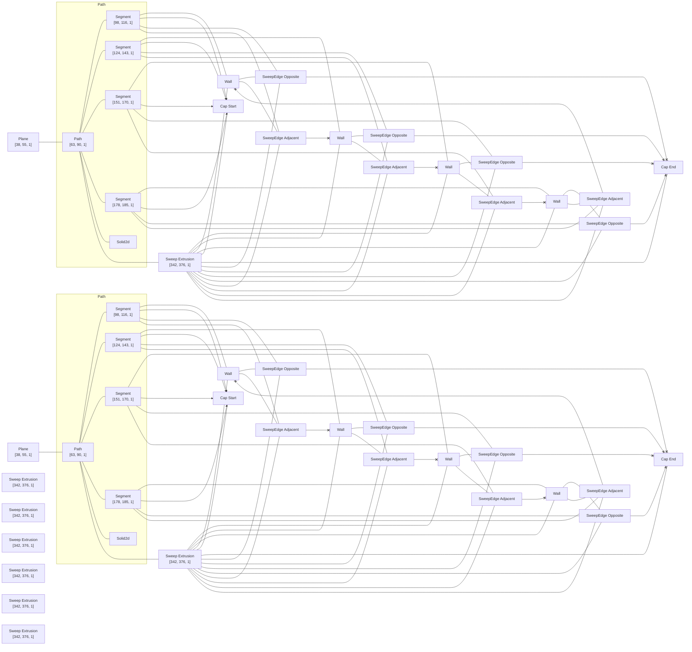

```mermaid
flowchart LR
  subgraph path3 [Path]
    3["Path<br>[63, 90, 1]"]
      %% Missing NodePath
    5["Segment<br>[98, 116, 1]"]
      %% Missing NodePath
    7["Segment<br>[124, 143, 1]"]
      %% Missing NodePath
    9["Segment<br>[151, 170, 1]"]
      %% Missing NodePath
    12["Segment<br>[178, 185, 1]"]
      %% Missing NodePath
    13[Solid2d]
  end
  subgraph path4 [Path]
    4["Path<br>[63, 90, 1]"]
      %% Missing NodePath
    6["Segment<br>[98, 116, 1]"]
      %% Missing NodePath
    8["Segment<br>[124, 143, 1]"]
      %% Missing NodePath
    10["Segment<br>[151, 170, 1]"]
      %% Missing NodePath
    11["Segment<br>[178, 185, 1]"]
      %% Missing NodePath
    14[Solid2d]
  end
  1["Plane<br>[38, 55, 1]"]
    %% Missing NodePath
  2["Plane<br>[38, 55, 1]"]
    %% Missing NodePath
  15["Sweep Extrusion<br>[342, 376, 1]"]
    %% Missing NodePath
  16["Sweep Extrusion<br>[342, 376, 1]"]
    %% Missing NodePath
  17["Sweep Extrusion<br>[342, 376, 1]"]
    %% Missing NodePath
  18["Sweep Extrusion<br>[342, 376, 1]"]
    %% Missing NodePath
  19["Sweep Extrusion<br>[342, 376, 1]"]
    %% Missing NodePath
  20["Sweep Extrusion<br>[342, 376, 1]"]
    %% Missing NodePath
  21["Sweep Extrusion<br>[342, 376, 1]"]
    %% Missing NodePath
  22["Sweep Extrusion<br>[342, 376, 1]"]
    %% Missing NodePath
  23[Wall]
    %% face_code_ref=Missing NodePath
  24[Wall]
    %% face_code_ref=Missing NodePath
  25[Wall]
    %% face_code_ref=Missing NodePath
  26[Wall]
    %% face_code_ref=Missing NodePath
  27[Wall]
    %% face_code_ref=Missing NodePath
  28[Wall]
    %% face_code_ref=Missing NodePath
  29[Wall]
    %% face_code_ref=Missing NodePath
  30[Wall]
    %% face_code_ref=Missing NodePath
  31["Cap Start"]
    %% face_code_ref=Missing NodePath
  32["Cap Start"]
    %% face_code_ref=Missing NodePath
  33["Cap End"]
    %% face_code_ref=Missing NodePath
  34["Cap End"]
    %% face_code_ref=Missing NodePath
  35["SweepEdge Opposite"]
  36["SweepEdge Opposite"]
  37["SweepEdge Opposite"]
  38["SweepEdge Opposite"]
  39["SweepEdge Opposite"]
  40["SweepEdge Opposite"]
  41["SweepEdge Opposite"]
  42["SweepEdge Opposite"]
  43["SweepEdge Adjacent"]
  44["SweepEdge Adjacent"]
  45["SweepEdge Adjacent"]
  46["SweepEdge Adjacent"]
  47["SweepEdge Adjacent"]
  48["SweepEdge Adjacent"]
  49["SweepEdge Adjacent"]
  50["SweepEdge Adjacent"]
  1 --- 3
  2 --- 4
  3 --- 5
  3 --- 7
  3 --- 9
  3 --- 12
  3 --- 13
  3 ---- 20
  4 --- 6
  4 --- 8
  4 --- 10
  4 --- 11
  4 --- 14
  4 ---- 15
  5 --- 29
  5 x--> 32
  5 --- 39
  5 --- 47
  6 --- 26
  6 x--> 31
  6 --- 35
  6 --- 43
  7 --- 28
  7 x--> 32
  7 --- 40
  7 --- 48
  8 --- 24
  8 x--> 31
  8 --- 36
  8 --- 44
  9 --- 27
  9 x--> 32
  9 --- 41
  9 --- 49
  10 --- 23
  10 x--> 31
  10 --- 37
  10 --- 45
  11 --- 25
  11 x--> 31
  11 --- 38
  11 --- 46
  12 --- 30
  12 x--> 32
  12 --- 42
  12 --- 50
  15 --- 23
  15 --- 24
  15 --- 25
  15 --- 26
  15 --- 31
  15 --- 33
  15 --- 35
  15 --- 36
  15 --- 37
  15 --- 38
  15 --- 43
  15 --- 44
  15 --- 45
  15 --- 46
  20 --- 27
  20 --- 28
  20 --- 29
  20 --- 30
  20 --- 32
  20 --- 34
  20 --- 39
  20 --- 40
  20 --- 41
  20 --- 42
  20 --- 47
  20 --- 48
  20 --- 49
  20 --- 50
  23 --- 37
  44 <--x 23
  23 --- 45
  24 --- 36
  43 <--x 24
  24 --- 44
  25 --- 38
  45 <--x 25
  25 --- 46
  26 --- 35
  26 --- 43
  46 <--x 26
  27 --- 41
  48 <--x 27
  27 --- 49
  28 --- 40
  47 <--x 28
  28 --- 48
  29 --- 39
  29 --- 47
  50 <--x 29
  30 --- 42
  49 <--x 30
  30 --- 50
  35 <--x 33
  36 <--x 33
  37 <--x 33
  38 <--x 33
  39 <--x 34
  40 <--x 34
  41 <--x 34
  42 <--x 34
```
