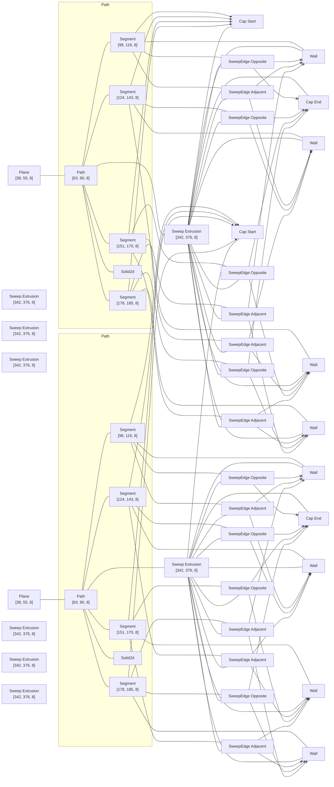

```mermaid
flowchart LR
  subgraph path2 [Path]
    2["Path<br>[63, 90, 8]"]
    3["Segment<br>[98, 116, 8]"]
    4["Segment<br>[124, 143, 8]"]
    5["Segment<br>[151, 170, 8]"]
    6["Segment<br>[178, 185, 8]"]
    7[Solid2d]
  end
  subgraph path27 [Path]
    27["Path<br>[63, 90, 8]"]
    28["Segment<br>[98, 116, 8]"]
    29["Segment<br>[124, 143, 8]"]
    30["Segment<br>[151, 170, 8]"]
    31["Segment<br>[178, 185, 8]"]
    32[Solid2d]
  end
  1["Plane<br>[38, 55, 8]"]
  8["Sweep Extrusion<br>[342, 376, 8]"]
  9[Wall]
  10[Wall]
  11[Wall]
  12[Wall]
  13["Cap Start"]
  14["Cap End"]
  15["SweepEdge Opposite"]
  16["SweepEdge Adjacent"]
  17["SweepEdge Opposite"]
  18["SweepEdge Adjacent"]
  19["SweepEdge Opposite"]
  20["SweepEdge Adjacent"]
  21["SweepEdge Opposite"]
  22["SweepEdge Adjacent"]
  23["Sweep Extrusion<br>[342, 376, 8]"]
  24["Sweep Extrusion<br>[342, 376, 8]"]
  25["Sweep Extrusion<br>[342, 376, 8]"]
  26["Plane<br>[38, 55, 8]"]
  33["Sweep Extrusion<br>[342, 376, 8]"]
  34[Wall]
  35[Wall]
  36[Wall]
  37[Wall]
  38["Cap Start"]
  39["Cap End"]
  40["SweepEdge Opposite"]
  41["SweepEdge Adjacent"]
  42["SweepEdge Opposite"]
  43["SweepEdge Adjacent"]
  44["SweepEdge Opposite"]
  45["SweepEdge Adjacent"]
  46["SweepEdge Opposite"]
  47["SweepEdge Adjacent"]
  48["Sweep Extrusion<br>[342, 376, 8]"]
  49["Sweep Extrusion<br>[342, 376, 8]"]
  50["Sweep Extrusion<br>[342, 376, 8]"]
  1 --- 2
  2 --- 3
  2 --- 4
  2 --- 5
  2 --- 6
  2 ---- 8
  2 --- 7
  3 --- 9
  3 --- 15
  3 --- 16
  3 x--> 13
  4 --- 10
  4 --- 17
  4 --- 18
  4 x--> 13
  5 --- 11
  5 --- 19
  5 --- 20
  5 x--> 13
  6 --- 12
  6 --- 21
  6 --- 22
  6 x--> 13
  8 --- 9
  8 --- 10
  8 --- 11
  8 --- 12
  8 --- 13
  8 --- 14
  8 --- 15
  8 --- 16
  8 --- 17
  8 --- 18
  8 --- 19
  8 --- 20
  8 --- 21
  8 --- 22
  15 <--x 9
  15 <--x 14
  16 <--x 9
  16 <--x 10
  17 <--x 10
  17 <--x 14
  18 <--x 10
  18 <--x 11
  19 <--x 11
  19 <--x 14
  20 <--x 11
  20 <--x 12
  21 <--x 12
  21 <--x 14
  22 <--x 9
  22 <--x 12
  26 --- 27
  27 --- 28
  27 --- 29
  27 --- 30
  27 --- 31
  27 ---- 33
  27 --- 32
  28 --- 34
  28 --- 40
  28 --- 41
  28 x--> 38
  29 --- 35
  29 --- 42
  29 --- 43
  29 x--> 38
  30 --- 36
  30 --- 44
  30 --- 45
  30 x--> 38
  31 --- 37
  31 --- 46
  31 --- 47
  31 x--> 38
  33 --- 34
  33 --- 35
  33 --- 36
  33 --- 37
  33 --- 38
  33 --- 39
  33 --- 40
  33 --- 41
  33 --- 42
  33 --- 43
  33 --- 44
  33 --- 45
  33 --- 46
  33 --- 47
  40 <--x 34
  40 <--x 39
  41 <--x 34
  41 <--x 35
  42 <--x 35
  42 <--x 39
  43 <--x 35
  43 <--x 36
  44 <--x 36
  44 <--x 39
  45 <--x 36
  45 <--x 37
  46 <--x 37
  46 <--x 39
  47 <--x 34
  47 <--x 37
```
