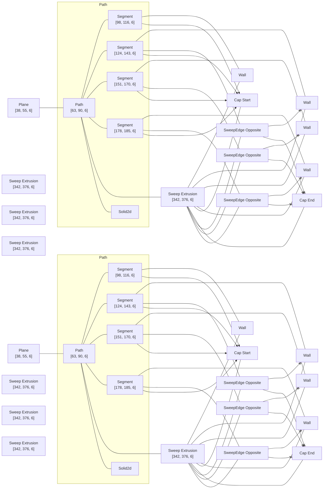

```mermaid
flowchart LR
  subgraph path2 [Path]
    2["Path<br>[63, 90, 6]"]
    3["Segment<br>[98, 116, 6]"]
    4["Segment<br>[124, 143, 6]"]
    5["Segment<br>[151, 170, 6]"]
    6["Segment<br>[178, 185, 6]"]
    7[Solid2d]
  end
  subgraph path22 [Path]
    22["Path<br>[63, 90, 6]"]
    23["Segment<br>[98, 116, 6]"]
    24["Segment<br>[124, 143, 6]"]
    25["Segment<br>[151, 170, 6]"]
    26["Segment<br>[178, 185, 6]"]
    27[Solid2d]
  end
  1["Plane<br>[38, 55, 6]"]
  8["Sweep Extrusion<br>[342, 376, 6]"]
  9[Wall]
  10[Wall]
  11[Wall]
  12[Wall]
  13["Cap Start"]
  14["Cap End"]
  15["SweepEdge Opposite"]
  16["SweepEdge Opposite"]
  17["SweepEdge Opposite"]
  18["Sweep Extrusion<br>[342, 376, 6]"]
  19["Sweep Extrusion<br>[342, 376, 6]"]
  20["Sweep Extrusion<br>[342, 376, 6]"]
  21["Plane<br>[38, 55, 6]"]
  28["Sweep Extrusion<br>[342, 376, 6]"]
  29[Wall]
  30[Wall]
  31[Wall]
  32[Wall]
  33["Cap Start"]
  34["Cap End"]
  35["SweepEdge Opposite"]
  36["SweepEdge Opposite"]
  37["SweepEdge Opposite"]
  38["Sweep Extrusion<br>[342, 376, 6]"]
  39["Sweep Extrusion<br>[342, 376, 6]"]
  40["Sweep Extrusion<br>[342, 376, 6]"]
  1 --- 2
  2 --- 3
  2 --- 4
  2 --- 5
  2 --- 6
  2 ---- 8
  2 --- 7
  3 --- 9
  3 x--> 13
  4 --- 10
  4 --- 15
  4 x--> 13
  5 --- 11
  5 --- 16
  5 x--> 13
  6 --- 12
  6 --- 17
  6 x--> 13
  8 --- 9
  8 --- 10
  8 --- 11
  8 --- 12
  8 --- 13
  8 --- 14
  8 --- 15
  8 --- 16
  8 --- 17
  15 <--x 10
  15 <--x 14
  16 <--x 11
  16 <--x 14
  17 <--x 12
  17 <--x 14
  21 --- 22
  22 --- 23
  22 --- 24
  22 --- 25
  22 --- 26
  22 ---- 28
  22 --- 27
  23 --- 29
  23 x--> 33
  24 --- 30
  24 --- 35
  24 x--> 33
  25 --- 31
  25 --- 36
  25 x--> 33
  26 --- 32
  26 --- 37
  26 x--> 33
  28 --- 29
  28 --- 30
  28 --- 31
  28 --- 32
  28 --- 33
  28 --- 34
  28 --- 35
  28 --- 36
  28 --- 37
  35 <--x 30
  35 <--x 34
  36 <--x 31
  36 <--x 34
  37 <--x 32
  37 <--x 34
```
