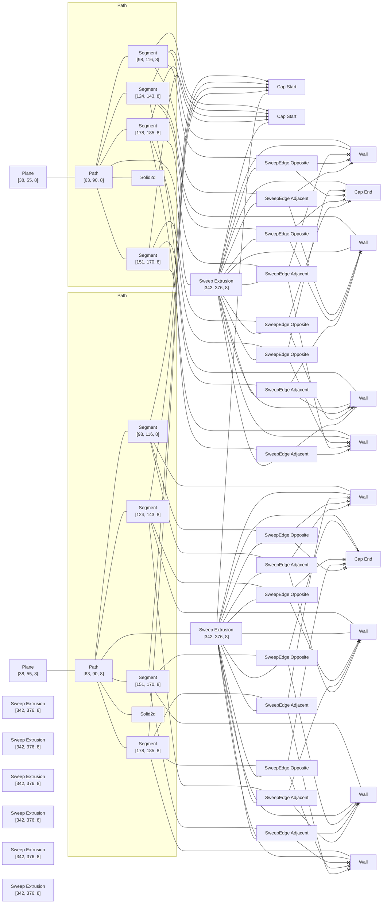

```mermaid
flowchart LR
  subgraph path3 [Path]
    3["Path<br>[63, 90, 8]"]
    5["Segment<br>[98, 116, 8]"]
    8["Segment<br>[124, 143, 8]"]
    10["Segment<br>[151, 170, 8]"]
    11["Segment<br>[178, 185, 8]"]
    13[Solid2d]
  end
  subgraph path4 [Path]
    4["Path<br>[63, 90, 8]"]
    6["Segment<br>[98, 116, 8]"]
    7["Segment<br>[124, 143, 8]"]
    9["Segment<br>[151, 170, 8]"]
    12["Segment<br>[178, 185, 8]"]
    14[Solid2d]
  end
  1["Plane<br>[38, 55, 8]"]
  2["Plane<br>[38, 55, 8]"]
  15["Sweep Extrusion<br>[342, 376, 8]"]
  16["Sweep Extrusion<br>[342, 376, 8]"]
  17["Sweep Extrusion<br>[342, 376, 8]"]
  18["Sweep Extrusion<br>[342, 376, 8]"]
  19["Sweep Extrusion<br>[342, 376, 8]"]
  20["Sweep Extrusion<br>[342, 376, 8]"]
  21["Sweep Extrusion<br>[342, 376, 8]"]
  22["Sweep Extrusion<br>[342, 376, 8]"]
  23[Wall]
  24[Wall]
  25[Wall]
  26[Wall]
  27[Wall]
  28[Wall]
  29[Wall]
  30[Wall]
  31["Cap Start"]
  32["Cap Start"]
  33["Cap End"]
  34["Cap End"]
  35["SweepEdge Opposite"]
  36["SweepEdge Adjacent"]
  37["SweepEdge Opposite"]
  38["SweepEdge Adjacent"]
  39["SweepEdge Opposite"]
  40["SweepEdge Adjacent"]
  41["SweepEdge Opposite"]
  42["SweepEdge Adjacent"]
  43["SweepEdge Opposite"]
  44["SweepEdge Adjacent"]
  45["SweepEdge Opposite"]
  46["SweepEdge Adjacent"]
  47["SweepEdge Opposite"]
  48["SweepEdge Adjacent"]
  49["SweepEdge Opposite"]
  50["SweepEdge Adjacent"]
  1 --- 3
  2 --- 4
  3 --- 5
  3 --- 8
  3 --- 10
  3 --- 11
  3 --- 13
  3 ---- 22
  4 --- 6
  4 --- 7
  4 --- 9
  4 --- 12
  4 --- 14
  4 ---- 17
  5 --- 28
  5 x--> 32
  5 --- 45
  5 --- 46
  6 --- 26
  6 x--> 31
  6 --- 41
  6 --- 42
  7 --- 24
  7 x--> 31
  7 --- 37
  7 --- 38
  8 --- 29
  8 x--> 32
  8 --- 47
  8 --- 48
  9 --- 23
  9 x--> 31
  9 --- 35
  9 --- 36
  10 --- 30
  10 x--> 32
  10 --- 49
  10 --- 50
  11 --- 27
  11 x--> 32
  11 --- 43
  11 --- 44
  12 --- 25
  12 x--> 31
  12 --- 39
  12 --- 40
  17 --- 23
  17 --- 24
  17 --- 25
  17 --- 26
  17 --- 31
  17 --- 33
  17 --- 35
  17 --- 36
  17 --- 37
  17 --- 38
  17 --- 39
  17 --- 40
  17 --- 41
  17 --- 42
  22 --- 27
  22 --- 28
  22 --- 29
  22 --- 30
  22 --- 32
  22 --- 34
  22 --- 43
  22 --- 44
  22 --- 45
  22 --- 46
  22 --- 47
  22 --- 48
  22 --- 49
  22 --- 50
  35 <--x 23
  36 <--x 23
  38 <--x 23
  37 <--x 24
  38 <--x 24
  42 <--x 24
  36 <--x 25
  39 <--x 25
  40 <--x 25
  40 <--x 26
  41 <--x 26
  42 <--x 26
  43 <--x 27
  44 <--x 27
  50 <--x 27
  44 <--x 28
  45 <--x 28
  46 <--x 28
  46 <--x 29
  47 <--x 29
  48 <--x 29
  48 <--x 30
  49 <--x 30
  50 <--x 30
  35 <--x 33
  37 <--x 33
  39 <--x 33
  41 <--x 33
  43 <--x 34
  45 <--x 34
  47 <--x 34
  49 <--x 34
```
