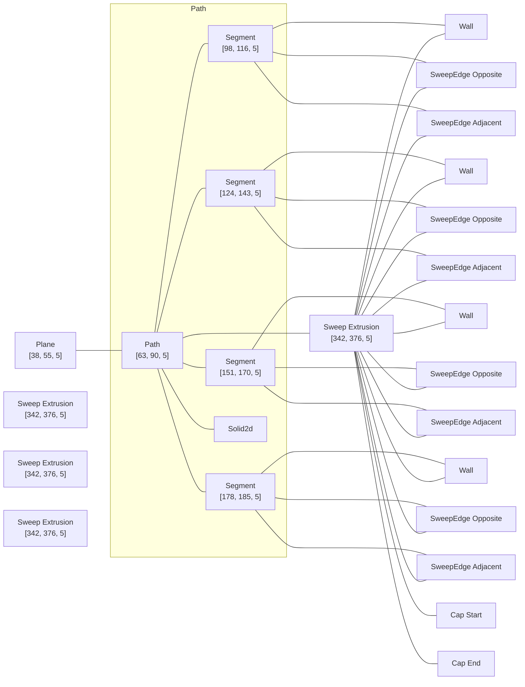

```mermaid
flowchart LR
  subgraph path2 [Path]
    2["Path<br>[63, 90, 5]"]
    3["Segment<br>[98, 116, 5]"]
    4["Segment<br>[124, 143, 5]"]
    5["Segment<br>[151, 170, 5]"]
    6["Segment<br>[178, 185, 5]"]
    7[Solid2d]
  end
  1["Plane<br>[38, 55, 5]"]
  8["Sweep Extrusion<br>[342, 376, 5]"]
  9[Wall]
  10[Wall]
  11[Wall]
  12[Wall]
  13["Cap Start"]
  14["Cap End"]
  15["SweepEdge Opposite"]
  16["SweepEdge Adjacent"]
  17["SweepEdge Opposite"]
  18["SweepEdge Adjacent"]
  19["SweepEdge Opposite"]
  20["SweepEdge Adjacent"]
  21["SweepEdge Opposite"]
  22["SweepEdge Adjacent"]
  23["Sweep Extrusion<br>[342, 376, 5]"]
  24["Sweep Extrusion<br>[342, 376, 5]"]
  25["Sweep Extrusion<br>[342, 376, 5]"]
  1 --- 2
  2 --- 3
  2 --- 4
  2 --- 5
  2 --- 6
  2 ---- 8
  2 --- 7
  3 --- 9
  3 --- 15
  3 --- 16
  4 --- 10
  4 --- 17
  4 --- 18
  5 --- 11
  5 --- 19
  5 --- 20
  6 --- 12
  6 --- 21
  6 --- 22
  8 --- 9
  8 --- 10
  8 --- 11
  8 --- 12
  8 --- 13
  8 --- 14
  8 --- 15
  8 --- 16
  8 --- 17
  8 --- 18
  8 --- 19
  8 --- 20
  8 --- 21
  8 --- 22
```
