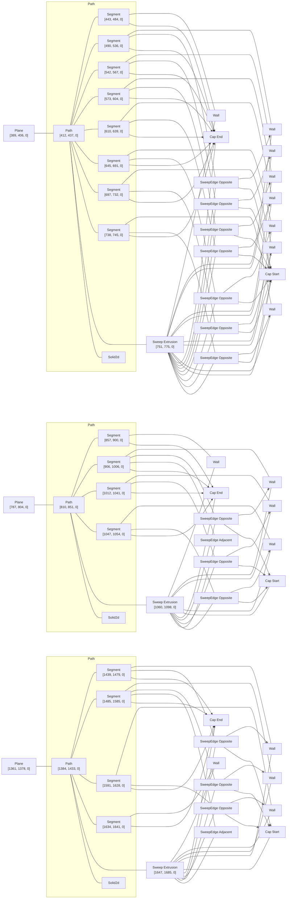

```mermaid
flowchart LR
  subgraph path2 [Path]
    2["Path<br>[412, 437, 0]"]
    3["Segment<br>[443, 484, 0]"]
    4["Segment<br>[490, 536, 0]"]
    5["Segment<br>[542, 567, 0]"]
    6["Segment<br>[573, 604, 0]"]
    7["Segment<br>[610, 639, 0]"]
    8["Segment<br>[645, 691, 0]"]
    9["Segment<br>[697, 732, 0]"]
    10["Segment<br>[738, 745, 0]"]
    11[Solid2d]
  end
  subgraph path31 [Path]
    31["Path<br>[810, 851, 0]"]
    32["Segment<br>[857, 900, 0]"]
    33["Segment<br>[906, 1006, 0]"]
    34["Segment<br>[1012, 1041, 0]"]
    35["Segment<br>[1047, 1054, 0]"]
    36[Solid2d]
  end
  subgraph path49 [Path]
    49["Path<br>[1384, 1433, 0]"]
    50["Segment<br>[1439, 1479, 0]"]
    51["Segment<br>[1485, 1585, 0]"]
    52["Segment<br>[1591, 1628, 0]"]
    53["Segment<br>[1634, 1641, 0]"]
    54[Solid2d]
  end
  1["Plane<br>[389, 406, 0]"]
  12["Sweep Extrusion<br>[751, 775, 0]"]
  13[Wall]
  14[Wall]
  15[Wall]
  16[Wall]
  17[Wall]
  18[Wall]
  19[Wall]
  20[Wall]
  21["Cap Start"]
  22["Cap End"]
  23["SweepEdge Opposite"]
  24["SweepEdge Opposite"]
  25["SweepEdge Opposite"]
  26["SweepEdge Opposite"]
  27["SweepEdge Opposite"]
  28["SweepEdge Opposite"]
  29["SweepEdge Opposite"]
  30["Plane<br>[787, 804, 0]"]
  37["Sweep Extrusion<br>[1060, 1098, 0]"]
  38[Wall]
  39[Wall]
  40[Wall]
  41[Wall]
  42["Cap Start"]
  43["Cap End"]
  44["SweepEdge Opposite"]
  45["SweepEdge Opposite"]
  46["SweepEdge Opposite"]
  47["SweepEdge Adjacent"]
  48["Plane<br>[1361, 1378, 0]"]
  55["Sweep Extrusion<br>[1647, 1685, 0]"]
  56[Wall]
  57[Wall]
  58[Wall]
  59[Wall]
  60["Cap Start"]
  61["Cap End"]
  62["SweepEdge Opposite"]
  63["SweepEdge Opposite"]
  64["SweepEdge Opposite"]
  65["SweepEdge Adjacent"]
  1 --- 2
  2 --- 3
  2 --- 4
  2 --- 5
  2 --- 6
  2 --- 7
  2 --- 8
  2 --- 9
  2 --- 10
  2 ---- 12
  2 --- 11
  3 --- 13
  3 x--> 22
  4 --- 14
  4 --- 23
  4 x--> 22
  5 --- 15
  5 --- 24
  5 x--> 22
  6 --- 16
  6 --- 25
  6 x--> 22
  7 --- 17
  7 --- 26
  7 x--> 22
  8 --- 18
  8 --- 27
  8 x--> 22
  9 --- 19
  9 --- 28
  9 x--> 22
  10 --- 20
  10 --- 29
  10 x--> 22
  12 --- 13
  12 --- 14
  12 --- 15
  12 --- 16
  12 --- 17
  12 --- 18
  12 --- 19
  12 --- 20
  12 --- 21
  12 --- 22
  12 --- 23
  12 --- 24
  12 --- 25
  12 --- 26
  12 --- 27
  12 --- 28
  12 --- 29
  23 <--x 14
  23 <--x 21
  24 <--x 15
  24 <--x 21
  25 <--x 16
  25 <--x 21
  26 <--x 17
  26 <--x 21
  27 <--x 18
  27 <--x 21
  28 <--x 19
  28 <--x 21
  29 <--x 20
  29 <--x 21
  30 --- 31
  31 --- 32
  31 --- 33
  31 --- 34
  31 --- 35
  31 ---- 37
  31 --- 36
  32 --- 38
  32 x--> 43
  33 --- 39
  33 --- 44
  33 --- 47
  33 x--> 43
  34 --- 40
  34 --- 45
  34 x--> 43
  35 --- 41
  35 --- 46
  35 x--> 43
  37 --- 38
  37 --- 39
  37 --- 40
  37 --- 41
  37 --- 42
  37 --- 43
  37 --- 44
  37 --- 45
  37 --- 46
  37 --- 47
  44 <--x 39
  44 <--x 42
  45 <--x 40
  45 <--x 42
  46 <--x 41
  46 <--x 42
  48 --- 49
  49 --- 50
  49 --- 51
  49 --- 52
  49 --- 53
  49 ---- 55
  49 --- 54
  50 --- 59
  50 --- 64
  50 x--> 61
  51 --- 58
  51 --- 63
  51 --- 65
  51 x--> 61
  52 --- 57
  52 --- 62
  52 x--> 61
  53 --- 56
  53 x--> 61
  55 --- 56
  55 --- 57
  55 --- 58
  55 --- 59
  55 --- 60
  55 --- 61
  55 --- 62
  55 --- 63
  55 --- 64
  55 --- 65
  62 <--x 57
  62 <--x 60
  63 <--x 58
  63 <--x 60
  64 <--x 59
  64 <--x 60
```
