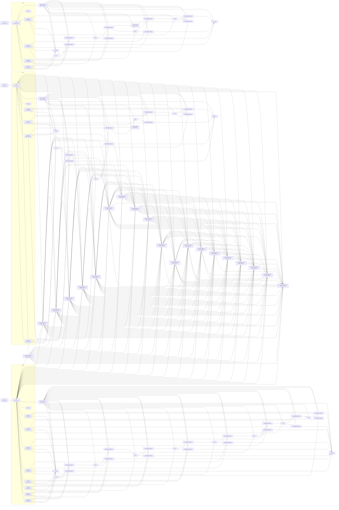

```mermaid
flowchart LR
  subgraph path2 [Path]
    2["Path<br>[412, 437, 0]"]
      %% [ProgramBodyItem { index: 12 }, VariableDeclarationDeclaration, VariableDeclarationInit, PipeBodyItem { index: 1 }]
    3["Segment<br>[443, 484, 0]"]
      %% [ProgramBodyItem { index: 12 }, VariableDeclarationDeclaration, VariableDeclarationInit, PipeBodyItem { index: 2 }]
    4["Segment<br>[490, 536, 0]"]
      %% [ProgramBodyItem { index: 12 }, VariableDeclarationDeclaration, VariableDeclarationInit, PipeBodyItem { index: 3 }]
    5["Segment<br>[542, 567, 0]"]
      %% [ProgramBodyItem { index: 12 }, VariableDeclarationDeclaration, VariableDeclarationInit, PipeBodyItem { index: 4 }]
    6["Segment<br>[573, 604, 0]"]
      %% [ProgramBodyItem { index: 12 }, VariableDeclarationDeclaration, VariableDeclarationInit, PipeBodyItem { index: 5 }]
    7["Segment<br>[610, 639, 0]"]
      %% [ProgramBodyItem { index: 12 }, VariableDeclarationDeclaration, VariableDeclarationInit, PipeBodyItem { index: 6 }]
    8["Segment<br>[645, 691, 0]"]
      %% [ProgramBodyItem { index: 12 }, VariableDeclarationDeclaration, VariableDeclarationInit, PipeBodyItem { index: 7 }]
    9["Segment<br>[697, 732, 0]"]
      %% [ProgramBodyItem { index: 12 }, VariableDeclarationDeclaration, VariableDeclarationInit, PipeBodyItem { index: 8 }]
    10["Segment<br>[738, 745, 0]"]
      %% [ProgramBodyItem { index: 12 }, VariableDeclarationDeclaration, VariableDeclarationInit, PipeBodyItem { index: 9 }]
    11[Solid2d]
  end
  subgraph path40 [Path]
    40["Path<br>[810, 851, 0]"]
      %% [ProgramBodyItem { index: 13 }, VariableDeclarationDeclaration, VariableDeclarationInit, PipeBodyItem { index: 1 }]
    41["Segment<br>[857, 900, 0]"]
      %% [ProgramBodyItem { index: 13 }, VariableDeclarationDeclaration, VariableDeclarationInit, PipeBodyItem { index: 2 }]
    42["Segment<br>[906, 1006, 0]"]
      %% [ProgramBodyItem { index: 13 }, VariableDeclarationDeclaration, VariableDeclarationInit, PipeBodyItem { index: 3 }]
    43["Segment<br>[1012, 1041, 0]"]
      %% [ProgramBodyItem { index: 13 }, VariableDeclarationDeclaration, VariableDeclarationInit, PipeBodyItem { index: 4 }]
    44["Segment<br>[1047, 1054, 0]"]
      %% [ProgramBodyItem { index: 13 }, VariableDeclarationDeclaration, VariableDeclarationInit, PipeBodyItem { index: 5 }]
    45[Solid2d]
  end
  subgraph path63 [Path]
    63["Path<br>[1384, 1433, 0]"]
      %% [ProgramBodyItem { index: 14 }, VariableDeclarationDeclaration, VariableDeclarationInit, PipeBodyItem { index: 1 }]
    64["Segment<br>[1439, 1479, 0]"]
      %% [ProgramBodyItem { index: 14 }, VariableDeclarationDeclaration, VariableDeclarationInit, PipeBodyItem { index: 2 }]
    65["Segment<br>[1485, 1585, 0]"]
      %% [ProgramBodyItem { index: 14 }, VariableDeclarationDeclaration, VariableDeclarationInit, PipeBodyItem { index: 3 }]
    66["Segment<br>[1591, 1628, 0]"]
      %% [ProgramBodyItem { index: 14 }, VariableDeclarationDeclaration, VariableDeclarationInit, PipeBodyItem { index: 4 }]
    67["Segment<br>[1634, 1641, 0]"]
      %% [ProgramBodyItem { index: 14 }, VariableDeclarationDeclaration, VariableDeclarationInit, PipeBodyItem { index: 5 }]
    68[Solid2d]
  end
  1["Plane<br>[389, 406, 0]"]
    %% [ProgramBodyItem { index: 12 }, VariableDeclarationDeclaration, VariableDeclarationInit, PipeBodyItem { index: 0 }]
  12["Sweep Extrusion<br>[751, 775, 0]"]
    %% [ProgramBodyItem { index: 12 }, VariableDeclarationDeclaration, VariableDeclarationInit, PipeBodyItem { index: 10 }]
  13[Wall]
    %% face_code_ref=Missing NodePath
  14[Wall]
    %% face_code_ref=Missing NodePath
  15[Wall]
    %% face_code_ref=Missing NodePath
  16[Wall]
    %% face_code_ref=Missing NodePath
  17[Wall]
    %% face_code_ref=Missing NodePath
  18[Wall]
    %% face_code_ref=Missing NodePath
  19[Wall]
    %% face_code_ref=Missing NodePath
  20[Wall]
    %% face_code_ref=Missing NodePath
  21["Cap Start"]
    %% face_code_ref=Missing NodePath
  22["Cap End"]
    %% face_code_ref=Missing NodePath
  23["SweepEdge Opposite"]
  24["SweepEdge Adjacent"]
  25["SweepEdge Opposite"]
  26["SweepEdge Adjacent"]
  27["SweepEdge Opposite"]
  28["SweepEdge Adjacent"]
  29["SweepEdge Opposite"]
  30["SweepEdge Adjacent"]
  31["SweepEdge Opposite"]
  32["SweepEdge Adjacent"]
  33["SweepEdge Opposite"]
  34["SweepEdge Adjacent"]
  35["SweepEdge Opposite"]
  36["SweepEdge Adjacent"]
  37["SweepEdge Opposite"]
  38["SweepEdge Adjacent"]
  39["Plane<br>[787, 804, 0]"]
    %% [ProgramBodyItem { index: 13 }, VariableDeclarationDeclaration, VariableDeclarationInit, PipeBodyItem { index: 0 }]
  46["Sweep Extrusion<br>[1060, 1098, 0]"]
    %% [ProgramBodyItem { index: 13 }, VariableDeclarationDeclaration, VariableDeclarationInit, PipeBodyItem { index: 6 }]
  47[Wall]
    %% face_code_ref=Missing NodePath
  48[Wall]
    %% face_code_ref=Missing NodePath
  49[Wall]
    %% face_code_ref=Missing NodePath
  50[Wall]
    %% face_code_ref=Missing NodePath
  51["Cap Start"]
    %% face_code_ref=Missing NodePath
  52["Cap End"]
    %% face_code_ref=Missing NodePath
  53["SweepEdge Opposite"]
  54["SweepEdge Adjacent"]
  55["SweepEdge Opposite"]
  56["SweepEdge Adjacent"]
  57["SweepEdge Opposite"]
  58["SweepEdge Adjacent"]
  59["SweepEdge Opposite"]
  60["SweepEdge Adjacent"]
  61["EdgeCut Fillet<br>[1104, 1185, 0]"]
    %% [ProgramBodyItem { index: 13 }, VariableDeclarationDeclaration, VariableDeclarationInit, PipeBodyItem { index: 7 }]
  62["Plane<br>[1361, 1378, 0]"]
    %% [ProgramBodyItem { index: 14 }, VariableDeclarationDeclaration, VariableDeclarationInit, PipeBodyItem { index: 0 }]
  69["Sweep Extrusion<br>[1647, 1685, 0]"]
    %% [ProgramBodyItem { index: 14 }, VariableDeclarationDeclaration, VariableDeclarationInit, PipeBodyItem { index: 6 }]
  70[Wall]
    %% face_code_ref=Missing NodePath
  71[Wall]
    %% face_code_ref=Missing NodePath
  72[Wall]
    %% face_code_ref=Missing NodePath
  73[Wall]
    %% face_code_ref=Missing NodePath
  74["Cap Start"]
    %% face_code_ref=Missing NodePath
  75["Cap End"]
    %% face_code_ref=Missing NodePath
  76["SweepEdge Opposite"]
  77["SweepEdge Adjacent"]
  78["SweepEdge Opposite"]
  79["SweepEdge Adjacent"]
  80["SweepEdge Opposite"]
  81["SweepEdge Adjacent"]
  82["SweepEdge Opposite"]
  83["SweepEdge Adjacent"]
  84["EdgeCut Fillet<br>[1691, 1773, 0]"]
    %% [ProgramBodyItem { index: 14 }, VariableDeclarationDeclaration, VariableDeclarationInit, PipeBodyItem { index: 7 }]
  85["CompositeSolid Union<br>[1939, 1960, 0]"]
    %% [ProgramBodyItem { index: 15 }, ExpressionStatementExpr]
  86["CompositeSolid Union<br>[1939, 1960, 0]"]
    %% [ProgramBodyItem { index: 15 }, ExpressionStatementExpr]
  87["CompositeSolid Union<br>[1939, 1960, 0]"]
    %% [ProgramBodyItem { index: 15 }, ExpressionStatementExpr]
  88["CompositeSolid Union<br>[1939, 1960, 0]"]
    %% [ProgramBodyItem { index: 15 }, ExpressionStatementExpr]
  89["CompositeSolid Union<br>[1939, 1960, 0]"]
    %% [ProgramBodyItem { index: 15 }, ExpressionStatementExpr]
  90["CompositeSolid Union<br>[1939, 1960, 0]"]
    %% [ProgramBodyItem { index: 15 }, ExpressionStatementExpr]
  91["CompositeSolid Union<br>[1939, 1960, 0]"]
    %% [ProgramBodyItem { index: 15 }, ExpressionStatementExpr]
  92["CompositeSolid Union<br>[1939, 1960, 0]"]
    %% [ProgramBodyItem { index: 15 }, ExpressionStatementExpr]
  93["CompositeSolid Union<br>[1939, 1960, 0]"]
    %% [ProgramBodyItem { index: 15 }, ExpressionStatementExpr]
  94["CompositeSolid Union<br>[1939, 1960, 0]"]
    %% [ProgramBodyItem { index: 15 }, ExpressionStatementExpr]
  95["CompositeSolid Union<br>[1939, 1960, 0]"]
    %% [ProgramBodyItem { index: 15 }, ExpressionStatementExpr]
  96["CompositeSolid Union<br>[1939, 1960, 0]"]
    %% [ProgramBodyItem { index: 15 }, ExpressionStatementExpr]
  97["CompositeSolid Union<br>[1939, 1960, 0]"]
    %% [ProgramBodyItem { index: 15 }, ExpressionStatementExpr]
  98["CompositeSolid Union<br>[1939, 1960, 0]"]
    %% [ProgramBodyItem { index: 15 }, ExpressionStatementExpr]
  99["CompositeSolid Union<br>[1939, 1960, 0]"]
    %% [ProgramBodyItem { index: 15 }, ExpressionStatementExpr]
  100["CompositeSolid Union<br>[1939, 1960, 0]"]
    %% [ProgramBodyItem { index: 15 }, ExpressionStatementExpr]
  101["CompositeSolid Union<br>[1939, 1960, 0]"]
    %% [ProgramBodyItem { index: 15 }, ExpressionStatementExpr]
  102["CompositeSolid Union<br>[1939, 1960, 0]"]
    %% [ProgramBodyItem { index: 15 }, ExpressionStatementExpr]
  103["CompositeSolid Union<br>[1939, 1960, 0]"]
    %% [ProgramBodyItem { index: 15 }, ExpressionStatementExpr]
  104["CompositeSolid Union<br>[1939, 1960, 0]"]
    %% [ProgramBodyItem { index: 15 }, ExpressionStatementExpr]
  1 --- 2
  2 --- 3
  2 --- 4
  2 --- 5
  2 --- 6
  2 --- 7
  2 --- 8
  2 --- 9
  2 --- 10
  2 --- 11
  2 ---- 12
  2 <--x 85
  2 <--x 86
  2 <--x 87
  2 <--x 88
  2 <--x 89
  2 <--x 90
  2 <--x 91
  2 <--x 92
  2 <--x 93
  2 <--x 94
  2 <--x 95
  2 <--x 96
  2 <--x 97
  2 <--x 98
  2 <--x 99
  2 <--x 100
  2 <--x 101
  2 <--x 102
  2 <--x 103
  2 --- 104
  3 --- 13
  3 x--> 22
  3 --- 23
  3 --- 24
  4 --- 14
  4 x--> 22
  4 --- 25
  4 --- 26
  5 --- 15
  5 x--> 22
  5 --- 27
  5 --- 28
  6 --- 16
  6 x--> 22
  6 --- 29
  6 --- 30
  7 --- 17
  7 x--> 22
  7 --- 31
  7 --- 32
  8 --- 18
  8 x--> 22
  8 --- 33
  8 --- 34
  9 --- 19
  9 x--> 22
  9 --- 35
  9 --- 36
  10 --- 20
  10 x--> 22
  10 --- 37
  10 --- 38
  12 --- 13
  12 --- 14
  12 --- 15
  12 --- 16
  12 --- 17
  12 --- 18
  12 --- 19
  12 --- 20
  12 --- 21
  12 --- 22
  12 --- 23
  12 --- 24
  12 --- 25
  12 --- 26
  12 --- 27
  12 --- 28
  12 --- 29
  12 --- 30
  12 --- 31
  12 --- 32
  12 --- 33
  12 --- 34
  12 --- 35
  12 --- 36
  12 --- 37
  12 --- 38
  13 --- 23
  13 --- 24
  38 <--x 13
  24 <--x 14
  14 --- 25
  14 --- 26
  26 <--x 15
  15 --- 27
  15 --- 28
  28 <--x 16
  16 --- 29
  16 --- 30
  30 <--x 17
  17 --- 31
  17 --- 32
  32 <--x 18
  18 --- 33
  18 --- 34
  34 <--x 19
  19 --- 35
  19 --- 36
  36 <--x 20
  20 --- 37
  20 --- 38
  23 <--x 21
  25 <--x 21
  27 <--x 21
  29 <--x 21
  31 <--x 21
  33 <--x 21
  35 <--x 21
  37 <--x 21
  39 --- 40
  40 --- 41
  40 --- 42
  40 --- 43
  40 --- 44
  40 --- 45
  40 ---- 46
  40 <--x 85
  40 <--x 86
  40 <--x 87
  40 <--x 88
  40 <--x 89
  40 <--x 90
  40 <--x 91
  40 <--x 92
  40 <--x 93
  40 <--x 94
  40 <--x 95
  40 <--x 96
  40 <--x 97
  40 <--x 98
  40 <--x 99
  40 <--x 100
  40 <--x 101
  40 <--x 102
  40 <--x 103
  40 --- 104
  41 --- 47
  41 x--> 52
  41 --- 53
  41 --- 54
  42 --- 48
  42 x--> 52
  42 --- 55
  42 --- 56
  43 --- 49
  43 x--> 52
  43 --- 57
  43 --- 58
  44 --- 50
  44 x--> 52
  44 --- 59
  44 --- 60
  46 --- 47
  46 --- 48
  46 --- 49
  46 --- 50
  46 --- 51
  46 --- 52
  46 --- 53
  46 --- 54
  46 --- 55
  46 --- 56
  46 --- 57
  46 --- 58
  46 --- 59
  46 --- 60
  47 --- 53
  47 --- 54
  60 <--x 47
  54 <--x 48
  48 --- 55
  48 --- 56
  56 <--x 49
  49 --- 57
  49 --- 58
  58 <--x 50
  50 --- 59
  50 --- 60
  53 <--x 51
  55 <--x 51
  57 <--x 51
  59 <--x 51
  56 <--x 61
  62 --- 63
  63 --- 64
  63 --- 65
  63 --- 66
  63 --- 67
  63 --- 68
  63 ---- 69
  64 --- 73
  64 x--> 75
  64 --- 82
  64 --- 83
  65 --- 72
  65 x--> 75
  65 --- 80
  65 --- 81
  66 --- 71
  66 x--> 75
  66 --- 78
  66 --- 79
  67 --- 70
  67 x--> 75
  67 --- 76
  67 --- 77
  69 --- 70
  69 --- 71
  69 --- 72
  69 --- 73
  69 --- 74
  69 --- 75
  69 --- 76
  69 --- 77
  69 --- 78
  69 --- 79
  69 --- 80
  69 --- 81
  69 --- 82
  69 --- 83
  70 --- 76
  70 --- 77
  79 <--x 70
  71 --- 78
  71 --- 79
  81 <--x 71
  72 --- 80
  72 --- 81
  83 <--x 72
  77 <--x 73
  73 --- 82
  73 --- 83
  76 <--x 74
  78 <--x 74
  80 <--x 74
  82 <--x 74
  81 <--x 84
  86 x--> 85
  87 x--> 85
  88 x--> 85
  89 x--> 85
  90 x--> 85
  91 x--> 85
  92 x--> 85
  93 x--> 85
  94 x--> 85
  95 x--> 85
  96 x--> 85
  97 x--> 85
  98 x--> 85
  99 x--> 85
  100 x--> 85
  101 x--> 85
  102 x--> 85
  103 x--> 85
  104 x--> 85
  87 --- 86
  88 --- 86
  89 --- 86
  90 --- 86
  91 --- 86
  92 --- 86
  93 --- 86
  94 --- 86
  95 --- 86
  96 --- 86
  97 --- 86
  98 --- 86
  99 --- 86
  100 --- 86
  101 --- 86
  102 --- 86
  103 --- 86
  104 --- 86
  88 --- 87
  89 --- 87
  90 --- 87
  91 --- 87
  92 --- 87
  93 --- 87
  94 --- 87
  95 --- 87
  96 --- 87
  97 --- 87
  98 --- 87
  99 --- 87
  100 --- 87
  101 --- 87
  102 --- 87
  103 --- 87
  104 --- 87
  89 --- 88
  90 --- 88
  91 --- 88
  92 --- 88
  93 --- 88
  94 --- 88
  95 --- 88
  96 --- 88
  97 --- 88
  98 --- 88
  99 --- 88
  100 --- 88
  101 --- 88
  102 --- 88
  103 --- 88
  104 --- 88
  90 --- 89
  91 --- 89
  92 --- 89
  93 --- 89
  94 --- 89
  95 --- 89
  96 --- 89
  97 --- 89
  98 --- 89
  99 --- 89
  100 --- 89
  101 --- 89
  102 --- 89
  103 --- 89
  104 --- 89
  91 --- 90
  92 --- 90
  93 --- 90
  94 --- 90
  95 --- 90
  96 --- 90
  97 --- 90
  98 --- 90
  99 --- 90
  100 --- 90
  101 --- 90
  102 --- 90
  103 --- 90
  104 --- 90
  92 --- 91
  93 --- 91
  94 --- 91
  95 --- 91
  96 --- 91
  97 --- 91
  98 --- 91
  99 --- 91
  100 --- 91
  101 --- 91
  102 --- 91
  103 --- 91
  104 --- 91
  93 --- 92
  94 --- 92
  95 --- 92
  96 --- 92
  97 --- 92
  98 --- 92
  99 --- 92
  100 --- 92
  101 --- 92
  102 --- 92
  103 --- 92
  104 --- 92
  94 --- 93
  95 --- 93
  96 --- 93
  97 --- 93
  98 --- 93
  99 --- 93
  100 --- 93
  101 --- 93
  102 --- 93
  103 --- 93
  104 --- 93
  95 --- 94
  96 --- 94
  97 --- 94
  98 --- 94
  99 --- 94
  100 --- 94
  101 --- 94
  102 --- 94
  103 --- 94
  104 --- 94
  96 --- 95
  97 --- 95
  98 --- 95
  99 --- 95
  100 --- 95
  101 --- 95
  102 --- 95
  103 --- 95
  104 --- 95
  97 --- 96
  98 --- 96
  99 --- 96
  100 --- 96
  101 --- 96
  102 --- 96
  103 --- 96
  104 --- 96
  98 --- 97
  99 --- 97
  100 --- 97
  101 --- 97
  102 --- 97
  103 --- 97
  104 --- 97
  99 --- 98
  100 --- 98
  101 --- 98
  102 --- 98
  103 --- 98
  104 --- 98
  100 --- 99
  101 --- 99
  102 --- 99
  103 --- 99
  104 --- 99
  101 --- 100
  102 --- 100
  103 --- 100
  104 --- 100
  102 --- 101
  103 --- 101
  104 --- 101
  103 --- 102
  104 --- 102
  104 --- 103
```
