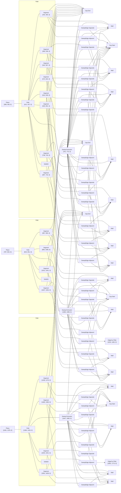

```mermaid
flowchart LR
  subgraph path2 [Path]
    2["Path<br>[412, 437, 0]"]
    3["Segment<br>[443, 484, 0]"]
    4["Segment<br>[490, 536, 0]"]
    5["Segment<br>[542, 567, 0]"]
    6["Segment<br>[573, 604, 0]"]
    7["Segment<br>[610, 639, 0]"]
    8["Segment<br>[645, 691, 0]"]
    9["Segment<br>[697, 732, 0]"]
    10["Segment<br>[738, 745, 0]"]
    11[Solid2d]
  end
  subgraph path40 [Path]
    40["Path<br>[810, 851, 0]"]
    41["Segment<br>[857, 900, 0]"]
    42["Segment<br>[906, 1006, 0]"]
    43["Segment<br>[1012, 1041, 0]"]
    44["Segment<br>[1047, 1054, 0]"]
    45[Solid2d]
  end
  subgraph path63 [Path]
    63["Path<br>[1384, 1433, 0]"]
    64["Segment<br>[1439, 1479, 0]"]
    65["Segment<br>[1485, 1585, 0]"]
    66["Segment<br>[1591, 1628, 0]"]
    67["Segment<br>[1634, 1641, 0]"]
    68[Solid2d]
  end
  1["Plane<br>[389, 406, 0]"]
  12["Sweep Extrusion<br>[751, 775, 0]"]
  13[Wall]
  14[Wall]
  15[Wall]
  16[Wall]
  17[Wall]
  18[Wall]
  19[Wall]
  20[Wall]
  21["Cap Start"]
  22["Cap End"]
  23["SweepEdge Opposite"]
  24["SweepEdge Adjacent"]
  25["SweepEdge Opposite"]
  26["SweepEdge Adjacent"]
  27["SweepEdge Opposite"]
  28["SweepEdge Adjacent"]
  29["SweepEdge Opposite"]
  30["SweepEdge Adjacent"]
  31["SweepEdge Opposite"]
  32["SweepEdge Adjacent"]
  33["SweepEdge Opposite"]
  34["SweepEdge Adjacent"]
  35["SweepEdge Opposite"]
  36["SweepEdge Adjacent"]
  37["SweepEdge Opposite"]
  38["SweepEdge Adjacent"]
  39["Plane<br>[787, 804, 0]"]
  46["Sweep Extrusion<br>[1060, 1098, 0]"]
  47[Wall]
  48[Wall]
  49[Wall]
  50[Wall]
  51["Cap Start"]
  52["Cap End"]
  53["SweepEdge Opposite"]
  54["SweepEdge Adjacent"]
  55["SweepEdge Opposite"]
  56["SweepEdge Adjacent"]
  57["SweepEdge Opposite"]
  58["SweepEdge Adjacent"]
  59["SweepEdge Opposite"]
  60["SweepEdge Adjacent"]
  61["EdgeCut Fillet<br>[1104, 1185, 0]"]
  62["Plane<br>[1361, 1378, 0]"]
  69["Sweep Extrusion<br>[1647, 1685, 0]"]
  70[Wall]
  71[Wall]
  72[Wall]
  73[Wall]
  74["Cap Start"]
  75["Cap End"]
  76["SweepEdge Opposite"]
  77["SweepEdge Adjacent"]
  78["SweepEdge Opposite"]
  79["SweepEdge Adjacent"]
  80["SweepEdge Opposite"]
  81["SweepEdge Adjacent"]
  82["SweepEdge Opposite"]
  83["SweepEdge Adjacent"]
  84["EdgeCut Fillet<br>[1691, 1773, 0]"]
  1 --- 2
  2 --- 3
  2 --- 4
  2 --- 5
  2 --- 6
  2 --- 7
  2 --- 8
  2 --- 9
  2 --- 10
  2 ---- 12
  2 --- 11
  3 --- 13
  3 --- 23
  3 --- 24
  3 x--> 22
  4 --- 14
  4 --- 25
  4 --- 26
  4 x--> 22
  5 --- 15
  5 --- 27
  5 --- 28
  5 x--> 22
  6 --- 16
  6 --- 29
  6 --- 30
  6 x--> 22
  7 --- 17
  7 --- 31
  7 --- 32
  7 x--> 22
  8 --- 18
  8 --- 33
  8 --- 34
  8 x--> 22
  9 --- 19
  9 --- 35
  9 --- 36
  9 x--> 22
  10 --- 20
  10 --- 37
  10 --- 38
  10 x--> 22
  12 --- 13
  12 --- 14
  12 --- 15
  12 --- 16
  12 --- 17
  12 --- 18
  12 --- 19
  12 --- 20
  12 --- 21
  12 --- 22
  12 --- 23
  12 --- 24
  12 --- 25
  12 --- 26
  12 --- 27
  12 --- 28
  12 --- 29
  12 --- 30
  12 --- 31
  12 --- 32
  12 --- 33
  12 --- 34
  12 --- 35
  12 --- 36
  12 --- 37
  12 --- 38
  23 <--x 13
  23 <--x 21
  24 <--x 13
  24 <--x 14
  25 <--x 14
  25 <--x 21
  26 <--x 14
  26 <--x 15
  27 <--x 15
  27 <--x 21
  28 <--x 15
  28 <--x 16
  29 <--x 16
  29 <--x 21
  30 <--x 16
  30 <--x 17
  31 <--x 17
  31 <--x 21
  32 <--x 17
  32 <--x 18
  33 <--x 18
  33 <--x 21
  34 <--x 18
  34 <--x 19
  35 <--x 19
  35 <--x 21
  36 <--x 19
  36 <--x 20
  37 <--x 20
  37 <--x 21
  38 <--x 13
  38 <--x 20
  39 --- 40
  40 --- 41
  40 --- 42
  40 --- 43
  40 --- 44
  40 ---- 46
  40 --- 45
  41 --- 47
  41 --- 53
  41 --- 54
  41 x--> 52
  42 --- 48
  42 --- 55
  42 --- 56
  42 x--> 52
  43 --- 49
  43 --- 57
  43 --- 58
  43 x--> 52
  44 --- 50
  44 --- 59
  44 --- 60
  44 x--> 52
  46 --- 47
  46 --- 48
  46 --- 49
  46 --- 50
  46 --- 51
  46 --- 52
  46 --- 53
  46 --- 54
  46 --- 55
  46 --- 56
  46 --- 57
  46 --- 58
  46 --- 59
  46 --- 60
  53 <--x 47
  53 <--x 51
  54 <--x 47
  54 <--x 48
  55 <--x 48
  55 <--x 51
  57 <--x 49
  57 <--x 51
  58 <--x 49
  58 <--x 50
  59 <--x 50
  59 <--x 51
  60 <--x 47
  60 <--x 50
  56 <--x 61
  62 --- 63
  63 --- 64
  63 --- 65
  63 --- 66
  63 --- 67
  63 ---- 69
  63 --- 68
  64 --- 73
  64 --- 82
  64 --- 83
  64 x--> 75
  65 --- 72
  65 --- 80
  65 --- 81
  65 x--> 75
  66 --- 71
  66 --- 78
  66 --- 79
  66 x--> 75
  67 --- 70
  67 --- 76
  67 --- 77
  67 x--> 75
  69 --- 70
  69 --- 71
  69 --- 72
  69 --- 73
  69 --- 74
  69 --- 75
  69 --- 76
  69 --- 77
  69 --- 78
  69 --- 79
  69 --- 80
  69 --- 81
  69 --- 82
  69 --- 83
  76 <--x 70
  76 <--x 74
  77 <--x 70
  77 <--x 73
  78 <--x 71
  78 <--x 74
  79 <--x 70
  79 <--x 71
  80 <--x 72
  80 <--x 74
  82 <--x 73
  82 <--x 74
  83 <--x 72
  83 <--x 73
  81 <--x 84
```
