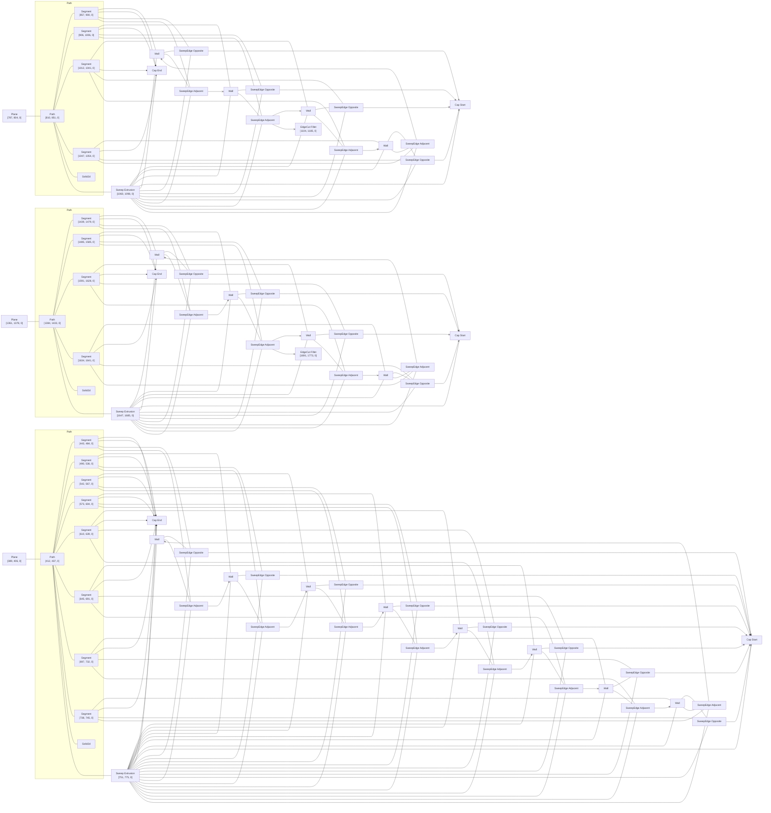

```mermaid
flowchart LR
  subgraph path4 [Path]
    4["Path<br>[412, 437, 0]"]
      %% [ProgramBodyItem { index: 12 }, VariableDeclarationDeclaration, VariableDeclarationInit, PipeBodyItem { index: 1 }]
    7["Segment<br>[443, 484, 0]"]
      %% [ProgramBodyItem { index: 12 }, VariableDeclarationDeclaration, VariableDeclarationInit, PipeBodyItem { index: 2 }]
    8["Segment<br>[490, 536, 0]"]
      %% [ProgramBodyItem { index: 12 }, VariableDeclarationDeclaration, VariableDeclarationInit, PipeBodyItem { index: 3 }]
    9["Segment<br>[542, 567, 0]"]
      %% [ProgramBodyItem { index: 12 }, VariableDeclarationDeclaration, VariableDeclarationInit, PipeBodyItem { index: 4 }]
    10["Segment<br>[573, 604, 0]"]
      %% [ProgramBodyItem { index: 12 }, VariableDeclarationDeclaration, VariableDeclarationInit, PipeBodyItem { index: 5 }]
    11["Segment<br>[610, 639, 0]"]
      %% [ProgramBodyItem { index: 12 }, VariableDeclarationDeclaration, VariableDeclarationInit, PipeBodyItem { index: 6 }]
    12["Segment<br>[645, 691, 0]"]
      %% [ProgramBodyItem { index: 12 }, VariableDeclarationDeclaration, VariableDeclarationInit, PipeBodyItem { index: 7 }]
    13["Segment<br>[697, 732, 0]"]
      %% [ProgramBodyItem { index: 12 }, VariableDeclarationDeclaration, VariableDeclarationInit, PipeBodyItem { index: 8 }]
    14["Segment<br>[738, 745, 0]"]
      %% [ProgramBodyItem { index: 12 }, VariableDeclarationDeclaration, VariableDeclarationInit, PipeBodyItem { index: 9 }]
    24[Solid2d]
  end
  subgraph path5 [Path]
    5["Path<br>[810, 851, 0]"]
      %% [ProgramBodyItem { index: 13 }, VariableDeclarationDeclaration, VariableDeclarationInit, PipeBodyItem { index: 1 }]
    15["Segment<br>[857, 900, 0]"]
      %% [ProgramBodyItem { index: 13 }, VariableDeclarationDeclaration, VariableDeclarationInit, PipeBodyItem { index: 2 }]
    16["Segment<br>[906, 1006, 0]"]
      %% [ProgramBodyItem { index: 13 }, VariableDeclarationDeclaration, VariableDeclarationInit, PipeBodyItem { index: 3 }]
    17["Segment<br>[1012, 1041, 0]"]
      %% [ProgramBodyItem { index: 13 }, VariableDeclarationDeclaration, VariableDeclarationInit, PipeBodyItem { index: 4 }]
    18["Segment<br>[1047, 1054, 0]"]
      %% [ProgramBodyItem { index: 13 }, VariableDeclarationDeclaration, VariableDeclarationInit, PipeBodyItem { index: 5 }]
    23[Solid2d]
  end
  subgraph path6 [Path]
    6["Path<br>[1384, 1433, 0]"]
      %% [ProgramBodyItem { index: 14 }, VariableDeclarationDeclaration, VariableDeclarationInit, PipeBodyItem { index: 1 }]
    19["Segment<br>[1439, 1479, 0]"]
      %% [ProgramBodyItem { index: 14 }, VariableDeclarationDeclaration, VariableDeclarationInit, PipeBodyItem { index: 2 }]
    20["Segment<br>[1485, 1585, 0]"]
      %% [ProgramBodyItem { index: 14 }, VariableDeclarationDeclaration, VariableDeclarationInit, PipeBodyItem { index: 3 }]
    21["Segment<br>[1591, 1628, 0]"]
      %% [ProgramBodyItem { index: 14 }, VariableDeclarationDeclaration, VariableDeclarationInit, PipeBodyItem { index: 4 }]
    22["Segment<br>[1634, 1641, 0]"]
      %% [ProgramBodyItem { index: 14 }, VariableDeclarationDeclaration, VariableDeclarationInit, PipeBodyItem { index: 5 }]
    25[Solid2d]
  end
  1["Plane<br>[389, 406, 0]"]
    %% [ProgramBodyItem { index: 12 }, VariableDeclarationDeclaration, VariableDeclarationInit, PipeBodyItem { index: 0 }]
  2["Plane<br>[787, 804, 0]"]
    %% [ProgramBodyItem { index: 13 }, VariableDeclarationDeclaration, VariableDeclarationInit, PipeBodyItem { index: 0 }]
  3["Plane<br>[1361, 1378, 0]"]
    %% [ProgramBodyItem { index: 14 }, VariableDeclarationDeclaration, VariableDeclarationInit, PipeBodyItem { index: 0 }]
  26["Sweep Extrusion<br>[751, 775, 0]"]
    %% [ProgramBodyItem { index: 12 }, VariableDeclarationDeclaration, VariableDeclarationInit, PipeBodyItem { index: 10 }]
  27["Sweep Extrusion<br>[1060, 1098, 0]"]
    %% [ProgramBodyItem { index: 13 }, VariableDeclarationDeclaration, VariableDeclarationInit, PipeBodyItem { index: 6 }]
  28["Sweep Extrusion<br>[1647, 1685, 0]"]
    %% [ProgramBodyItem { index: 14 }, VariableDeclarationDeclaration, VariableDeclarationInit, PipeBodyItem { index: 6 }]
  29[Wall]
    %% face_code_ref=Missing NodePath
  30[Wall]
    %% face_code_ref=Missing NodePath
  31[Wall]
    %% face_code_ref=Missing NodePath
  32[Wall]
    %% face_code_ref=Missing NodePath
  33[Wall]
    %% face_code_ref=Missing NodePath
  34[Wall]
    %% face_code_ref=Missing NodePath
  35[Wall]
    %% face_code_ref=Missing NodePath
  36[Wall]
    %% face_code_ref=Missing NodePath
  37[Wall]
    %% face_code_ref=Missing NodePath
  38[Wall]
    %% face_code_ref=Missing NodePath
  39[Wall]
    %% face_code_ref=Missing NodePath
  40[Wall]
    %% face_code_ref=Missing NodePath
  41[Wall]
    %% face_code_ref=Missing NodePath
  42[Wall]
    %% face_code_ref=Missing NodePath
  43[Wall]
    %% face_code_ref=Missing NodePath
  44[Wall]
    %% face_code_ref=Missing NodePath
  45["Cap Start"]
    %% face_code_ref=Missing NodePath
  46["Cap Start"]
    %% face_code_ref=Missing NodePath
  47["Cap Start"]
    %% face_code_ref=Missing NodePath
  48["Cap End"]
    %% face_code_ref=Missing NodePath
  49["Cap End"]
    %% face_code_ref=Missing NodePath
  50["Cap End"]
    %% face_code_ref=Missing NodePath
  51["SweepEdge Opposite"]
  52["SweepEdge Opposite"]
  53["SweepEdge Opposite"]
  54["SweepEdge Opposite"]
  55["SweepEdge Opposite"]
  56["SweepEdge Opposite"]
  57["SweepEdge Opposite"]
  58["SweepEdge Opposite"]
  59["SweepEdge Opposite"]
  60["SweepEdge Opposite"]
  61["SweepEdge Opposite"]
  62["SweepEdge Opposite"]
  63["SweepEdge Opposite"]
  64["SweepEdge Opposite"]
  65["SweepEdge Opposite"]
  66["SweepEdge Opposite"]
  67["SweepEdge Adjacent"]
  68["SweepEdge Adjacent"]
  69["SweepEdge Adjacent"]
  70["SweepEdge Adjacent"]
  71["SweepEdge Adjacent"]
  72["SweepEdge Adjacent"]
  73["SweepEdge Adjacent"]
  74["SweepEdge Adjacent"]
  75["SweepEdge Adjacent"]
  76["SweepEdge Adjacent"]
  77["SweepEdge Adjacent"]
  78["SweepEdge Adjacent"]
  79["SweepEdge Adjacent"]
  80["SweepEdge Adjacent"]
  81["SweepEdge Adjacent"]
  82["SweepEdge Adjacent"]
  83["EdgeCut Fillet<br>[1104, 1185, 0]"]
    %% [ProgramBodyItem { index: 13 }, VariableDeclarationDeclaration, VariableDeclarationInit, PipeBodyItem { index: 7 }]
  84["EdgeCut Fillet<br>[1691, 1773, 0]"]
    %% [ProgramBodyItem { index: 14 }, VariableDeclarationDeclaration, VariableDeclarationInit, PipeBodyItem { index: 7 }]
  1 --- 4
  2 --- 5
  3 --- 6
  4 --- 7
  4 --- 8
  4 --- 9
  4 --- 10
  4 --- 11
  4 --- 12
  4 --- 13
  4 --- 14
  4 --- 24
  4 ---- 26
  5 --- 15
  5 --- 16
  5 --- 17
  5 --- 18
  5 --- 23
  5 ---- 27
  6 --- 19
  6 --- 20
  6 --- 21
  6 --- 22
  6 --- 25
  6 ---- 28
  7 --- 43
  7 x--> 48
  7 --- 59
  7 --- 75
  8 --- 40
  8 x--> 48
  8 --- 60
  8 --- 76
  9 --- 39
  9 x--> 48
  9 --- 61
  9 --- 77
  10 --- 41
  10 x--> 48
  10 --- 62
  10 --- 78
  11 --- 38
  11 x--> 48
  11 --- 63
  11 --- 79
  12 --- 37
  12 x--> 48
  12 --- 64
  12 --- 80
  13 --- 42
  13 x--> 48
  13 --- 65
  13 --- 81
  14 --- 44
  14 x--> 48
  14 --- 66
  14 --- 82
  15 --- 35
  15 x--> 49
  15 --- 55
  15 --- 71
  16 --- 36
  16 x--> 49
  16 --- 56
  16 --- 72
  17 --- 33
  17 x--> 49
  17 --- 57
  17 --- 73
  18 --- 34
  18 x--> 49
  18 --- 58
  18 --- 74
  19 --- 29
  19 x--> 50
  19 --- 54
  19 --- 70
  20 --- 30
  20 x--> 50
  20 --- 53
  20 --- 69
  21 --- 31
  21 x--> 50
  21 --- 52
  21 --- 68
  22 --- 32
  22 x--> 50
  22 --- 51
  22 --- 67
  26 --- 37
  26 --- 38
  26 --- 39
  26 --- 40
  26 --- 41
  26 --- 42
  26 --- 43
  26 --- 44
  26 --- 45
  26 --- 48
  26 --- 59
  26 --- 60
  26 --- 61
  26 --- 62
  26 --- 63
  26 --- 64
  26 --- 65
  26 --- 66
  26 --- 75
  26 --- 76
  26 --- 77
  26 --- 78
  26 --- 79
  26 --- 80
  26 --- 81
  26 --- 82
  27 --- 33
  27 --- 34
  27 --- 35
  27 --- 36
  27 --- 46
  27 --- 49
  27 --- 55
  27 --- 56
  27 --- 57
  27 --- 58
  27 --- 71
  27 --- 72
  27 --- 73
  27 --- 74
  28 --- 29
  28 --- 30
  28 --- 31
  28 --- 32
  28 --- 47
  28 --- 50
  28 --- 51
  28 --- 52
  28 --- 53
  28 --- 54
  28 --- 67
  28 --- 68
  28 --- 69
  28 --- 70
  29 --- 54
  67 <--x 29
  29 --- 70
  30 --- 53
  30 --- 69
  70 <--x 30
  31 --- 52
  31 --- 68
  69 <--x 31
  32 --- 51
  32 --- 67
  68 <--x 32
  33 --- 57
  72 <--x 33
  33 --- 73
  34 --- 58
  73 <--x 34
  34 --- 74
  35 --- 55
  35 --- 71
  74 <--x 35
  36 --- 56
  71 <--x 36
  36 --- 72
  37 --- 64
  79 <--x 37
  37 --- 80
  38 --- 63
  78 <--x 38
  38 --- 79
  39 --- 61
  76 <--x 39
  39 --- 77
  40 --- 60
  75 <--x 40
  40 --- 76
  41 --- 62
  77 <--x 41
  41 --- 78
  42 --- 65
  80 <--x 42
  42 --- 81
  43 --- 59
  43 --- 75
  82 <--x 43
  44 --- 66
  81 <--x 44
  44 --- 82
  59 <--x 45
  60 <--x 45
  61 <--x 45
  62 <--x 45
  63 <--x 45
  64 <--x 45
  65 <--x 45
  66 <--x 45
  55 <--x 46
  56 <--x 46
  57 <--x 46
  58 <--x 46
  51 <--x 47
  52 <--x 47
  53 <--x 47
  54 <--x 47
  69 <--x 84
  72 <--x 83
```
