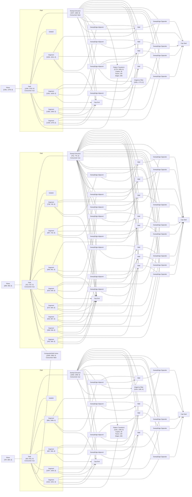

```mermaid
flowchart LR
  subgraph path11 [Path]
    11["Path<br>[412, 437, 0]<br>Consumed: true"]
      %% [ProgramBodyItem { index: 12 }, VariableDeclarationDeclaration, VariableDeclarationInit, PipeBodyItem { index: 1 }]
    24["Segment<br>[443, 484, 0]"]
      %% [ProgramBodyItem { index: 12 }, VariableDeclarationDeclaration, VariableDeclarationInit, PipeBodyItem { index: 2 }]
    25["Segment<br>[490, 536, 0]"]
      %% [ProgramBodyItem { index: 12 }, VariableDeclarationDeclaration, VariableDeclarationInit, PipeBodyItem { index: 3 }]
    26["Segment<br>[542, 567, 0]"]
      %% [ProgramBodyItem { index: 12 }, VariableDeclarationDeclaration, VariableDeclarationInit, PipeBodyItem { index: 4 }]
    27["Segment<br>[573, 604, 0]"]
      %% [ProgramBodyItem { index: 12 }, VariableDeclarationDeclaration, VariableDeclarationInit, PipeBodyItem { index: 5 }]
    28["Segment<br>[610, 639, 0]"]
      %% [ProgramBodyItem { index: 12 }, VariableDeclarationDeclaration, VariableDeclarationInit, PipeBodyItem { index: 6 }]
    29["Segment<br>[645, 691, 0]"]
      %% [ProgramBodyItem { index: 12 }, VariableDeclarationDeclaration, VariableDeclarationInit, PipeBodyItem { index: 7 }]
    30["Segment<br>[697, 732, 0]"]
      %% [ProgramBodyItem { index: 12 }, VariableDeclarationDeclaration, VariableDeclarationInit, PipeBodyItem { index: 8 }]
    31["Segment<br>[738, 745, 0]"]
      %% [ProgramBodyItem { index: 12 }, VariableDeclarationDeclaration, VariableDeclarationInit, PipeBodyItem { index: 9 }]
    35[Solid2d]
  end
  subgraph path12 [Path]
    12["Path<br>[810, 851, 0]<br>Consumed: true"]
      %% [ProgramBodyItem { index: 13 }, VariableDeclarationDeclaration, VariableDeclarationInit, PipeBodyItem { index: 1 }]
    32["Segment<br>[857, 900, 0]"]
      %% [ProgramBodyItem { index: 13 }, VariableDeclarationDeclaration, VariableDeclarationInit, PipeBodyItem { index: 2 }]
    33["Segment<br>[906, 1006, 0]"]
      %% [ProgramBodyItem { index: 13 }, VariableDeclarationDeclaration, VariableDeclarationInit, PipeBodyItem { index: 3 }]
    18["Segment<br>[1012, 1041, 0]"]
      %% [ProgramBodyItem { index: 13 }, VariableDeclarationDeclaration, VariableDeclarationInit, PipeBodyItem { index: 4 }]
    19["Segment<br>[1047, 1054, 0]"]
      %% [ProgramBodyItem { index: 13 }, VariableDeclarationDeclaration, VariableDeclarationInit, PipeBodyItem { index: 5 }]
    36[Solid2d]
  end
  subgraph path10 [Path]
    10["Path<br>[1384, 1433, 0]<br>Consumed: true"]
      %% [ProgramBodyItem { index: 14 }, VariableDeclarationDeclaration, VariableDeclarationInit, PipeBodyItem { index: 1 }]
    20["Segment<br>[1439, 1479, 0]"]
      %% [ProgramBodyItem { index: 14 }, VariableDeclarationDeclaration, VariableDeclarationInit, PipeBodyItem { index: 2 }]
    21["Segment<br>[1485, 1585, 0]"]
      %% [ProgramBodyItem { index: 14 }, VariableDeclarationDeclaration, VariableDeclarationInit, PipeBodyItem { index: 3 }]
    22["Segment<br>[1591, 1628, 0]"]
      %% [ProgramBodyItem { index: 14 }, VariableDeclarationDeclaration, VariableDeclarationInit, PipeBodyItem { index: 4 }]
    23["Segment<br>[1634, 1641, 0]"]
      %% [ProgramBodyItem { index: 14 }, VariableDeclarationDeclaration, VariableDeclarationInit, PipeBodyItem { index: 5 }]
    34[Solid2d]
  end
  16["Plane<br>[389, 406, 0]"]
    %% [ProgramBodyItem { index: 12 }, VariableDeclarationDeclaration, VariableDeclarationInit, PipeBodyItem { index: 0 }]
  39["Sweep Extrusion<br>[751, 775, 0]<br>Consumed: true"]
    %% [ProgramBodyItem { index: 12 }, VariableDeclarationDeclaration, VariableDeclarationInit, PipeBodyItem { index: 10 }]
  78[Wall]
    %% face_code_ref=Missing NodePath
  79[Wall]
    %% face_code_ref=Missing NodePath
  80[Wall]
    %% face_code_ref=Missing NodePath
  81[Wall]
    %% face_code_ref=Missing NodePath
  82[Wall]
    %% face_code_ref=Missing NodePath
  83[Wall]
    %% face_code_ref=Missing NodePath
  84[Wall]
    %% face_code_ref=Missing NodePath
  85[Wall]
    %% face_code_ref=Missing NodePath
  6["Cap Start"]
    %% face_code_ref=Missing NodePath
  3["Cap End"]
    %% face_code_ref=Missing NodePath
  62["SweepEdge Opposite"]
  46["SweepEdge Adjacent"]
  63["SweepEdge Opposite"]
  47["SweepEdge Adjacent"]
  64["SweepEdge Opposite"]
  48["SweepEdge Adjacent"]
  65["SweepEdge Opposite"]
  49["SweepEdge Adjacent"]
  66["SweepEdge Opposite"]
  50["SweepEdge Adjacent"]
  67["SweepEdge Opposite"]
  51["SweepEdge Adjacent"]
  68["SweepEdge Opposite"]
  52["SweepEdge Adjacent"]
  69["SweepEdge Opposite"]
  53["SweepEdge Adjacent"]
  17["Plane<br>[787, 804, 0]"]
    %% [ProgramBodyItem { index: 13 }, VariableDeclarationDeclaration, VariableDeclarationInit, PipeBodyItem { index: 0 }]
  37["Sweep Extrusion<br>[1060, 1098, 0]<br>Consumed: true"]
    %% [ProgramBodyItem { index: 13 }, VariableDeclarationDeclaration, VariableDeclarationInit, PipeBodyItem { index: 6 }]
  86[Wall]
    %% face_code_ref=Missing NodePath
  87[Wall]
    %% face_code_ref=Missing NodePath
  72[Wall]
    %% face_code_ref=Missing NodePath
  73[Wall]
    %% face_code_ref=Missing NodePath
  4["Cap Start"]
    %% face_code_ref=Missing NodePath
  1["Cap End"]
    %% face_code_ref=Missing NodePath
  70["SweepEdge Opposite"]
  54["SweepEdge Adjacent"]
  71["SweepEdge Opposite"]
  55["SweepEdge Adjacent"]
  56["SweepEdge Opposite"]
  40["SweepEdge Adjacent"]
  57["SweepEdge Opposite"]
  41["SweepEdge Adjacent"]
  8["EdgeCut Fillet<br>[1104, 1185, 0]"]
    %% [ProgramBodyItem { index: 13 }, VariableDeclarationDeclaration, VariableDeclarationInit, PipeBodyItem { index: 7 }]
  13["Pattern Transform<br>[1191, 1348, 0]<br>Copies: 20<br>Faces: 140<br>Edges: 300"]
    %% [ProgramBodyItem { index: 13 }, VariableDeclarationDeclaration, VariableDeclarationInit, PipeBodyItem { index: 8 }]
  15["Plane<br>[1361, 1378, 0]"]
    %% [ProgramBodyItem { index: 14 }, VariableDeclarationDeclaration, VariableDeclarationInit, PipeBodyItem { index: 0 }]
  38["Sweep Extrusion<br>[1647, 1685, 0]<br>Consumed: false"]
    %% [ProgramBodyItem { index: 14 }, VariableDeclarationDeclaration, VariableDeclarationInit, PipeBodyItem { index: 6 }]
  77[Wall]
    %% face_code_ref=Missing NodePath
  76[Wall]
    %% face_code_ref=Missing NodePath
  75[Wall]
    %% face_code_ref=Missing NodePath
  74[Wall]
    %% face_code_ref=Missing NodePath
  5["Cap Start"]
    %% face_code_ref=Missing NodePath
  2["Cap End"]
    %% face_code_ref=Missing NodePath
  61["SweepEdge Opposite"]
  45["SweepEdge Adjacent"]
  60["SweepEdge Opposite"]
  44["SweepEdge Adjacent"]
  59["SweepEdge Opposite"]
  43["SweepEdge Adjacent"]
  58["SweepEdge Opposite"]
  42["SweepEdge Adjacent"]
  9["EdgeCut Fillet<br>[1691, 1773, 0]"]
    %% [ProgramBodyItem { index: 14 }, VariableDeclarationDeclaration, VariableDeclarationInit, PipeBodyItem { index: 7 }]
  14["Pattern Transform<br>[1779, 1936, 0]<br>Copies: 20<br>Faces: 140<br>Edges: 300"]
    %% [ProgramBodyItem { index: 14 }, VariableDeclarationDeclaration, VariableDeclarationInit, PipeBodyItem { index: 8 }]
  7["CompositeSolid Union<br>[1939, 1960, 0]<br>Consumed: false"]
    %% [ProgramBodyItem { index: 15 }, ExpressionStatementExpr]
  18 <--x 1
  19 <--x 1
  32 <--x 1
  33 <--x 1
  37 --- 1
  20 <--x 2
  21 <--x 2
  22 <--x 2
  23 <--x 2
  38 --- 2
  24 <--x 3
  25 <--x 3
  26 <--x 3
  27 <--x 3
  28 <--x 3
  29 <--x 3
  30 <--x 3
  31 <--x 3
  39 --- 3
  37 --- 4
  56 <--x 4
  57 <--x 4
  70 <--x 4
  71 <--x 4
  38 --- 5
  58 <--x 5
  59 <--x 5
  60 <--x 5
  61 <--x 5
  39 --- 6
  62 <--x 6
  63 <--x 6
  64 <--x 6
  65 <--x 6
  66 <--x 6
  67 <--x 6
  68 <--x 6
  69 <--x 6
  11 --- 7
  12 --- 7
  55 x--> 8
  43 x--> 9
  10 --- 14
  15 --- 10
  10 --- 20
  10 --- 21
  10 --- 22
  10 --- 23
  10 --- 34
  10 ---- 38
  16 --- 11
  11 --- 24
  11 --- 25
  11 --- 26
  11 --- 27
  11 --- 28
  11 --- 29
  11 --- 30
  11 --- 31
  11 --- 35
  11 ---- 39
  12 --- 13
  17 --- 12
  12 --- 18
  12 --- 19
  12 --- 32
  12 --- 33
  12 --- 36
  12 ---- 37
  37 <--x 13
  38 <--x 14
  18 --- 40
  18 --- 56
  18 --- 72
  19 --- 41
  19 --- 57
  19 --- 73
  20 --- 42
  20 --- 58
  20 --- 74
  21 --- 43
  21 --- 59
  21 --- 75
  22 --- 44
  22 --- 60
  22 --- 76
  23 --- 45
  23 --- 61
  23 --- 77
  24 --- 46
  24 --- 62
  24 --- 78
  25 --- 47
  25 --- 63
  25 --- 79
  26 --- 48
  26 --- 64
  26 --- 80
  27 --- 49
  27 --- 65
  27 --- 81
  28 --- 50
  28 --- 66
  28 --- 82
  29 --- 51
  29 --- 67
  29 --- 83
  30 --- 52
  30 --- 68
  30 --- 84
  31 --- 53
  31 --- 69
  31 --- 85
  32 --- 54
  32 --- 70
  32 --- 86
  33 --- 55
  33 --- 71
  33 --- 87
  37 --- 40
  37 --- 41
  37 --- 54
  37 --- 55
  37 --- 56
  37 --- 57
  37 --- 70
  37 --- 71
  37 --- 72
  37 --- 73
  37 --- 86
  37 --- 87
  38 --- 42
  38 --- 43
  38 --- 44
  38 --- 45
  38 --- 58
  38 --- 59
  38 --- 60
  38 --- 61
  38 --- 74
  38 --- 75
  38 --- 76
  38 --- 77
  39 --- 46
  39 --- 47
  39 --- 48
  39 --- 49
  39 --- 50
  39 --- 51
  39 --- 52
  39 --- 53
  39 --- 62
  39 --- 63
  39 --- 64
  39 --- 65
  39 --- 66
  39 --- 67
  39 --- 68
  39 --- 69
  39 --- 78
  39 --- 79
  39 --- 80
  39 --- 81
  39 --- 82
  39 --- 83
  39 --- 84
  39 --- 85
  72 --- 40
  40 x--> 72
  73 --- 41
  41 x--> 73
  74 --- 42
  42 x--> 74
  75 --- 43
  43 x--> 75
  76 --- 44
  44 x--> 76
  77 --- 45
  45 x--> 77
  78 --- 46
  46 x--> 78
  79 --- 47
  47 x--> 79
  80 --- 48
  48 x--> 80
  81 --- 49
  49 x--> 81
  82 --- 50
  50 x--> 82
  83 --- 51
  51 x--> 83
  84 --- 52
  52 x--> 84
  85 --- 53
  53 x--> 85
  86 --- 54
  54 x--> 86
  87 --- 55
  55 x--> 87
  72 --- 56
  73 --- 57
  74 --- 58
  75 --- 59
  76 --- 60
  77 --- 61
  78 --- 62
  79 --- 63
  80 --- 64
  81 --- 65
  82 --- 66
  83 --- 67
  84 --- 68
  85 --- 69
  86 --- 70
  87 --- 71
```
