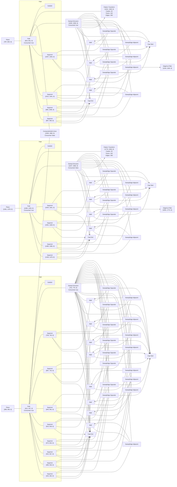

```mermaid
flowchart LR
  subgraph path24 [Path]
    24["Path<br>[412, 437, 0]<br>Consumed: true"]
      %% [ProgramBodyItem { index: 12 }, VariableDeclarationDeclaration, VariableDeclarationInit, PipeBodyItem { index: 1 }]
    25["Segment<br>[443, 484, 0]"]
      %% [ProgramBodyItem { index: 12 }, VariableDeclarationDeclaration, VariableDeclarationInit, PipeBodyItem { index: 2 }]
    26["Segment<br>[490, 536, 0]"]
      %% [ProgramBodyItem { index: 12 }, VariableDeclarationDeclaration, VariableDeclarationInit, PipeBodyItem { index: 3 }]
    27["Segment<br>[542, 567, 0]"]
      %% [ProgramBodyItem { index: 12 }, VariableDeclarationDeclaration, VariableDeclarationInit, PipeBodyItem { index: 4 }]
    28["Segment<br>[573, 604, 0]"]
      %% [ProgramBodyItem { index: 12 }, VariableDeclarationDeclaration, VariableDeclarationInit, PipeBodyItem { index: 5 }]
    29["Segment<br>[610, 639, 0]"]
      %% [ProgramBodyItem { index: 12 }, VariableDeclarationDeclaration, VariableDeclarationInit, PipeBodyItem { index: 6 }]
    30["Segment<br>[645, 691, 0]"]
      %% [ProgramBodyItem { index: 12 }, VariableDeclarationDeclaration, VariableDeclarationInit, PipeBodyItem { index: 7 }]
    31["Segment<br>[697, 732, 0]"]
      %% [ProgramBodyItem { index: 12 }, VariableDeclarationDeclaration, VariableDeclarationInit, PipeBodyItem { index: 8 }]
    32["Segment<br>[738, 745, 0]"]
      %% [ProgramBodyItem { index: 12 }, VariableDeclarationDeclaration, VariableDeclarationInit, PipeBodyItem { index: 9 }]
    54[Solid2d]
  end
  subgraph path35 [Path]
    35["Path<br>[810, 851, 0]<br>Consumed: true"]
      %% [ProgramBodyItem { index: 13 }, VariableDeclarationDeclaration, VariableDeclarationInit, PipeBodyItem { index: 1 }]
    36["Segment<br>[857, 900, 0]"]
      %% [ProgramBodyItem { index: 13 }, VariableDeclarationDeclaration, VariableDeclarationInit, PipeBodyItem { index: 2 }]
    37["Segment<br>[906, 1006, 0]"]
      %% [ProgramBodyItem { index: 13 }, VariableDeclarationDeclaration, VariableDeclarationInit, PipeBodyItem { index: 3 }]
    38["Segment<br>[1012, 1041, 0]"]
      %% [ProgramBodyItem { index: 13 }, VariableDeclarationDeclaration, VariableDeclarationInit, PipeBodyItem { index: 4 }]
    39["Segment<br>[1047, 1054, 0]"]
      %% [ProgramBodyItem { index: 13 }, VariableDeclarationDeclaration, VariableDeclarationInit, PipeBodyItem { index: 5 }]
    55[Solid2d]
  end
  subgraph path44 [Path]
    44["Path<br>[1384, 1433, 0]<br>Consumed: true"]
      %% [ProgramBodyItem { index: 14 }, VariableDeclarationDeclaration, VariableDeclarationInit, PipeBodyItem { index: 1 }]
    45["Segment<br>[1439, 1479, 0]"]
      %% [ProgramBodyItem { index: 14 }, VariableDeclarationDeclaration, VariableDeclarationInit, PipeBodyItem { index: 2 }]
    46["Segment<br>[1485, 1585, 0]"]
      %% [ProgramBodyItem { index: 14 }, VariableDeclarationDeclaration, VariableDeclarationInit, PipeBodyItem { index: 3 }]
    47["Segment<br>[1591, 1628, 0]"]
      %% [ProgramBodyItem { index: 14 }, VariableDeclarationDeclaration, VariableDeclarationInit, PipeBodyItem { index: 4 }]
    48["Segment<br>[1634, 1641, 0]"]
      %% [ProgramBodyItem { index: 14 }, VariableDeclarationDeclaration, VariableDeclarationInit, PipeBodyItem { index: 5 }]
    53[Solid2d]
  end
  1["Cap End"]
    %% face_code_ref=Missing NodePath
  2["Cap End"]
    %% face_code_ref=Missing NodePath
  3["Cap End"]
    %% face_code_ref=Missing NodePath
  4["Cap Start"]
    %% face_code_ref=Missing NodePath
  5["Cap Start"]
    %% face_code_ref=Missing NodePath
  6["Cap Start"]
    %% face_code_ref=Missing NodePath
  7[Wall]
    %% face_code_ref=Missing NodePath
  8[Wall]
    %% face_code_ref=Missing NodePath
  9[Wall]
    %% face_code_ref=Missing NodePath
  10[Wall]
    %% face_code_ref=Missing NodePath
  11[Wall]
    %% face_code_ref=Missing NodePath
  12[Wall]
    %% face_code_ref=Missing NodePath
  13[Wall]
    %% face_code_ref=Missing NodePath
  14[Wall]
    %% face_code_ref=Missing NodePath
  15[Wall]
    %% face_code_ref=Missing NodePath
  16[Wall]
    %% face_code_ref=Missing NodePath
  17[Wall]
    %% face_code_ref=Missing NodePath
  18[Wall]
    %% face_code_ref=Missing NodePath
  19[Wall]
    %% face_code_ref=Missing NodePath
  20[Wall]
    %% face_code_ref=Missing NodePath
  21[Wall]
    %% face_code_ref=Missing NodePath
  22[Wall]
    %% face_code_ref=Missing NodePath
  23["Plane<br>[389, 406, 0]"]
    %% [ProgramBodyItem { index: 12 }, VariableDeclarationDeclaration, VariableDeclarationInit, PipeBodyItem { index: 0 }]
  33["Sweep Extrusion<br>[751, 775, 0]<br>Consumed: true"]
    %% [ProgramBodyItem { index: 12 }, VariableDeclarationDeclaration, VariableDeclarationInit, PipeBodyItem { index: 10 }]
  34["Plane<br>[787, 804, 0]"]
    %% [ProgramBodyItem { index: 13 }, VariableDeclarationDeclaration, VariableDeclarationInit, PipeBodyItem { index: 0 }]
  40["Sweep Extrusion<br>[1060, 1098, 0]<br>Consumed: true"]
    %% [ProgramBodyItem { index: 13 }, VariableDeclarationDeclaration, VariableDeclarationInit, PipeBodyItem { index: 6 }]
  41["EdgeCut Fillet<br>[1104, 1185, 0]"]
    %% [ProgramBodyItem { index: 13 }, VariableDeclarationDeclaration, VariableDeclarationInit, PipeBodyItem { index: 7 }]
  42["Pattern Transform<br>[1191, 1348, 0]<br>Copies: 20<br>Faces: 140<br>Edges: 300"]
    %% [ProgramBodyItem { index: 13 }, VariableDeclarationDeclaration, VariableDeclarationInit, PipeBodyItem { index: 8 }]
  43["Plane<br>[1361, 1378, 0]"]
    %% [ProgramBodyItem { index: 14 }, VariableDeclarationDeclaration, VariableDeclarationInit, PipeBodyItem { index: 0 }]
  49["Sweep Extrusion<br>[1647, 1685, 0]<br>Consumed: false"]
    %% [ProgramBodyItem { index: 14 }, VariableDeclarationDeclaration, VariableDeclarationInit, PipeBodyItem { index: 6 }]
  50["EdgeCut Fillet<br>[1691, 1773, 0]"]
    %% [ProgramBodyItem { index: 14 }, VariableDeclarationDeclaration, VariableDeclarationInit, PipeBodyItem { index: 7 }]
  51["Pattern Transform<br>[1779, 1936, 0]<br>Copies: 20<br>Faces: 140<br>Edges: 300"]
    %% [ProgramBodyItem { index: 14 }, VariableDeclarationDeclaration, VariableDeclarationInit, PipeBodyItem { index: 8 }]
  52["CompositeSolid Union<br>[1939, 1960, 0]<br>Consumed: false"]
    %% [ProgramBodyItem { index: 15 }, ExpressionStatementExpr]
  56["SweepEdge Adjacent"]
  57["SweepEdge Adjacent"]
  58["SweepEdge Adjacent"]
  59["SweepEdge Adjacent"]
  60["SweepEdge Adjacent"]
  61["SweepEdge Adjacent"]
  62["SweepEdge Adjacent"]
  63["SweepEdge Adjacent"]
  64["SweepEdge Adjacent"]
  65["SweepEdge Adjacent"]
  66["SweepEdge Adjacent"]
  67["SweepEdge Adjacent"]
  68["SweepEdge Adjacent"]
  69["SweepEdge Adjacent"]
  70["SweepEdge Adjacent"]
  71["SweepEdge Adjacent"]
  72["SweepEdge Opposite"]
  73["SweepEdge Opposite"]
  74["SweepEdge Opposite"]
  75["SweepEdge Opposite"]
  76["SweepEdge Opposite"]
  77["SweepEdge Opposite"]
  78["SweepEdge Opposite"]
  79["SweepEdge Opposite"]
  80["SweepEdge Opposite"]
  81["SweepEdge Opposite"]
  82["SweepEdge Opposite"]
  83["SweepEdge Opposite"]
  84["SweepEdge Opposite"]
  85["SweepEdge Opposite"]
  86["SweepEdge Opposite"]
  87["SweepEdge Opposite"]
  36 <--x 1
  37 <--x 1
  38 <--x 1
  39 <--x 1
  40 --- 1
  45 <--x 2
  46 <--x 2
  47 <--x 2
  48 <--x 2
  49 --- 2
  25 <--x 3
  26 <--x 3
  27 <--x 3
  28 <--x 3
  29 <--x 3
  30 <--x 3
  31 <--x 3
  32 <--x 3
  33 --- 3
  40 --- 4
  72 <--x 4
  73 <--x 4
  86 <--x 4
  87 <--x 4
  49 --- 5
  74 <--x 5
  75 <--x 5
  76 <--x 5
  77 <--x 5
  33 --- 6
  78 <--x 6
  79 <--x 6
  80 <--x 6
  81 <--x 6
  82 <--x 6
  83 <--x 6
  84 <--x 6
  85 <--x 6
  38 --- 7
  40 --- 7
  7 --- 56
  56 <--x 7
  7 --- 72
  39 --- 8
  40 --- 8
  8 --- 57
  57 <--x 8
  8 --- 73
  45 --- 9
  49 --- 9
  9 --- 58
  58 <--x 9
  9 --- 74
  46 --- 10
  49 --- 10
  10 --- 59
  59 <--x 10
  10 --- 75
  47 --- 11
  49 --- 11
  11 --- 60
  60 <--x 11
  11 --- 76
  48 --- 12
  49 --- 12
  12 --- 61
  61 <--x 12
  12 --- 77
  25 --- 13
  33 --- 13
  13 --- 62
  62 <--x 13
  13 --- 78
  26 --- 14
  33 --- 14
  14 --- 63
  63 <--x 14
  14 --- 79
  27 --- 15
  33 --- 15
  15 --- 64
  64 <--x 15
  15 --- 80
  28 --- 16
  33 --- 16
  16 --- 65
  65 <--x 16
  16 --- 81
  29 --- 17
  33 --- 17
  17 --- 66
  66 <--x 17
  17 --- 82
  30 --- 18
  33 --- 18
  18 --- 67
  67 <--x 18
  18 --- 83
  31 --- 19
  33 --- 19
  19 --- 68
  68 <--x 19
  19 --- 84
  32 --- 20
  33 --- 20
  20 --- 69
  69 <--x 20
  20 --- 85
  36 --- 21
  40 --- 21
  21 --- 70
  70 <--x 21
  21 --- 86
  37 --- 22
  40 --- 22
  22 --- 71
  71 <--x 22
  22 --- 87
  23 --- 24
  24 --- 25
  24 --- 26
  24 --- 27
  24 --- 28
  24 --- 29
  24 --- 30
  24 --- 31
  24 --- 32
  24 ---- 33
  24 --- 52
  24 --- 54
  25 --- 62
  25 --- 78
  26 --- 63
  26 --- 79
  27 --- 64
  27 --- 80
  28 --- 65
  28 --- 81
  29 --- 66
  29 --- 82
  30 --- 67
  30 --- 83
  31 --- 68
  31 --- 84
  32 --- 69
  32 --- 85
  33 --- 62
  33 --- 63
  33 --- 64
  33 --- 65
  33 --- 66
  33 --- 67
  33 --- 68
  33 --- 69
  33 --- 78
  33 --- 79
  33 --- 80
  33 --- 81
  33 --- 82
  33 --- 83
  33 --- 84
  33 --- 85
  34 --- 35
  35 --- 36
  35 --- 37
  35 --- 38
  35 --- 39
  35 ---- 40
  35 --- 42
  35 --- 52
  35 --- 55
  36 --- 70
  36 --- 86
  37 --- 71
  37 --- 87
  38 --- 56
  38 --- 72
  39 --- 57
  39 --- 73
  40 x--> 42
  40 --- 56
  40 --- 57
  40 --- 70
  40 --- 71
  40 --- 72
  40 --- 73
  40 --- 86
  40 --- 87
  71 x--> 41
  43 --- 44
  44 --- 45
  44 --- 46
  44 --- 47
  44 --- 48
  44 ---- 49
  44 --- 51
  44 --- 53
  45 --- 58
  45 --- 74
  46 --- 59
  46 --- 75
  47 --- 60
  47 --- 76
  48 --- 61
  48 --- 77
  49 x--> 51
  49 --- 58
  49 --- 59
  49 --- 60
  49 --- 61
  49 --- 74
  49 --- 75
  49 --- 76
  49 --- 77
  59 x--> 50
```
