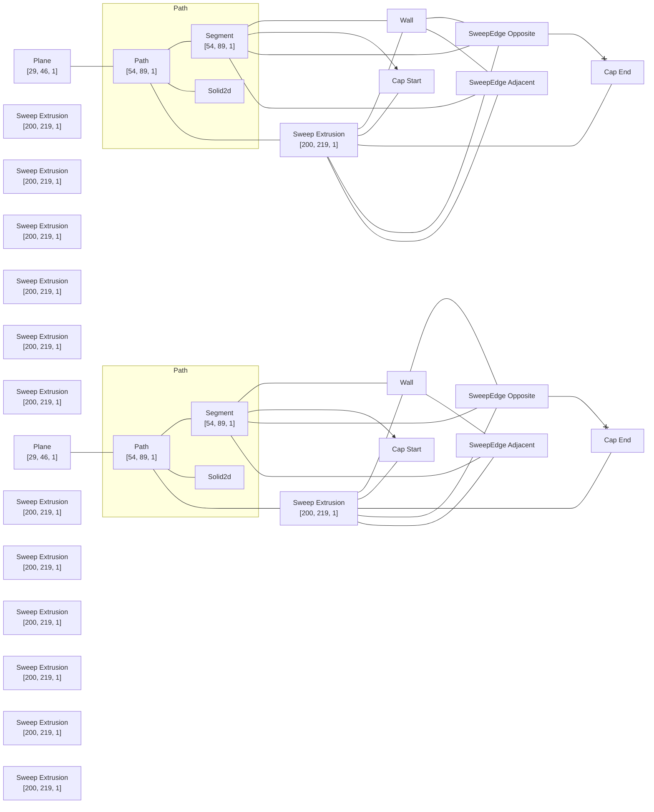

```mermaid
flowchart LR
  subgraph path2 [Path]
    2["Path<br>[54, 89, 1]"]
    3["Segment<br>[54, 89, 1]"]
    4[Solid2d]
  end
  subgraph path18 [Path]
    18["Path<br>[54, 89, 1]"]
    19["Segment<br>[54, 89, 1]"]
    20[Solid2d]
  end
  1["Plane<br>[29, 46, 1]"]
  5["Sweep Extrusion<br>[200, 219, 1]"]
  6[Wall]
    %% face_code_ref=Missing NodePath
  7["Cap Start"]
    %% face_code_ref=Missing NodePath
  8["Cap End"]
    %% face_code_ref=Missing NodePath
  9["SweepEdge Opposite"]
  10["SweepEdge Adjacent"]
  11["Sweep Extrusion<br>[200, 219, 1]"]
  12["Sweep Extrusion<br>[200, 219, 1]"]
  13["Sweep Extrusion<br>[200, 219, 1]"]
  14["Sweep Extrusion<br>[200, 219, 1]"]
  15["Sweep Extrusion<br>[200, 219, 1]"]
  16["Sweep Extrusion<br>[200, 219, 1]"]
  17["Plane<br>[29, 46, 1]"]
  21["Sweep Extrusion<br>[200, 219, 1]"]
  22[Wall]
    %% face_code_ref=Missing NodePath
  23["Cap Start"]
    %% face_code_ref=Missing NodePath
  24["Cap End"]
    %% face_code_ref=Missing NodePath
  25["SweepEdge Opposite"]
  26["SweepEdge Adjacent"]
  27["Sweep Extrusion<br>[200, 219, 1]"]
  28["Sweep Extrusion<br>[200, 219, 1]"]
  29["Sweep Extrusion<br>[200, 219, 1]"]
  30["Sweep Extrusion<br>[200, 219, 1]"]
  31["Sweep Extrusion<br>[200, 219, 1]"]
  32["Sweep Extrusion<br>[200, 219, 1]"]
  1 --- 2
  2 --- 3
  2 --- 4
  2 ---- 5
  3 --- 6
  3 x--> 7
  3 --- 9
  3 --- 10
  5 --- 6
  5 --- 7
  5 --- 8
  5 --- 9
  5 --- 10
  6 --- 9
  6 --- 10
  9 <--x 8
  17 --- 18
  18 --- 19
  18 --- 20
  18 ---- 21
  19 --- 22
  19 x--> 23
  19 --- 25
  19 --- 26
  21 --- 22
  21 --- 23
  21 --- 24
  21 --- 25
  21 --- 26
  22 --- 25
  22 --- 26
  25 <--x 24
```
