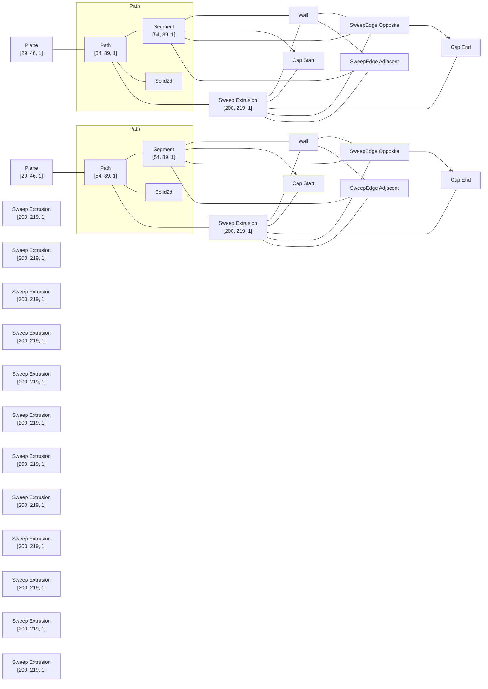

```mermaid
flowchart LR
  subgraph path3 [Path]
    3["Path<br>[54, 89, 1]"]
    5["Segment<br>[54, 89, 1]"]
    7[Solid2d]
  end
  subgraph path4 [Path]
    4["Path<br>[54, 89, 1]"]
    6["Segment<br>[54, 89, 1]"]
    8[Solid2d]
  end
  1["Plane<br>[29, 46, 1]"]
  2["Plane<br>[29, 46, 1]"]
  9["Sweep Extrusion<br>[200, 219, 1]"]
  10["Sweep Extrusion<br>[200, 219, 1]"]
  11["Sweep Extrusion<br>[200, 219, 1]"]
  12["Sweep Extrusion<br>[200, 219, 1]"]
  13["Sweep Extrusion<br>[200, 219, 1]"]
  14["Sweep Extrusion<br>[200, 219, 1]"]
  15["Sweep Extrusion<br>[200, 219, 1]"]
  16["Sweep Extrusion<br>[200, 219, 1]"]
  17["Sweep Extrusion<br>[200, 219, 1]"]
  18["Sweep Extrusion<br>[200, 219, 1]"]
  19["Sweep Extrusion<br>[200, 219, 1]"]
  20["Sweep Extrusion<br>[200, 219, 1]"]
  21["Sweep Extrusion<br>[200, 219, 1]"]
  22["Sweep Extrusion<br>[200, 219, 1]"]
  23[Wall]
  24[Wall]
  25["Cap Start"]
  26["Cap Start"]
  27["Cap End"]
  28["Cap End"]
  29["SweepEdge Opposite"]
  30["SweepEdge Opposite"]
  31["SweepEdge Adjacent"]
  32["SweepEdge Adjacent"]
  1 --- 3
  2 --- 4
  3 --- 5
  3 --- 7
  3 ---- 10
  4 --- 6
  4 --- 8
  4 ---- 18
  5 --- 23
  5 x--> 25
  5 --- 29
  5 --- 31
  6 --- 24
  6 x--> 26
  6 --- 30
  6 --- 32
  10 --- 23
  10 --- 25
  10 --- 27
  10 --- 29
  10 --- 31
  18 --- 24
  18 --- 26
  18 --- 28
  18 --- 30
  18 --- 32
  23 --- 29
  23 --- 31
  24 --- 30
  24 --- 32
  29 <--x 27
  30 <--x 28
```
