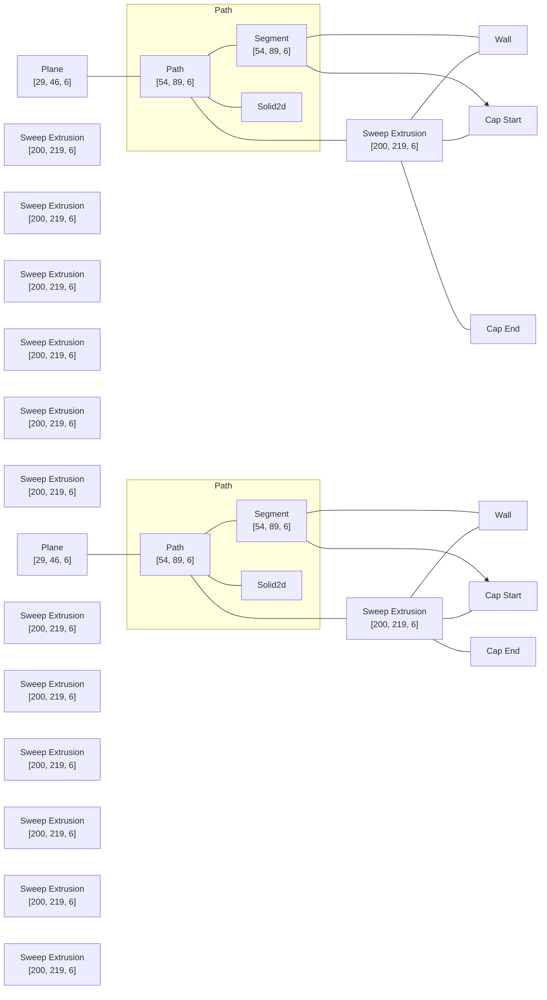

```mermaid
flowchart LR
  subgraph path2 [Path]
    2["Path<br>[54, 89, 6]"]
    3["Segment<br>[54, 89, 6]"]
    4[Solid2d]
  end
  subgraph path16 [Path]
    16["Path<br>[54, 89, 6]"]
    17["Segment<br>[54, 89, 6]"]
    18[Solid2d]
  end
  1["Plane<br>[29, 46, 6]"]
  5["Sweep Extrusion<br>[200, 219, 6]"]
  6[Wall]
  7["Cap Start"]
  8["Cap End"]
  9["Sweep Extrusion<br>[200, 219, 6]"]
  10["Sweep Extrusion<br>[200, 219, 6]"]
  11["Sweep Extrusion<br>[200, 219, 6]"]
  12["Sweep Extrusion<br>[200, 219, 6]"]
  13["Sweep Extrusion<br>[200, 219, 6]"]
  14["Sweep Extrusion<br>[200, 219, 6]"]
  15["Plane<br>[29, 46, 6]"]
  19["Sweep Extrusion<br>[200, 219, 6]"]
  20[Wall]
  21["Cap Start"]
  22["Cap End"]
  23["Sweep Extrusion<br>[200, 219, 6]"]
  24["Sweep Extrusion<br>[200, 219, 6]"]
  25["Sweep Extrusion<br>[200, 219, 6]"]
  26["Sweep Extrusion<br>[200, 219, 6]"]
  27["Sweep Extrusion<br>[200, 219, 6]"]
  28["Sweep Extrusion<br>[200, 219, 6]"]
  1 --- 2
  2 --- 3
  2 ---- 5
  2 --- 4
  3 --- 6
  3 x--> 7
  5 --- 6
  5 --- 7
  5 --- 8
  15 --- 16
  16 --- 17
  16 ---- 19
  16 --- 18
  17 --- 20
  17 x--> 21
  19 --- 20
  19 --- 21
  19 --- 22
```
