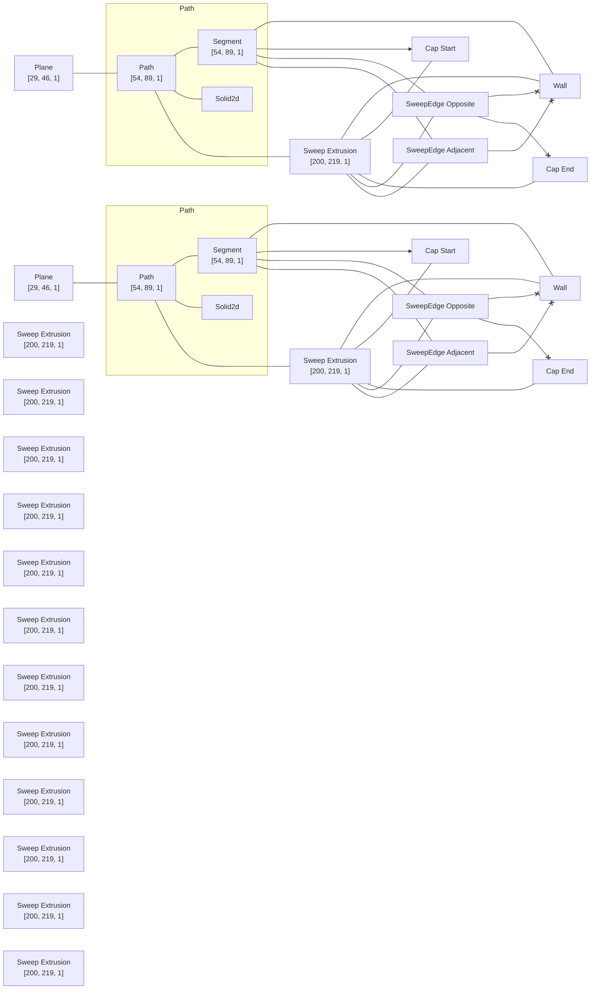

```mermaid
flowchart LR
  subgraph path3 [Path]
    3["Path<br>[54, 89, 1]"]
      %% Missing NodePath
    5["Segment<br>[54, 89, 1]"]
      %% Missing NodePath
    7[Solid2d]
  end
  subgraph path4 [Path]
    4["Path<br>[54, 89, 1]"]
      %% Missing NodePath
    6["Segment<br>[54, 89, 1]"]
      %% Missing NodePath
    8[Solid2d]
  end
  1["Plane<br>[29, 46, 1]"]
    %% Missing NodePath
  2["Plane<br>[29, 46, 1]"]
    %% Missing NodePath
  9["Sweep Extrusion<br>[200, 219, 1]"]
    %% Missing NodePath
  10["Sweep Extrusion<br>[200, 219, 1]"]
    %% Missing NodePath
  11["Sweep Extrusion<br>[200, 219, 1]"]
    %% Missing NodePath
  12["Sweep Extrusion<br>[200, 219, 1]"]
    %% Missing NodePath
  13["Sweep Extrusion<br>[200, 219, 1]"]
    %% Missing NodePath
  14["Sweep Extrusion<br>[200, 219, 1]"]
    %% Missing NodePath
  15["Sweep Extrusion<br>[200, 219, 1]"]
    %% Missing NodePath
  16["Sweep Extrusion<br>[200, 219, 1]"]
    %% Missing NodePath
  17["Sweep Extrusion<br>[200, 219, 1]"]
    %% Missing NodePath
  18["Sweep Extrusion<br>[200, 219, 1]"]
    %% Missing NodePath
  19["Sweep Extrusion<br>[200, 219, 1]"]
    %% Missing NodePath
  20["Sweep Extrusion<br>[200, 219, 1]"]
    %% Missing NodePath
  21["Sweep Extrusion<br>[200, 219, 1]"]
    %% Missing NodePath
  22["Sweep Extrusion<br>[200, 219, 1]"]
    %% Missing NodePath
  23[Wall]
  24[Wall]
  25["Cap Start"]
  26["Cap Start"]
  27["Cap End"]
  28["Cap End"]
  29["SweepEdge Opposite"]
  30["SweepEdge Opposite"]
  31["SweepEdge Adjacent"]
  32["SweepEdge Adjacent"]
  1 --- 3
  2 --- 4
  3 --- 5
  3 --- 7
  3 ---- 10
  4 --- 6
  4 --- 8
  4 ---- 15
  5 --- 23
  5 x--> 25
  5 --- 29
  5 --- 31
  6 --- 24
  6 x--> 26
  6 --- 30
  6 --- 32
  10 --- 23
  10 --- 25
  10 --- 27
  10 --- 29
  10 --- 31
  15 --- 24
  15 --- 26
  15 --- 28
  15 --- 30
  15 --- 32
  29 <--x 23
  31 <--x 23
  30 <--x 24
  32 <--x 24
  29 <--x 27
  30 <--x 28
```
