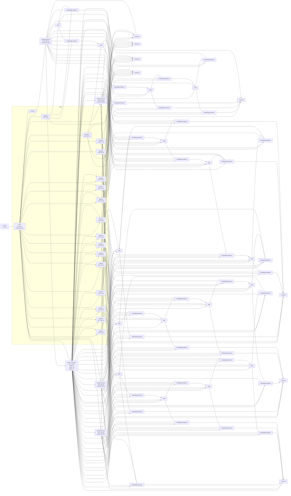

```mermaid
flowchart LR
  subgraph path2 [Path]
    2["Path<br>[30, 55, 0]<br>Consumed: true"]
      %% [ProgramBodyItem { index: 0 }, VariableDeclarationDeclaration, VariableDeclarationInit, PipeBodyItem { index: 1 }]
    3["Segment<br>[61, 79, 0]"]
      %% [ProgramBodyItem { index: 0 }, VariableDeclarationDeclaration, VariableDeclarationInit, PipeBodyItem { index: 2 }]
    4["Segment<br>[85, 103, 0]"]
      %% [ProgramBodyItem { index: 0 }, VariableDeclarationDeclaration, VariableDeclarationInit, PipeBodyItem { index: 3 }]
    5["Segment<br>[109, 128, 0]"]
      %% [ProgramBodyItem { index: 0 }, VariableDeclarationDeclaration, VariableDeclarationInit, PipeBodyItem { index: 4 }]
    6["Segment<br>[134, 141, 0]"]
      %% [ProgramBodyItem { index: 0 }, VariableDeclarationDeclaration, VariableDeclarationInit, PipeBodyItem { index: 5 }]
    7[Solid2d]
    25["Segment<br>[172, 234, 0]"]
      %% [ProgramBodyItem { index: 0 }, VariableDeclarationDeclaration, VariableDeclarationInit, PipeBodyItem { index: 7 }]
    26["Segment<br>[172, 234, 0]"]
      %% [ProgramBodyItem { index: 0 }, VariableDeclarationDeclaration, VariableDeclarationInit, PipeBodyItem { index: 7 }]
    27["Segment<br>[172, 234, 0]"]
      %% [ProgramBodyItem { index: 0 }, VariableDeclarationDeclaration, VariableDeclarationInit, PipeBodyItem { index: 7 }]
    28["Segment<br>[172, 234, 0]"]
      %% [ProgramBodyItem { index: 0 }, VariableDeclarationDeclaration, VariableDeclarationInit, PipeBodyItem { index: 7 }]
    44["Segment<br>[172, 234, 0]"]
      %% [ProgramBodyItem { index: 0 }, VariableDeclarationDeclaration, VariableDeclarationInit, PipeBodyItem { index: 7 }]
    45["Segment<br>[172, 234, 0]"]
      %% [ProgramBodyItem { index: 0 }, VariableDeclarationDeclaration, VariableDeclarationInit, PipeBodyItem { index: 7 }]
    46["Segment<br>[172, 234, 0]"]
      %% [ProgramBodyItem { index: 0 }, VariableDeclarationDeclaration, VariableDeclarationInit, PipeBodyItem { index: 7 }]
    47["Segment<br>[172, 234, 0]"]
      %% [ProgramBodyItem { index: 0 }, VariableDeclarationDeclaration, VariableDeclarationInit, PipeBodyItem { index: 7 }]
    63["Segment<br>[172, 234, 0]"]
      %% [ProgramBodyItem { index: 0 }, VariableDeclarationDeclaration, VariableDeclarationInit, PipeBodyItem { index: 7 }]
    64["Segment<br>[172, 234, 0]"]
      %% [ProgramBodyItem { index: 0 }, VariableDeclarationDeclaration, VariableDeclarationInit, PipeBodyItem { index: 7 }]
    65["Segment<br>[172, 234, 0]"]
      %% [ProgramBodyItem { index: 0 }, VariableDeclarationDeclaration, VariableDeclarationInit, PipeBodyItem { index: 7 }]
    66["Segment<br>[172, 234, 0]"]
      %% [ProgramBodyItem { index: 0 }, VariableDeclarationDeclaration, VariableDeclarationInit, PipeBodyItem { index: 7 }]
  end
  1["Plane<br>[7, 24, 0]"]
    %% [ProgramBodyItem { index: 0 }, VariableDeclarationDeclaration, VariableDeclarationInit, PipeBodyItem { index: 0 }]
  8["Sweep Extrusion<br>[147, 166, 0]<br>Consumed: false"]
    %% [ProgramBodyItem { index: 0 }, VariableDeclarationDeclaration, VariableDeclarationInit, PipeBodyItem { index: 6 }]
  9[Wall]
    %% face_code_ref=Missing NodePath
  10[Wall]
    %% face_code_ref=Missing NodePath
  11[Wall]
    %% face_code_ref=Missing NodePath
  12[Wall]
    %% face_code_ref=Missing NodePath
  13["Cap Start"]
    %% face_code_ref=Missing NodePath
  14["Cap End"]
    %% face_code_ref=Missing NodePath
  15["SweepEdge Opposite"]
  16["SweepEdge Adjacent"]
  17["SweepEdge Opposite"]
  18["SweepEdge Adjacent"]
  19["SweepEdge Opposite"]
  20["SweepEdge Adjacent"]
  21["SweepEdge Opposite"]
  22["SweepEdge Adjacent"]
  23["Pattern Transform<br>[172, 234, 0]<br>Copies: 3<br>Faces: 18<br>Edges: 36"]
    %% [ProgramBodyItem { index: 0 }, VariableDeclarationDeclaration, VariableDeclarationInit, PipeBodyItem { index: 7 }]
  24["Sweep Extrusion<br>[172, 234, 0]<br>Consumed: false"]
    %% [ProgramBodyItem { index: 0 }, VariableDeclarationDeclaration, VariableDeclarationInit, PipeBodyItem { index: 7 }]
  29[Wall]
    %% face_code_ref=Missing NodePath
  30[Wall]
    %% face_code_ref=Missing NodePath
  31[Wall]
    %% face_code_ref=Missing NodePath
  32[Wall]
    %% face_code_ref=Missing NodePath
  33["Cap Start"]
    %% face_code_ref=Missing NodePath
  34["Cap End"]
    %% face_code_ref=Missing NodePath
  35["SweepEdge Opposite"]
  36["SweepEdge Adjacent"]
  37["SweepEdge Opposite"]
  38["SweepEdge Adjacent"]
  39["SweepEdge Opposite"]
  40["SweepEdge Adjacent"]
  41["SweepEdge Opposite"]
  42["SweepEdge Adjacent"]
  43["Sweep Extrusion<br>[172, 234, 0]<br>Consumed: false"]
    %% [ProgramBodyItem { index: 0 }, VariableDeclarationDeclaration, VariableDeclarationInit, PipeBodyItem { index: 7 }]
  48[Wall]
    %% face_code_ref=Missing NodePath
  49[Wall]
    %% face_code_ref=Missing NodePath
  50[Wall]
    %% face_code_ref=Missing NodePath
  51[Wall]
    %% face_code_ref=Missing NodePath
  52["Cap Start"]
    %% face_code_ref=Missing NodePath
  53["Cap End"]
    %% face_code_ref=Missing NodePath
  54["SweepEdge Opposite"]
  55["SweepEdge Adjacent"]
  56["SweepEdge Opposite"]
  57["SweepEdge Adjacent"]
  58["SweepEdge Opposite"]
  59["SweepEdge Adjacent"]
  60["SweepEdge Opposite"]
  61["SweepEdge Adjacent"]
  62["Sweep Extrusion<br>[172, 234, 0]<br>Consumed: false"]
    %% [ProgramBodyItem { index: 0 }, VariableDeclarationDeclaration, VariableDeclarationInit, PipeBodyItem { index: 7 }]
  67[Wall]
    %% face_code_ref=Missing NodePath
  68[Wall]
    %% face_code_ref=Missing NodePath
  69[Wall]
    %% face_code_ref=Missing NodePath
  70[Wall]
    %% face_code_ref=Missing NodePath
  71["Cap Start"]
    %% face_code_ref=Missing NodePath
  72["Cap End"]
    %% face_code_ref=Missing NodePath
  73["SweepEdge Opposite"]
  74["SweepEdge Adjacent"]
  75["SweepEdge Opposite"]
  76["SweepEdge Adjacent"]
  77["SweepEdge Opposite"]
  78["SweepEdge Adjacent"]
  79["SweepEdge Opposite"]
  80["SweepEdge Adjacent"]
  1 --- 2
  2 --- 3
  2 --- 4
  2 --- 5
  2 --- 6
  2 --- 7
  2 ---- 8
  2 --- 23
  2 <---x 24
  2 <--x 25
  2 <--x 26
  2 <--x 27
  2 <--x 28
  2 <---x 43
  2 <--x 44
  2 <--x 45
  2 <--x 46
  2 <--x 47
  2 <---x 62
  2 <--x 63
  2 <--x 64
  2 <--x 65
  2 <--x 66
  3 --- 12
  3 x--> 13
  3 --- 21
  3 --- 22
  4 --- 11
  4 x--> 13
  4 --- 19
  4 --- 20
  5 --- 10
  5 x--> 13
  5 --- 17
  5 --- 18
  6 --- 9
  6 x--> 13
  6 --- 15
  6 --- 16
  8 --- 9
  8 --- 10
  8 --- 11
  8 --- 12
  8 --- 13
  8 --- 14
  8 --- 15
  8 --- 16
  8 --- 17
  8 --- 18
  8 --- 19
  8 --- 20
  8 --- 21
  8 --- 22
  8 x--> 23
  9 --- 15
  9 --- 16
  18 <--x 9
  10 --- 17
  10 --- 18
  20 <--x 10
  11 --- 19
  11 --- 20
  22 <--x 11
  16 <--x 12
  12 --- 21
  12 --- 22
  15 <--x 14
  17 <--x 14
  19 <--x 14
  21 <--x 14
  23 x--> 24
  23 x--> 25
  23 x--> 26
  23 x--> 27
  23 x--> 28
  23 x--> 29
  23 x--> 30
  23 x--> 31
  23 x--> 32
  23 x--> 33
  23 x--> 34
  23 x--> 35
  23 x--> 36
  23 x--> 37
  23 x--> 38
  23 x--> 39
  23 x--> 40
  23 x--> 41
  23 x--> 42
  23 x--> 43
  23 x--> 44
  23 x--> 45
  23 x--> 46
  23 x--> 47
  23 x--> 48
  23 x--> 49
  23 x--> 50
  23 x--> 51
  23 x--> 52
  23 x--> 53
  23 x--> 54
  23 x--> 55
  23 x--> 56
  23 x--> 57
  23 x--> 58
  23 x--> 59
  23 x--> 60
  23 x--> 61
  23 x--> 62
  23 x--> 63
  23 x--> 64
  23 x--> 65
  23 x--> 66
  23 x--> 67
  23 x--> 68
  23 x--> 69
  23 x--> 70
  23 x--> 71
  23 x--> 72
  23 x--> 73
  23 x--> 74
  23 x--> 75
  23 x--> 76
  23 x--> 77
  23 x--> 78
  23 x--> 79
  23 x--> 80
  24 --- 29
  24 --- 30
  24 --- 31
  24 --- 32
  24 --- 33
  24 --- 34
  24 --- 35
  24 --- 36
  24 --- 37
  24 --- 38
  24 --- 39
  24 --- 40
  24 --- 41
  24 --- 42
  25 --- 29
  25 x--> 33
  25 --- 35
  25 --- 36
  26 --- 30
  26 x--> 33
  26 --- 37
  26 --- 38
  27 --- 31
  27 x--> 33
  27 --- 39
  27 --- 40
  28 --- 32
  28 x--> 33
  28 --- 41
  28 --- 42
  29 --- 35
  29 --- 36
  38 <--x 29
  30 --- 37
  30 --- 38
  40 <--x 30
  31 --- 39
  31 --- 40
  42 <--x 31
  36 <--x 32
  32 --- 41
  32 --- 42
  35 <--x 34
  37 <--x 34
  39 <--x 34
  41 <--x 34
  43 --- 48
  43 --- 49
  43 --- 50
  43 --- 51
  43 --- 52
  43 --- 53
  43 --- 54
  43 --- 55
  43 --- 56
  43 --- 57
  43 --- 58
  43 --- 59
  43 --- 60
  43 --- 61
  44 --- 48
  44 x--> 52
  44 --- 54
  44 --- 55
  45 --- 49
  45 x--> 52
  45 --- 56
  45 --- 57
  46 --- 50
  46 x--> 52
  46 --- 58
  46 --- 59
  47 --- 51
  47 x--> 52
  47 --- 60
  47 --- 61
  48 --- 54
  48 --- 55
  57 <--x 48
  49 --- 56
  49 --- 57
  59 <--x 49
  50 --- 58
  50 --- 59
  61 <--x 50
  55 <--x 51
  51 --- 60
  51 --- 61
  54 <--x 53
  56 <--x 53
  58 <--x 53
  60 <--x 53
  62 --- 67
  62 --- 68
  62 --- 69
  62 --- 70
  62 --- 71
  62 --- 72
  62 --- 73
  62 --- 74
  62 --- 75
  62 --- 76
  62 --- 77
  62 --- 78
  62 --- 79
  62 --- 80
  63 --- 67
  63 x--> 71
  63 --- 73
  63 --- 74
  64 --- 68
  64 x--> 71
  64 --- 75
  64 --- 76
  65 --- 69
  65 x--> 71
  65 --- 77
  65 --- 78
  66 --- 70
  66 x--> 71
  66 --- 79
  66 --- 80
  67 --- 73
  67 --- 74
  76 <--x 67
  68 --- 75
  68 --- 76
  78 <--x 68
  69 --- 77
  69 --- 78
  80 <--x 69
  74 <--x 70
  70 --- 79
  70 --- 80
  73 <--x 72
  75 <--x 72
  77 <--x 72
  79 <--x 72
```
