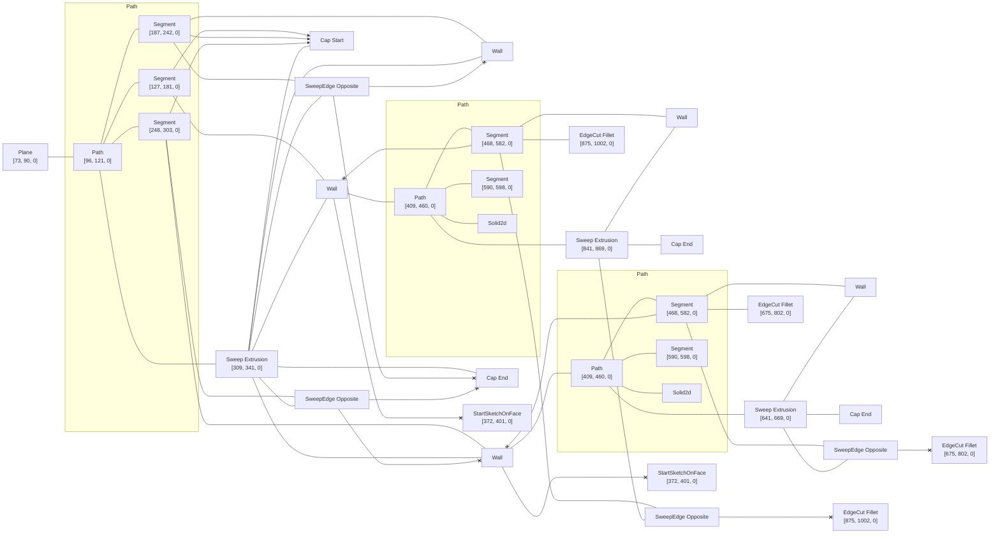

```mermaid
flowchart LR
  subgraph path2 [Path]
    2["Path<br>[96, 121, 0]"]
    3["Segment<br>[127, 181, 0]"]
    4["Segment<br>[187, 242, 0]"]
    5["Segment<br>[248, 303, 0]"]
  end
  subgraph path14 [Path]
    14["Path<br>[409, 460, 0]"]
    15["Segment<br>[468, 582, 0]"]
    16["Segment<br>[590, 598, 0]"]
    17[Solid2d]
  end
  subgraph path24 [Path]
    24["Path<br>[409, 460, 0]"]
    25["Segment<br>[468, 582, 0]"]
    26["Segment<br>[590, 598, 0]"]
    27[Solid2d]
  end
  1["Plane<br>[73, 90, 0]"]
  6["Sweep Extrusion<br>[309, 341, 0]"]
  7[Wall]
  8[Wall]
  9[Wall]
  10["Cap Start"]
  11["Cap End"]
  12["SweepEdge Opposite"]
  13["SweepEdge Opposite"]
  18["Sweep Extrusion<br>[641, 669, 0]"]
  19[Wall]
  20["Cap End"]
  21["SweepEdge Opposite"]
  22["EdgeCut Fillet<br>[675, 802, 0]"]
  23["EdgeCut Fillet<br>[675, 802, 0]"]
  28["Sweep Extrusion<br>[841, 869, 0]"]
  29[Wall]
  30["Cap End"]
  31["SweepEdge Opposite"]
  32["EdgeCut Fillet<br>[875, 1002, 0]"]
  33["EdgeCut Fillet<br>[875, 1002, 0]"]
  34["StartSketchOnFace<br>[372, 401, 0]"]
  35["StartSketchOnFace<br>[372, 401, 0]"]
  1 --- 2
  2 --- 3
  2 --- 4
  2 --- 5
  2 ---- 6
  3 --- 7
  3 x--> 10
  4 --- 8
  4 --- 12
  4 x--> 10
  5 --- 9
  5 --- 13
  5 x--> 10
  6 --- 7
  6 --- 8
  6 --- 9
  6 --- 10
  6 --- 11
  6 --- 12
  6 --- 13
  7 --- 24
  9 --- 14
  12 <--x 8
  12 <--x 11
  13 <--x 9
  13 <--x 11
  14 --- 15
  14 --- 16
  14 ---- 18
  14 --- 17
  15 --- 19
  15 --- 21
  15 --- 22
  15 <--x 9
  18 --- 19
  18 --- 20
  18 --- 21
  21 <--x 23
  24 --- 25
  24 --- 26
  24 ---- 28
  24 --- 27
  25 --- 29
  25 --- 31
  25 --- 32
  25 <--x 7
  28 --- 29
  28 --- 30
  28 --- 31
  31 <--x 33
  9 <--x 34
  7 <--x 35
```
