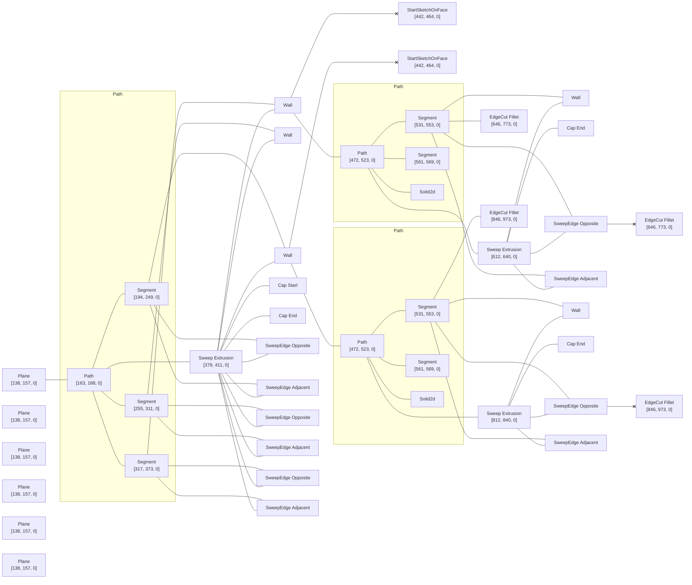

```mermaid
flowchart LR
  subgraph path7 [Path]
    7["Path<br>[163, 188, 0]"]
    8["Segment<br>[194, 249, 0]"]
    9["Segment<br>[255, 311, 0]"]
    10["Segment<br>[317, 373, 0]"]
  end
  subgraph path23 [Path]
    23["Path<br>[472, 523, 0]"]
    24["Segment<br>[531, 553, 0]"]
    25["Segment<br>[561, 569, 0]"]
    26[Solid2d]
  end
  subgraph path34 [Path]
    34["Path<br>[472, 523, 0]"]
    35["Segment<br>[531, 553, 0]"]
    36["Segment<br>[561, 569, 0]"]
    37[Solid2d]
  end
  1["Plane<br>[138, 157, 0]"]
  2["Plane<br>[138, 157, 0]"]
  3["Plane<br>[138, 157, 0]"]
  4["Plane<br>[138, 157, 0]"]
  5["Plane<br>[138, 157, 0]"]
  6["Plane<br>[138, 157, 0]"]
  11["Sweep Extrusion<br>[379, 411, 0]"]
  12[Wall]
  13[Wall]
  14[Wall]
  15["Cap Start"]
  16["Cap End"]
  17["SweepEdge Opposite"]
  18["SweepEdge Adjacent"]
  19["SweepEdge Opposite"]
  20["SweepEdge Adjacent"]
  21["SweepEdge Opposite"]
  22["SweepEdge Adjacent"]
  27["Sweep Extrusion<br>[612, 640, 0]"]
  28[Wall]
  29["Cap End"]
  30["SweepEdge Opposite"]
  31["SweepEdge Adjacent"]
  32["EdgeCut Fillet<br>[646, 773, 0]"]
  33["EdgeCut Fillet<br>[646, 773, 0]"]
  38["Sweep Extrusion<br>[812, 840, 0]"]
  39[Wall]
  40["Cap End"]
  41["SweepEdge Opposite"]
  42["SweepEdge Adjacent"]
  43["EdgeCut Fillet<br>[846, 973, 0]"]
  44["EdgeCut Fillet<br>[846, 973, 0]"]
  45["StartSketchOnFace<br>[442, 464, 0]"]
  46["StartSketchOnFace<br>[442, 464, 0]"]
  1 --- 7
  7 --- 8
  7 --- 9
  7 --- 10
  7 ---- 11
  8 --- 12
  8 --- 17
  8 --- 18
  9 --- 13
  9 --- 19
  9 --- 20
  10 --- 14
  10 --- 21
  10 --- 22
  11 --- 12
  11 --- 13
  11 --- 14
  11 --- 15
  11 --- 16
  11 --- 17
  11 --- 18
  11 --- 19
  11 --- 20
  11 --- 21
  11 --- 22
  12 --- 34
  14 --- 23
  23 --- 24
  23 --- 25
  23 ---- 27
  23 --- 26
  24 --- 28
  24 --- 30
  24 --- 31
  24 --- 32
  27 --- 28
  27 --- 29
  27 --- 30
  27 --- 31
  30 <--x 33
  34 --- 35
  34 --- 36
  34 ---- 38
  34 --- 37
  35 --- 39
  35 --- 41
  35 --- 42
  35 --- 43
  38 --- 39
  38 --- 40
  38 --- 41
  38 --- 42
  41 <--x 44
  14 <--x 45
  12 <--x 46
```
